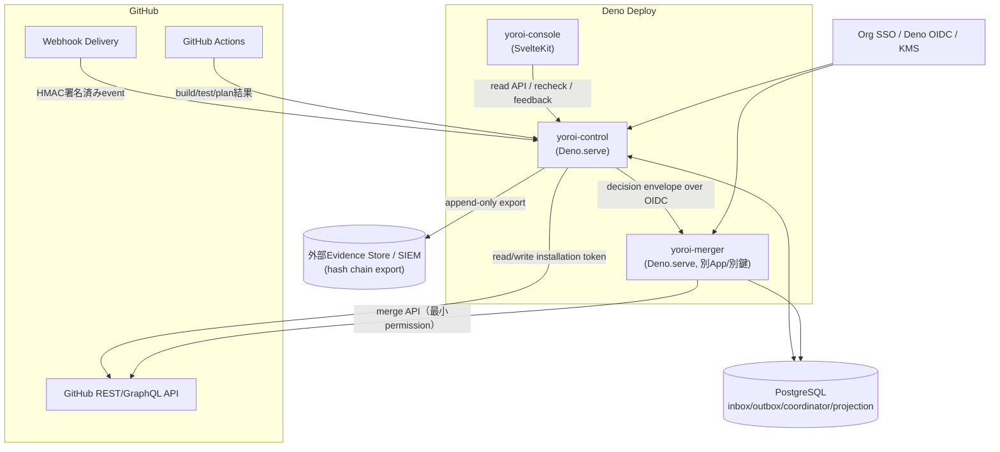
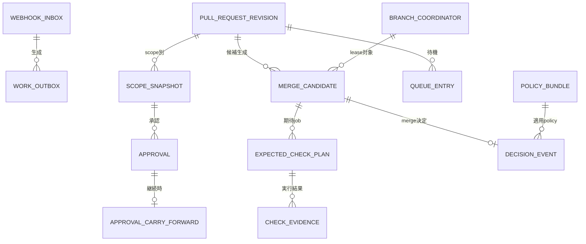
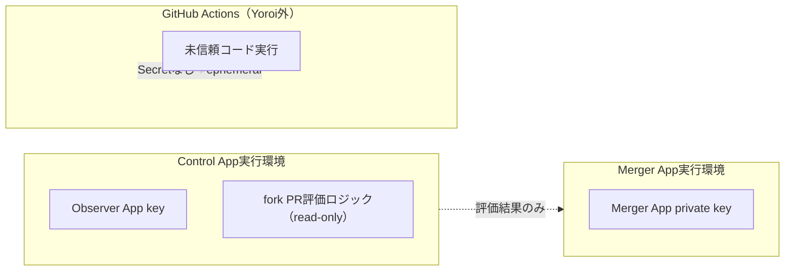
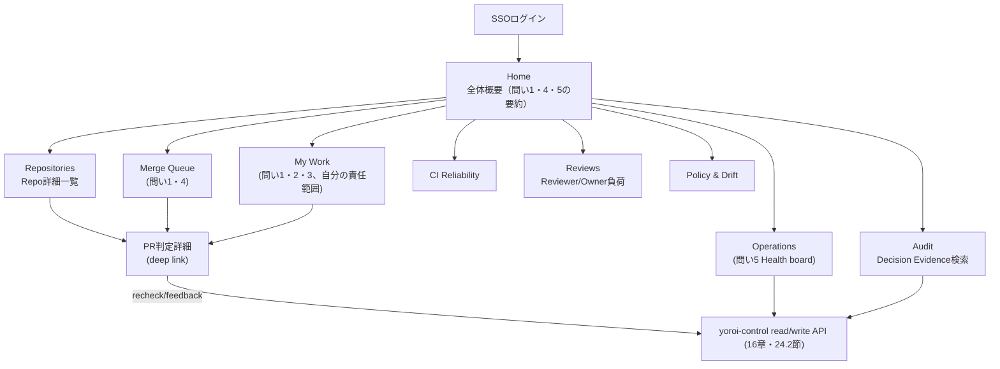

# 構成管理Bot "Yoroi" 技術設計書

> 本書は [doc/requirements.md](./requirements.md)（v0.2）を実装可能な技術設計へ変換したものである。要件文中のID（FR-xxx、SEC-xxx、NFR-xxx、DP-xxx、AT-xxx）は本書でもそのまま参照し、要件↔設計のトレーサビリティを保つ。

## 目次

1. [設計概要と対応範囲](#1-設計概要と対応範囲)
2. [アーキテクチャ設計](#2-アーキテクチャ設計)
3. [Monorepo構成とビルド](#3-monorepo構成とビルド)
4. [ドメインモデル](#4-ドメインモデル)
5. [状態機械設計](#5-状態機械設計)
6. [PostgreSQLスキーマ設計](#6-postgresqlスキーマ設計)
7. [Webhook Ingestion設計](#7-webhook-ingestion設計)
8. [Scope Change Digest / Context Safety Proof設計](#8-scope-change-digest--context-safety-proof設計)
9. [Policy Engine設計](#9-policy-engine設計)
10. [Branch Coordinator（Lease/Fencing）設計](#10-branch-coordinatorleasefencing設計)
11. [Merge Scheduler設計](#11-merge-scheduler設計)
12. [Decision EnvelopeとMerger App設計](#12-decision-envelopeとmerger-app設計)
13. [GitHub API Adapter設計](#13-github-api-adapter設計)
14. [Notification / Summary設計](#14-notification--summary設計)
15. [Slash Command設計](#15-slash-command設計)
16. [内部/外部API設計](#16-内部外部api設計)
17. [Deno Deploy構成設計](#17-deno-deploy構成設計)
18. [Observability設計](#18-observability設計)
19. [セキュリティ実装設計](#19-セキュリティ実装設計)
20. [テスト戦略](#20-テスト戦略)
21. [実装ロードマップ対応](#21-実装ロードマップ対応)
22. [未決事項への設計上の対応方針](#22-未決事項への設計上の対応方針)
23. [管理者ダッシュボード設計](#23-管理者ダッシュボード設計)
24. [yoroi-console実装設計](#24-yoroi-console実装設計)
25. [トレーサビリティ](#25-トレーサビリティ)

---

## 1. 設計概要と対応範囲

### 1.1 目的

要件定義書の結論（1章）にある「GitHub App + Deno Deploy + PostgreSQLのイベント駆動コントロールプレーン」を、実装可能なモジュール構成・データモデル・アルゴリズム・APIへ落とし込む。

### 1.2 対応範囲

| 詳細度   | 対象フェーズ                                                                    | 内容                                                                                                                                                                             |
| -------- | ------------------------------------------------------------------------------- | -------------------------------------------------------------------------------------------------------------------------------------------------------------------------------- |
| 詳細設計 | Phase 0〜3（Journey/Threat Design、Observe、Approval Continuity、Serial Merge） | Webhook ingestion、状態機械、scope change digest / context safety proof、Policy Engine、Serial merge、Branch Coordinator、Merger App、reason graph、`/yoroi recheck`・`feedback` |
| 概要設計 | Phase 4〜6（Speculative/Batch、Org Governance、Advanced）                       | Speculative train、Batch/ddmin、Terraform drift連携、cross-repo DAG、auto-revert                                                                                                 |

MVPで見送る機能（Terraform apply、Speculative/Batch本実装、Merge権限付与）は、要件20章のGo/No-Go基準を満たすまでMergerへ本番merge権限を渡さない、という要件の意図をそのまま設計へ引き継ぐ。

### 1.3 設計原則との対応

要件6章の設計原則（DP-01〜DP-17）を実装レベルで守るため、本書は以下を一貫させる。

- **DP-01 Exact candidate / DP-13 Content-aware approval**：4章・8章で`ReviewIdentity`と`CandidateDecisionIdentity`を別々の型として分離する。
- **DP-02 Small trusted kernel**：6章のpackage境界で信頼核（`domain`, `postgres`, `evidence`）と非信頼核（`console`, AI提案）を分離する。
- **DP-06 Idempotent event sourcing**：6〜7章でinbox/outboxと単調な状態機械を実装する。
- **DP-07 Least privilege by component**：3章・17章でapp/DB role/secretをコンポーネント単位に分離する。
- **DP-08 Reconcile, do not assume**：7章・17章でDeno Cronによる再照合を設計する。
- **DP-16 No phantom platform primitive**：Deno Deployに存在しないQueueや共有memoryへ依存する実装を明示的に禁止する（7章・10章）。

### 1.4 表記法

- TypeScript型は**データ契約**（実装は簡略化した例示コード）。
- SQLはPostgreSQL DDL/DML（索引・制約は主要なもののみ）。
- mermaidは処理フロー・コンポーネント関係の可視化。
- コード中のコメントは要件IDを`(FR-xxx)`のように付記し、要件からの逸脱がないことを示す。

### 1.5 アーキテクチャスタイル：Modular FC/IS + Ports at the Edges

Yoroiは判定エンジン＋状態機械＋副作用実行基盤であり、Entity・UseCase・Presenter・Repository Interfaceを層ごとに揃えるクラシックなClean Architectureは本質的な価値（＝依存は外側から内側へ向ける）に対して儀式が重い。本書は以下の形でその本質だけを維持する。

- **Functional Core**：`packages/domain`（5章状態機械の`reduce`、8章の digest/proof計算、9章の`evaluate`）はI/Oを一切持たない純粋関数とし、「同じ入力→同じ出力」をproperty-based test（20.2節）でそのまま検証できる状態を保つ。UseCaseクラスは作らず、`facts → decision`の関数として表現する。
- **Imperative Shell**：`apps/control`・`apps/merger`のhandler、`packages/github`・`packages/postgres`・`packages/evidence`が副作用（GitHub API、PostgreSQL、署名、通知）を担う。ShellはCoreを呼び出す薄いオーケストレーションに徹し、判定ロジックを持ち込まない。
- **Ports at the Edges**：層を4つに割るのではなく、**外部境界にだけ**interfaceを置く。3.2節で列挙した`EventStore`/`WorkScheduler`/`Coordinator`/`IdentityIssuer`/`TelemetrySink`/`EvidenceSink`、13.1節の`GitHubAdapter`、17.4節の`IdentityIssuer`/`OidcVerifier`が全てこのPortであり、Deno Deploy・GitHub・PostgreSQL・（24章で導入する）Better Authはこれらの実装（Adapter）としてShell側にのみ存在する。
- **機能単位の凝集**：内部を`domain/entity/usecase/presenter`のような技術層で割らず、`state-machine`・`scope-digest`・`policy`・`branch-coordinator`のように**機能単位**でモジュールを凝集させる（3.1節のpackage構成は既にこの形）。
- **Merger Appの物理分離は別軸として維持**：FC/IS化はコード構造の話であり、19章で設計するMerger Appの別App・別鍵・別deploy権限という**物理的な信頼境界**を代替しない。両者は独立に維持する。

この方針により、テストは技術層ではなく「Core／Shellのどちら側か」で自然に分かれる（20章で詳細化、24.10節でyoroi-console側の対応を示す）。

```text
facts (webhook / GitHub再取得結果 / DB射影)
  → decision (domain: reduce / evaluate / computeScopeChangeDigest。純粋関数)
    → effects (shell: GitHub API呼出し、PostgreSQL更新、通知送信、merge実行)
```

---

## 2. アーキテクチャ設計

### 2.1 コンポーネント図



### 2.2 App分割と責務

要件13.2・13.10に従い、3つのDeno Deploy appへ分割する。IngressとControlは同一app（`yoroi-control`）に同居させ、最強権限を持つ`yoroi-merger`だけを別App/別GitHub App/別deploy権限にする。

| App             | 公開入口                                | 保持する資格情報                                                            | 主要モジュール                                                                                                            |
| --------------- | --------------------------------------- | --------------------------------------------------------------------------- | ------------------------------------------------------------------------------------------------------------------------- |
| `yoroi-control` | `/github/webhook`、read系API、UI向けAPI | Webhook secret、Observer App key、PostgreSQL app role、Merger呼び出し用OIDC | ingress、state machine、policy evaluator、scheduler、notification、Cron                                                   |
| `yoroi-merger`  | OIDC保護された`/internal/merge`         | Merger App key、envelope検証鍵                                              | envelope検証、fencing検証、GitHub再取得、merge実行のみ                                                                    |
| `yoroi-console` | SSO保護UI                               | 本番merge資格情報なし、PostgreSQL直接接続なし                               | SvelteKit UI、`yoroi-control`のread APIとrecheck/feedback呼び出し。管理者向けHome / Operations Health board等（23〜24章） |

### 2.3 主要シーケンス（Webhook → Decision → Merge）

```mermaid
sequenceDiagram
    participant GH as GitHub
    participant Ctrl as yoroi-control
    participant PG as PostgreSQL
    participant Mrg as yoroi-merger

    GH->>Ctrl: POST /github/webhook (HMAC署名)
    Ctrl->>Ctrl: HMAC検証・payload上限チェック
    Ctrl->>PG: BEGIN; INSERT webhook_inbox; INSERT work_outbox; COMMIT
    Ctrl-->>GH: 202 Accepted (10秒以内)
    Ctrl->>PG: bounded drain (少数work)
    Ctrl->>Ctrl: policy evaluation / scope digest / reason graph
    Ctrl->>GH: Check Run更新 / summary更新
    Note over Ctrl,PG: 全gate合格・queue順序到達
    Ctrl->>PG: acquire branch lease (fencing_token++)
    Ctrl->>Mrg: decision envelope + OIDC token
    Mrg->>Mrg: envelope署名検証・expiry検証・fencing検証
    Mrg->>GH: 権威状態を再取得 (head/base/approval/check/ruleset)
    Mrg->>GH: merge API呼び出し (operation_idでidempotent)
    Mrg->>PG: append decision_event (hash chain)
    Mrg-->>Ctrl: merge結果
    Ctrl->>GH: merge後summary更新
```

---

## 3. Monorepo構成とビルド

### 3.1 ディレクトリ構成

要件13.13の骨子を実ファイルレベルへ展開する。

```text
yoroi/
  deno.jsonc                     # workspace root
  apps/
    control/
      main.ts                    # Deno.serve + Deno.cron登録
      app.ts                     # ルーティング組み立て
      routes/
        webhook.ts
        api.ts
        commands.ts
      deno.jsonc
    merger/
      main.ts
      handler.ts
      deno.jsonc
    console/
      src/                       # SvelteKit。画面構成は23章、実装詳細は24章（24.3節にディレクトリ構成の全体を示す）
      deno.jsonc
  packages/
    domain/
      src/ids.ts
      src/state-machine.ts
      src/scope-digest.ts
      src/context-proof.ts
      src/decision-envelope.ts
      mod.ts
    github/
      src/adapter.ts
      src/tree-fetch.ts
      src/rate-limit.ts
      mod.ts
    postgres/
      src/client.ts
      src/inbox-outbox.ts
      src/branch-coordinator.ts
      src/migrations/
      mod.ts
    policy/
      src/schema.ts
      src/compile.ts
      src/evaluate.ts
      src/reason-graph.ts
      mod.ts
    evidence/
      src/envelope.ts
      src/sign.ts
      src/export.ts
      mod.ts
    notifications/
      src/summary.ts
      src/check-run.ts
      src/commands/
      mod.ts
    observability/
      src/otel.ts
      mod.ts
  tests/
    fixtures/
    property/
    fault-injection/
```

### 3.2 パッケージ境界の原則

- `domain`はDeno Deploy固有API（`Deno.cron`、OIDC等）へ依存しない。純粋なTypeScriptロジックのみとし、要件13.11のadapter方針（`EventStore`/`WorkScheduler`/`Coordinator`/`IdentityIssuer`/`TelemetrySink`/`EvidenceSink`）をinterfaceとして`domain`に置き、実装を`apps/*`または`packages/postgres`・`packages/github`側に置く。
- `github`パッケージはOctokitのthin wrapperとし、rate limit・installation tokenキャッシュ・tree completeness取得（8章）をここへ閉じ込める。
- `postgres`パッケージはSQLをこのパッケージの外へ漏らさない（他パッケージはリポジトリインターフェース越しにのみアクセスする）。
- `evidence`は署名・hash chain・外部exportのみを扱い、業務ロジックを持たない。

### 3.3 deno.jsonc（root）

```jsonc
{
	"workspace": ["apps/control", "apps/merger", "apps/console", "packages/*"],
	"compilerOptions": {
		"strict": true,
		"noUncheckedIndexedAccess": true,
		"exactOptionalPropertyTypes": true
	},
	"lock": true,
	"fmt": { "lineWidth": 100 },
	"lint": { "rules": { "tags": ["recommended"] } },
	"tasks": {
		"test": "deno test -A --parallel packages apps",
		"test:property": "deno test -A tests/property",
		"test:fault": "deno test -A tests/fault-injection",
		"check": "deno check apps/**/main.ts packages/**/mod.ts",
		"migrate": "deno run -A packages/postgres/src/migrations/run.ts"
	}
}
```

- `deno.lock`を必ずcommitし、CIは`--frozen`相当（`deno.lock`不一致でfail）で実行する（13.13、SEC-038）。
- 依存はJSR優先＋成熟したnpmパッケージを許容するhybrid方針とする（本書のコード例は`npm:`指定を使用）。

---

## 4. ドメインモデル

### 4.1 ID型（nominal typing）

文字列/数値の取り違え（例：`repository_id`と`installation_id`の混同）はSEC-019で禁止されるrepo間データ混同に直結するため、branded typeで型レベルに区別する。

```typescript
// packages/domain/src/ids.ts

type Brand<Base, Tag extends string> = Base & { readonly __brand: Tag };

export type InstallationId = Brand<number, 'InstallationId'>;
export type RepositoryId = Brand<number, 'RepositoryId'>;
export type PullRequestNumber = Brand<number, 'PullRequestNumber'>;
export type Sha = Brand<string, 'Sha'>; // commit/tree/blob OID
export type Sha256Hex = Brand<string, 'Sha256Hex'>; // digest全般
export type OperationId = Brand<string, 'OperationId'>; // ULID
export type DecisionId = Brand<string, 'DecisionId'>; // ULID
export type ActorStableId = Brand<string, 'ActorStableId'>; // GitHub user node_id
export type ScopeId = Brand<string, 'ScopeId'>;
export type FencingToken = Brand<bigint, 'FencingToken'>;
export type PolicyDigest = Brand<string, 'PolicyDigest'>;
```

### 4.2 二つの判定Identity（要件8.2の型化）

```typescript
// packages/domain/src/identity.ts

/** 人のreview continuityを表す単位。rebase等で不変なら維持される (DP-13) */
export interface ReviewIdentity {
	readonly repositoryId: RepositoryId;
	readonly pullRequestNumber: PullRequestNumber;
	readonly scopeId: ScopeId;
	readonly scopeChangeDigest: Sha256Hex;
	readonly contextSafetyProofDigest: Sha256Hex;
	readonly scopeMappingVersion: string;
	readonly policyDigest: PolicyDigest;
	readonly actorStableId: ActorStableId;
	readonly actorRole: ApproverRole;
}

/** 実行・merge権限に結合する単位。SHAが変われば必ず作り直す (DP-01) */
export interface CandidateDecisionIdentity {
	readonly repositoryId: RepositoryId;
	readonly pullRequestNumber: PullRequestNumber;
	readonly exactCandidateSha: Sha;
	readonly headSha: Sha;
	readonly baseSha: Sha;
	readonly orderedDependencyShas: readonly Sha[];
	readonly policyDigest: PolicyDigest;
	readonly expectedCheckPlanDigest: Sha256Hex;
}
```

この2型は**混ぜて使わない**。承認保存（`approval`テーブル）は`ReviewIdentity`のみを参照し、CI結果保存（`check_evidence`テーブル）とmerge実行は`CandidateDecisionIdentity`のみを参照する（6章のテーブル設計に反映）。

### 4.3 主要エンティティ型

要件16.1の表をTypeScript化する（フィールドは代表例、実装時にDBスキーマと1:1対応させる）。

```typescript
export interface PullRequestRevision {
	readonly repositoryId: RepositoryId;
	readonly pullRequestNumber: PullRequestNumber;
	readonly headSha: Sha;
	readonly baseSha: Sha;
	readonly isDraft: boolean;
	readonly authorStableId: ActorStableId;
	readonly touchedScopes: readonly ScopeId[];
	readonly sensitiveScopes: readonly ScopeId[];
}

export interface MergeCandidate {
	readonly candidateSha: Sha;
	readonly baseSha: Sha;
	readonly orderedHeads: readonly Sha[];
	readonly policyDigest: PolicyDigest;
	readonly builtAt: Date;
	readonly invalidatedAt: Date | null;
	readonly invalidationReason: string | null;
}

export interface Approval {
	readonly actorStableId: ActorStableId;
	readonly role: ApproverRole;
	readonly scopeId: ScopeId;
	readonly scopeChangeDigest: Sha256Hex;
	readonly contextProofPolicy: string;
	readonly policyDigest: PolicyDigest;
	readonly originalHeadSha: Sha; // 監査文脈
	readonly originalBaseSha: Sha; // 監査文脈
	readonly scopeResultDigest: Sha256Hex;
	readonly approvedAt: Date;
}

export interface ApprovalCarryForward {
	readonly originalReviewId: string;
	readonly oldBaseSha: Sha;
	readonly oldHeadSha: Sha;
	readonly newBaseSha: Sha;
	readonly newHeadSha: Sha;
	readonly unchangedScopeIds: readonly ScopeId[];
	readonly contextProofDigest: Sha256Hex;
	readonly proofAlgorithm: string;
}
```

`Approval`と`ApprovalCarryForward`を分離することで、reason graph（14章）とAT-04A〜04Fの受入シナリオが要求する「carried forward」の表示（元review ID・旧/新SHA・proof algorithm）を自然に満たす。

---

## 5. 状態機械設計

### 5.1 状態と許可遷移

要件8.3のstateDiagramをコード化する。「許可された遷移だけを実行する」（8.4）ことをコンパイル時＋実行時の二重で保証する。

```typescript
// packages/domain/src/state-machine.ts

export type PrState =
	| 'DISCOVERED'
	| 'DRAFT'
	| 'REVIEWING'
	| 'APPROVAL_COVERED'
	| 'PRECHECKED'
	| 'QUEUED'
	| 'CANDIDATE_BUILDING'
	| 'GATE_PASSED'
	| 'MERGING'
	| 'MERGED'
	| 'OBSERVING'
	| 'SUPERSEDED'
	| 'PAUSED'
	| 'QUARANTINED'
	| 'REVERTING';

const ALLOWED_TRANSITIONS: ReadonlyMap<PrState, ReadonlySet<PrState>> = new Map([
	['DISCOVERED', new Set<PrState>(['DRAFT', 'REVIEWING'])],
	['DRAFT', new Set<PrState>(['REVIEWING'])],
	['REVIEWING', new Set<PrState>(['APPROVAL_COVERED', 'SUPERSEDED'])],
	// 承認失効（FR-025）でREVIEWINGへ後退できる
	['APPROVAL_COVERED', new Set<PrState>(['PRECHECKED', 'REVIEWING'])],
	['PRECHECKED', new Set<PrState>(['QUEUED', 'REVIEWING'])],
	['QUEUED', new Set<PrState>(['CANDIDATE_BUILDING', 'PAUSED', 'REVIEWING'])],
	['CANDIDATE_BUILDING', new Set<PrState>(['GATE_PASSED', 'QUARANTINED', 'QUEUED'])],
	// GATE_PASSEDは期限付き（8.4）。base/head/policy更新やtree closeで候補側へ戻す
	['GATE_PASSED', new Set<PrState>(['MERGING', 'CANDIDATE_BUILDING'])],
	// merge直前再検証（8.4 “MERGING直前”）が失敗した場合は候補作り直し
	['MERGING', new Set<PrState>(['MERGED', 'CANDIDATE_BUILDING'])],
	['MERGED', new Set<PrState>(['OBSERVING'])],
	['OBSERVING', new Set<PrState>(['REVERTING'])],
	['PAUSED', new Set<PrState>(['QUEUED'])],
	['QUARANTINED', new Set<PrState>(['CANDIDATE_BUILDING', 'REVIEWING'])],
	['SUPERSEDED', new Set<PrState>([])],
	['REVERTING', new Set<PrState>([])]
]);
```

### 5.2 遷移イベントとreducer

```typescript
export interface PrStateRow {
	readonly state: PrState;
	readonly stateVersion: number; // 楽観的並行制御（6章）
	readonly headSha: Sha;
	readonly candidateSha: Sha | null;
}

export interface StateEvent {
	readonly operationId: OperationId;
	readonly toState: PrState;
	readonly actor: ActorRef;
	readonly reasonCode: string;
	readonly observedHeadSha: Sha;
	readonly inputDigest: Sha256Hex; // 何を根拠に遷移したか（監査・reason graph用）
	readonly occurredAt: Date;
}

export type TransitionRejected =
	| { readonly kind: 'STALE_SHA'; readonly observed: Sha; readonly current: Sha }
	| { readonly kind: 'ILLEGAL_TRANSITION'; readonly from: PrState; readonly to: PrState };

export function reduce(
	current: PrStateRow,
	event: StateEvent
): Result<PrStateRow, TransitionRejected> {
	// P-05, 8.4: 古いSHAのeventで新しいSHAの状態を後退させない
	if (isOlderOrEqualStaleSha(event.observedHeadSha, current)) {
		return err({ kind: 'STALE_SHA', observed: event.observedHeadSha, current: current.headSha });
	}
	const allowed = ALLOWED_TRANSITIONS.get(current.state) ?? new Set<PrState>();
	if (!allowed.has(event.toState)) {
		return err({ kind: 'ILLEGAL_TRANSITION', from: current.state, to: event.toState });
	}
	return ok({
		state: event.toState,
		stateVersion: current.stateVersion + 1,
		headSha: event.observedHeadSha,
		candidateSha: current.candidateSha
	});
}
```

`reduce`は純粋関数とし、DB更新は呼び出し側で`UPDATE ... WHERE state_version = $expected`によって行う（6.4節）。これによりevent順不同（FR-005）・重複適用（FR-004）の両方に対して安全になる。

### 5.3 G1〜G4ゲートとの対応

状態機械の遷移条件を4層ゲートへマップする。

| 遷移                               | 対応ゲート           | 判定コンポーネント                                |
| ---------------------------------- | -------------------- | ------------------------------------------------- |
| `REVIEWING → APPROVAL_COVERED`     | G1 Identity/Approval | Policy Engine（9章）+ Scope Change Digest（8章）  |
| `PRECHECKED → QUEUED`              | G2先行判定           | Merge Scheduler（11章）                           |
| `CANDIDATE_BUILDING → GATE_PASSED` | G2 + G3              | GitHub Adapter（13章）の`expected_check_plan`集約 |
| `GATE_PASSED → MERGING → MERGED`   | G4                   | Branch Coordinator（10章）+ Merger（12章）        |

---

## 6. PostgreSQLスキーマ設計

### 6.1 設計方針

- 全テーブルへ`installation_id`・`repository_id`を持たせ、複合indexの先頭に置く（SEC-019）。
- `decision_event`は追記専用（hash chain、UPDATE/DELETE禁止をDB roleで強制）。
- `webhook_inbox`・`work_outbox`はトランザクション境界を共有し、7章のingestionフローと1:1対応させる。

### 6.2 ER図（主要テーブル）



### 6.3 Inbox / Outbox

```sql
-- FR-002, FR-004: idempotency keyとしてdelivery_idを一意化
CREATE TABLE webhook_inbox (
  id                BIGSERIAL PRIMARY KEY,
  installation_id   BIGINT NOT NULL,
  repository_id     BIGINT,
  delivery_id       TEXT NOT NULL,
  event_type        TEXT NOT NULL,
  payload_digest    TEXT NOT NULL,
  payload_encrypted BYTEA,             -- raw payloadを保持する場合のみ。暗号化必須 (FR-002)
  received_at       TIMESTAMPTZ NOT NULL DEFAULT now(),
  expires_at        TIMESTAMPTZ,       -- payload_encryptedの短いTTL
  UNIQUE (installation_id, delivery_id)
);
CREATE INDEX idx_webhook_inbox_repo ON webhook_inbox (repository_id, received_at);

-- FR-003: 応答前にcommitするtransactional outbox。managed Queueがない前提 (DP-16)
CREATE TABLE work_outbox (
  id              BIGSERIAL PRIMARY KEY,
  operation_id    UUID NOT NULL UNIQUE,        -- 副作用の一意鍵 (FR-007)
  installation_id BIGINT NOT NULL,
  repository_id   BIGINT,
  kind            TEXT NOT NULL,               -- 'evaluate_policy' | 'update_check_run' | 'notify' ...
  payload         JSONB NOT NULL,
  state           TEXT NOT NULL DEFAULT 'pending' CHECK (state IN ('pending','leased','done','dead')),
  priority        SMALLINT NOT NULL DEFAULT 0,
  attempt         INT NOT NULL DEFAULT 0,
  max_attempt     INT NOT NULL DEFAULT 8,
  available_at    TIMESTAMPTZ NOT NULL DEFAULT now(),
  lease_owner     TEXT,
  lease_until     TIMESTAMPTZ,
  last_error      TEXT,
  created_at      TIMESTAMPTZ NOT NULL DEFAULT now()
);
CREATE INDEX idx_outbox_claim ON work_outbox (state, available_at)
  WHERE state IN ('pending','leased');
```

### 6.4 Branch Coordinator

```sql
-- 10章: repository_id + target_branch単位で一つだけの直列化権
CREATE TABLE branch_coordinator (
  installation_id     BIGINT NOT NULL,
  repository_id       BIGINT NOT NULL,
  target_branch       TEXT NOT NULL,
  holder_operation_id UUID,
  lease_until         TIMESTAMPTZ,
  fencing_token       BIGINT NOT NULL DEFAULT 0,  -- 取得の都度単調増加
  expected_base_sha   TEXT,
  state_version       BIGINT NOT NULL DEFAULT 0,
  updated_at          TIMESTAMPTZ NOT NULL DEFAULT now(),
  PRIMARY KEY (installation_id, repository_id, target_branch)
);
```

### 6.5 PR / Scope / Approval

```sql
CREATE TABLE pull_request_revision (
  installation_id     BIGINT NOT NULL,
  repository_id       BIGINT NOT NULL,
  pull_request_number INT NOT NULL,
  head_sha            TEXT NOT NULL,
  base_sha            TEXT NOT NULL,
  is_draft            BOOLEAN NOT NULL DEFAULT false,
  author_stable_id    TEXT NOT NULL,
  state               TEXT NOT NULL,
  state_version       BIGINT NOT NULL DEFAULT 0,
  updated_at          TIMESTAMPTZ NOT NULL DEFAULT now(),
  PRIMARY KEY (installation_id, repository_id, pull_request_number)
);

-- 8章: scope単位の変更同一性の記録
CREATE TABLE scope_snapshot (
  id                    BIGSERIAL PRIMARY KEY,
  installation_id       BIGINT NOT NULL,
  repository_id         BIGINT NOT NULL,
  pull_request_number   INT NOT NULL,
  scope_id              TEXT NOT NULL,
  base_sha              TEXT NOT NULL,
  head_sha              TEXT NOT NULL,
  scope_change_digest   TEXT NOT NULL,
  scope_result_digest   TEXT NOT NULL,
  algorithm_version     TEXT NOT NULL,
  scope_mapping_version TEXT NOT NULL,
  created_at            TIMESTAMPTZ NOT NULL DEFAULT now(),
  UNIQUE (installation_id, repository_id, pull_request_number, scope_id, head_sha)
);

CREATE TABLE approval (
  id                    BIGSERIAL PRIMARY KEY,
  installation_id       BIGINT NOT NULL,
  repository_id         BIGINT NOT NULL,
  pull_request_number   INT NOT NULL,
  scope_id              TEXT NOT NULL,
  actor_stable_id       TEXT NOT NULL,        -- 変更可能なhandleではなくstable ID (FR-081)
  role                  TEXT NOT NULL,
  scope_change_digest   TEXT NOT NULL,
  context_proof_policy  TEXT NOT NULL,
  policy_digest         TEXT NOT NULL,
  original_head_sha     TEXT NOT NULL,        -- 監査文脈
  original_base_sha     TEXT NOT NULL,        -- 監査文脈
  scope_result_digest   TEXT NOT NULL,
  approved_at           TIMESTAMPTZ NOT NULL DEFAULT now(),
  revoked_at            TIMESTAMPTZ,
  revoke_reason         TEXT
);
CREATE INDEX idx_approval_scope ON approval (installation_id, repository_id, pull_request_number, scope_id)
  WHERE revoked_at IS NULL;

CREATE TABLE approval_carry_forward (
  id                     BIGSERIAL PRIMARY KEY,
  original_approval_id   BIGINT NOT NULL REFERENCES approval(id),
  old_base_sha            TEXT NOT NULL,
  old_head_sha            TEXT NOT NULL,
  new_base_sha            TEXT NOT NULL,
  new_head_sha            TEXT NOT NULL,
  scope_id                TEXT NOT NULL,
  context_proof_digest    TEXT NOT NULL,
  proof_algorithm         TEXT NOT NULL,
  carried_forward_at      TIMESTAMPTZ NOT NULL DEFAULT now()
);
```

### 6.6 Candidate / CI Evidence / Queue

```sql
CREATE TABLE merge_candidate (
  candidate_sha        TEXT PRIMARY KEY,
  installation_id      BIGINT NOT NULL,
  repository_id        BIGINT NOT NULL,
  pull_request_number  INT NOT NULL,
  base_sha             TEXT NOT NULL,
  ordered_heads        TEXT[] NOT NULL,
  policy_digest        TEXT NOT NULL,
  built_at             TIMESTAMPTZ NOT NULL DEFAULT now(),
  invalidated_at        TIMESTAMPTZ,
  invalidation_reason   TEXT
);

CREATE TABLE expected_check_plan (
  id              BIGSERIAL PRIMARY KEY,
  candidate_sha   TEXT NOT NULL REFERENCES merge_candidate(candidate_sha),
  job_name        TEXT NOT NULL,
  reason          TEXT NOT NULL,       -- 選択理由 (FR-041)
  required        BOOLEAN NOT NULL DEFAULT true
);

CREATE TABLE check_evidence (
  id                BIGSERIAL PRIMARY KEY,
  candidate_sha     TEXT NOT NULL REFERENCES merge_candidate(candidate_sha),
  job_name          TEXT NOT NULL,
  workflow_sha      TEXT NOT NULL,
  runner_class      TEXT,
  input_digest      TEXT,
  artifact_digest   TEXT,
  conclusion        TEXT NOT NULL,     -- success|failure|cancelled|timed_out
  observed_at       TIMESTAMPTZ NOT NULL DEFAULT now(),
  UNIQUE (candidate_sha, job_name)
);

CREATE TABLE queue_entry (
  id                   BIGSERIAL PRIMARY KEY,
  installation_id      BIGINT NOT NULL,
  repository_id        BIGINT NOT NULL,
  pull_request_number  INT NOT NULL,
  lane                 TEXT NOT NULL DEFAULT 'default',
  priority             INT NOT NULL DEFAULT 0,
  enqueued_at          TIMESTAMPTZ NOT NULL DEFAULT now(),
  eta_p50              TIMESTAMPTZ,
  eta_p90              TIMESTAMPTZ,
  eta_confidence       TEXT,
  state                TEXT NOT NULL DEFAULT 'waiting'
);
```

### 6.7 Policy / Decision / Evidence

```sql
CREATE TABLE policy_bundle (
  digest        TEXT PRIMARY KEY,
  installation_id BIGINT,
  repository_id   BIGINT,
  version         TEXT NOT NULL,
  raw_yaml        TEXT NOT NULL,
  signer          TEXT,
  created_at      TIMESTAMPTZ NOT NULL DEFAULT now()
);

-- 追記専用。hash chainで改ざん検知 (AT-19)
CREATE TABLE decision_event (
  seq                  BIGSERIAL PRIMARY KEY,
  operation_id         UUID NOT NULL,
  installation_id      BIGINT NOT NULL,
  repository_id        BIGINT NOT NULL,
  pull_request_number  INT,
  actor_stable_id      TEXT,
  from_state           TEXT,
  to_state             TEXT,
  reason_code          TEXT NOT NULL,
  evidence             JSONB NOT NULL,
  prev_hash            TEXT NOT NULL,
  row_hash             TEXT NOT NULL,
  occurred_at          TIMESTAMPTZ NOT NULL DEFAULT now()
);
-- 追記専用を役割レベルで強制する
REVOKE UPDATE, DELETE ON decision_event FROM yoroi_app_role;

CREATE TABLE config_snapshot (
  id             BIGSERIAL PRIMARY KEY,
  resource_id    TEXT NOT NULL,
  desired_digest TEXT,
  actual_digest  TEXT,
  drifted        BOOLEAN NOT NULL DEFAULT false,
  observed_at    TIMESTAMPTZ NOT NULL DEFAULT now()
);

CREATE TABLE flaky_test (
  test_fingerprint  TEXT PRIMARY KEY,
  repository_id     BIGINT NOT NULL,
  owner_team        TEXT,
  failure_count     INT NOT NULL DEFAULT 0,
  reproduction_rate REAL,
  quarantine_until  TIMESTAMPTZ,
  status            TEXT NOT NULL DEFAULT 'observed'
);

CREATE TABLE feedback_case (
  id             BIGSERIAL PRIMARY KEY,
  decision_id    TEXT NOT NULL,
  category       TEXT NOT NULL,
  actor_stable_id TEXT NOT NULL,
  description    TEXT,
  disposition    TEXT,
  created_at     TIMESTAMPTZ NOT NULL DEFAULT now(),
  resolved_at    TIMESTAMPTZ
);
```

`decision_event.evidence`（JSONB）に`scope_review_proofs`・`check_plan_digest`・`fencing_token`等を含め、12章のDecision Envelopeをそのまま格納できるようにする。

---

## 7. Webhook Ingestion設計

### 7.1 処理フロー（要件13.3を実装コードへ）

```typescript
// apps/control/routes/webhook.ts

export async function handleWebhook(req: Request, ctx: ControlContext): Promise<Response> {
	// 1) サイズ・content-type・event allowlistの検査 (FR-001)
	const contentLength = Number(req.headers.get('content-length') ?? '0');
	if (contentLength > MAX_PAYLOAD_BYTES) return new Response('payload too large', { status: 413 });

	const eventType = req.headers.get('x-github-event');
	if (!eventType || !EVENT_ALLOWLIST.has(eventType)) {
		return new Response('unsupported event', { status: 202 }); // 未知eventは黙って受理しdrop
	}

	const rawBody = new Uint8Array(await req.arrayBuffer());

	// 2) raw bodyのままtiming-safe HMAC検証 (SEC-007)
	const signature = req.headers.get('x-hub-signature-256');
	if (!(await verifyHmacSignature(rawBody, signature, ctx.webhookSecret))) {
		return new Response('bad signature', { status: 401 });
	}

	const deliveryId = req.headers.get('x-github-delivery')!;
	const installationId = extractInstallationId(rawBody);
	const repositoryId = extractRepositoryId(rawBody);

	// 3) 一つのtransactionでinbox + outboxへcommit (FR-003)
	const operationId = ulid();
	await ctx.db.transaction(async (tx) => {
		const inserted = await tx.insertInbox({
			installationId,
			repositoryId,
			deliveryId,
			eventType,
			payloadDigest: await sha256Hex(rawBody),
			payloadEncrypted: shouldPersistRaw(eventType) ? await encrypt(rawBody, ctx.kmsKey) : null,
			expiresAt: shouldPersistRaw(eventType) ? addHours(new Date(), 24) : null
		});
		if (!inserted) return; // UNIQUE制約により重複delivery (FR-004)
		await tx.insertOutbox({
			operationId,
			installationId,
			repositoryId,
			kind: routeEventToWorkKind(eventType),
			payload: minimalEventFacts(eventType, rawBody) // 必要最小限のfactsのみ (FR-002)
		});
	});

	// 4) commit後、request budget内で現在eventを含む少数workをbounded drain
	await boundedDrain(ctx, { seedOperationId: operationId, budgetMs: 6000 });

	// 5) 10秒以内・内部目標p95 1秒以内に202
	return new Response(null, { status: 202 });
}
```

### 7.2 idempotency

- `webhook_inbox`の`UNIQUE (installation_id, delivery_id)`が一次防御（FR-004）。
- `work_outbox`の副作用実行は`operation_id`をunique keyとして扱い、GitHub API呼び出し（Check Run更新等）はGitHub側のidempotency（既存Check Runの`external_id`一致確認）と組み合わせる（FR-007）。
- 再処理・DLQ復帰・手動replayでも`operation_id`が同一である限り、同じ副作用を再度確定させない。

### 7.3 Outbox claim

```sql
-- packages/postgres/src/inbox-outbox.ts が発行するSQL
BEGIN;
SELECT id
FROM work_outbox
WHERE state = 'pending' AND available_at <= now()
ORDER BY priority DESC, created_at
FOR UPDATE SKIP LOCKED
LIMIT 20;

UPDATE work_outbox
SET state = 'leased', lease_owner = $instance,
    lease_until = now() + interval '30 seconds', attempt = attempt + 1
WHERE id = ANY($ids);
COMMIT;
```

```typescript
export async function claimOutboxBatch(
	db: PgClient,
	instanceId: string,
	limit = 20
): Promise<OutboxWork[]> {
	return db.transaction(async (tx) => {
		const rows = await tx.query<OutboxRow>(
			`SELECT id FROM work_outbox
       WHERE state = 'pending' AND available_at <= now()
       ORDER BY priority DESC, created_at
       FOR UPDATE SKIP LOCKED LIMIT $1`,
			[limit]
		);
		if (rows.length === 0) return [];
		await tx.query(
			`UPDATE work_outbox SET state = 'leased', lease_owner = $1,
       lease_until = now() + interval '30 seconds', attempt = attempt + 1
       WHERE id = ANY($2)`,
			[instanceId, rows.map((r) => r.id)]
		);
		return rows;
	});
}
```

失敗時はexponential backoffで`available_at`を更新し、`attempt >= max_attempt`で`state = 'dead'`（dead-letter）へ移す（SEC-024）。

### 7.4 禁止事項の実装上の担保

要件13.3の禁止事項をコードレビュー観点でチェックリスト化する。

| 禁止事項                                               | 実装上の担保                                                                                                  |
| ------------------------------------------------------ | ------------------------------------------------------------------------------------------------------------- |
| `Response`後のdetached Promiseのみに処理継続を委ねない | `handleWebhook`はcommit＋bounded drainまで`await`し、レスポンス後の非同期継続を主要delivery経路にしない       |
| in-memory arrayをqueueと呼ばない                       | `work_outbox`はPostgreSQLテーブル。プロセス内queueはbounded drainのローカルバッファのみで、永続性を主張しない |
| local filesystemをjournal/lock/evidence正本にしない    | 全て`packages/postgres`経由。`Deno.writeFile`等をdomain/controlから使用禁止（lintルールで検知）               |
| Deno Cronのみへ低遅延処理を依存しない                  | Cronは`outbox-sweep`（1分粒度）の安全網に限定し、通常経路はwebhook受信時のbounded drain                       |

---

## 8. Scope Change Digest / Context Safety Proof設計

要件7.2の中核アルゴリズムを実装レベルへ詳細化する。**最重要の信頼核**（DP-02）であるため、依存を最小化し、決定論的な純粋関数として実装する。

### 8.1 完全なtree取得（truncated対応）

```typescript
// packages/github/src/tree-fetch.ts

/**
 * AT-39: recursive tree応答がtruncated=trueの場合、
 * subtreeを個別取得し完全集合を得るまで判定しない。
 */
export async function fetchCompleteTree(
	gh: GitHubAdapter,
	repo: RepositoryId,
	sha: Sha
): Promise<FetchedTree> {
	const root = await gh.getTreeRecursive(repo, sha);
	if (!root.truncated) return toFetchedTree(root);

	const subtreeEntries = root.entries.filter((e) => e.type === 'tree');
	const subtrees = await Promise.all(
		subtreeEntries.map((e) => fetchCompleteTree(gh, repo, e.sha as Sha))
	);
	return mergeTreeWithSubtrees(root.entries, subtrees);
}
```

PR files APIは3,000ファイル上限があるため（S55）、大規模PRの完全性検証はこの`fetchCompleteTree`を正とし、Compare/PR files APIは補助的な差分ヒントとしてのみ使う（AT-39）。

### 8.2 CanonicalChangeRecordとScopeChangeDigest

```typescript
// packages/domain/src/scope-digest.ts

export type ChangeKind = 'add' | 'delete' | 'modify' | 'rename' | 'mode';

export interface CanonicalChangeRecord {
	readonly beforePath: string | null;
	readonly afterPath: string | null;
	readonly changeKind: ChangeKind;
	readonly objectType: 'blob' | 'tree' | 'commit'; // commit = submodule gitlink
	readonly modeBefore: string | null; // 例 "100644"
	readonly modeAfter: string | null;
	readonly exactChangeBytes: Uint8Array; // whitespace保持、hunk位置のみ正規化
	readonly binaryBeforeOid: Sha | null;
	readonly binaryAfterOid: Sha | null;
}

export interface ScopeChangeDigestInput {
	readonly digestAlgorithmVersion: 'scope-change-v1';
	readonly scopeMappingVersion: string;
	readonly scopeId: ScopeId;
	readonly records: readonly CanonicalChangeRecord[];
}

export async function computeScopeChangeDigest(input: ScopeChangeDigestInput): Promise<Sha256Hex> {
	const sorted = [...input.records].sort(compareCanonicalChangeRecord);
	// 各フィールドをlength-prefixed encodingで連結する。
	// 単純な文字列連結は "ab"+"c" と "a"+"bc" が同一digestになる衝突を許すため禁止。
	const material = concatBytes(
		lengthPrefixed(utf8(input.digestAlgorithmVersion)),
		lengthPrefixed(utf8(input.scopeMappingVersion)),
		lengthPrefixed(utf8(input.scopeId)),
		...sorted.map(encodeCanonicalRecordLengthPrefixed)
	);
	return sha256Hex(material);
}

export function computeScopeResultDigest(
	entries: readonly { path: string; objectType: string; mode: string; oid: Sha }[]
): Promise<Sha256Hex> {
	const sorted = [...entries].sort((a, b) => a.path.localeCompare(b.path));
	const material = concatBytes(...sorted.map(encodeResultEntryLengthPrefixed));
	return sha256Hex(material);
}
```

### 8.3 決定論的Data-Only Apply Engine

要件7.2 手順3「hookと外部protocolを無効化した決定論的data-only engine」を、**git working directoryを一切使わない純粋なtreeデータ変換**として設計する。これによりDeno Deploy上で未信頼コードを実行するリスクを構造的に排除する（SEC-009〜011）。

```typescript
// packages/domain/src/context-proof.ts

export interface DataOnlyApplyEngine {
	/**
	 * old_base → old_head で観測されたCanonicalChangeRecord集合を
	 * new_baseのtreeへ純粋なデータ変換として適用する。
	 *
	 * 制約:
	 *  - 作業ディレクトリを持たない。checkoutしない。
	 *  - pre-commit等のhookを起動しない。
	 *  - submodule fetch, Git LFS smudge, 外部URL解決を行わない。
	 *  - GitHub Trees/Blobs APIで取得済みのオブジェクト集合のみを入力とする。
	 */
	apply(
		newBaseTree: FetchedTree,
		records: readonly CanonicalChangeRecord[]
	): Result<SyntheticResultTree, ApplyConflict>;
}

export interface ContextSafetyProof {
	readonly scopeId: ScopeId;
	readonly oldBaseSha: Sha;
	readonly oldHeadSha: Sha;
	readonly newBaseSha: Sha;
	readonly proofAlgorithm: 'deterministic-replay-v1';
	readonly oldScopeChangeDigest: Sha256Hex;
	readonly newScopeChangeDigestOfBaseDelta: Sha256Hex; // AT-04E判定用
	readonly replayedResultDigest: Sha256Hex;
	readonly newHeadResultDigest: Sha256Hex;
	readonly sensitivePathOverlap: boolean;
	readonly outcome: 'carried_forward' | 'requires_context_reapproval' | 'invalidate_indeterminate';
	readonly reason: string;
}

export async function evaluateContextSafety(
	gh: GitHubAdapter,
	engine: DataOnlyApplyEngine,
	input: {
		scopeId: ScopeId;
		oldBaseSha: Sha;
		oldHeadSha: Sha;
		newBaseSha: Sha;
		newHeadSha: Sha;
		scopeMappingVersion: string;
		sensitivePaths: ReadonlySet<string>;
	}
): Promise<ContextSafetyProof> {
	// 手順1: old/new baseとheadの完全なtree/blob集合を取得
	const [oldBase, oldHead, newBase, newHead] = await Promise.all([
		fetchCompleteTree(gh, input.repositoryId, input.oldBaseSha),
		fetchCompleteTree(gh, input.repositoryId, input.oldHeadSha),
		fetchCompleteTree(gh, input.repositoryId, input.newBaseSha),
		fetchCompleteTree(gh, input.repositoryId, input.newHeadSha)
	]);

	const oldRecords = diffToCanonicalRecords(oldBase, oldHead, input.scopeId);
	const oldDigest = await computeScopeChangeDigest({
		digestAlgorithmVersion: 'scope-change-v1',
		scopeMappingVersion: input.scopeMappingVersion,
		scopeId: input.scopeId,
		records: oldRecords
	});

	// 手順3: 決定論的data-only engineで新baseへ再適用
	const replay = engine.apply(newBase, oldRecords);
	if (!replay.ok) {
		// rename曖昧・submodule・LFS・生成物不整合等は安全側に失効 (7.2)
		return indeterminate(input, oldDigest, replay.error);
	}

	const replayedResultDigest = await computeScopeResultDigest(replay.value.entries);
	const newHeadResultDigest = await computeScopeResultDigest(
		extractScopeEntries(newHead, input.scopeId)
	);

	// 手順4: 再適用結果とnew headの結果が一致するか
	if (replayedResultDigest !== newHeadResultDigest) {
		return invalidated(input, oldDigest, 'result_digest_mismatch');
	}

	// 手順5: new baseが同じ高感度pathを変更していたらcontext re-review要求 (AT-04E)
	const overlap = hasSensitivePathOverlap(oldBase, newBase, input.sensitivePaths);

	return {
		scopeId: input.scopeId,
		oldBaseSha: input.oldBaseSha,
		oldHeadSha: input.oldHeadSha,
		newBaseSha: input.newBaseSha,
		proofAlgorithm: 'deterministic-replay-v1',
		oldScopeChangeDigest: oldDigest,
		newScopeChangeDigestOfBaseDelta: await computeScopeChangeDigest({
			digestAlgorithmVersion: 'scope-change-v1',
			scopeMappingVersion: input.scopeMappingVersion,
			scopeId: input.scopeId,
			records: diffToCanonicalRecords(newBase, newHead, input.scopeId)
		}),
		replayedResultDigest,
		newHeadResultDigest,
		sensitivePathOverlap: overlap,
		outcome: overlap ? 'requires_context_reapproval' : 'carried_forward',
		reason: overlap
			? 'new baseが承認対象scopeと重なる高感度pathを変更したため、context再承認を要求する'
			: 'scope内変更が同一であり、新base上の適用結果がnew headと一致した'
	};
}
```

### 8.4 安全側失効となるケース（AT-04C対応）

| 条件                         | 実装での検出方法                                                                              | 結果                                                      |
| ---------------------------- | --------------------------------------------------------------------------------------------- | --------------------------------------------------------- |
| truncated tree未解消         | `fetchCompleteTree`が`truncated`を再帰的に解消できない（GitHub API失敗含む）                  | `indeterminate_invalidate`                                |
| submodule（gitlink）を含む   | `objectType === "commit"`のCanonicalChangeRecordが存在                                        | policyで許可されない限り`indeterminate_invalidate`        |
| Git LFS pointer              | blob内容が`version https://git-lfs...`パターンに一致                                          | pointer先実体を検証できないため`indeterminate_invalidate` |
| rename類似度のみでの同一判定 | before/after内容比較を必須化し、類似度スコアのみでの同一視を禁止                              | 内容不一致なら`invalidate`                                |
| 生成物のsource対応不明       | policyで明示された決定論的transformer+AST/byte evidenceがない限り非semantic差分も`invalidate` | `invalidate`                                              |

### 8.5 whitespace変更の扱い（AT-04D）

`exact_change_bytes`はwhitespaceを保持したままdigestに含めるため、`git patch-id --stable`とは異なりwhitespace変更は既定で別digestになる＝再承認対象になる（7.2、FR-090）。低感度scopeに限り、固定versionの決定論的formatter適用結果であることをAST/byte evidenceで証明できた場合のみ、policyの明示ruleで維持を許可する（`formatter_exception`のような拡張ポイントとして9章のpolicy schemaに予約する）。

---

## 9. Policy Engine設計

### 9.1 Policy Schema

要件15.1のYAML例をzodスキーマへ変換する。

```typescript
// packages/policy/src/schema.ts
import { z } from 'npm:zod@3';

const ApprovalRuleSchema = z.object({
	role: z.enum([
		'reviewer',
		'scope-approver',
		'security-approver',
		'data-approver',
		'infra-approver',
		'org-governor'
	]),
	count: z.number().int().positive(),
	distinct_teams: z.boolean().optional()
});

const ScopeRuleSchema = z.object({
	id: z.string(),
	match: z.array(z.string()), // glob pattern
	require: z.object({
		approvals: z.array(ApprovalRuleSchema),
		checks: z.array(z.string()).optional(),
		trusted_pipeline: z.boolean().optional(),
		prohibit_self_weakening: z.boolean().optional()
	})
});

export const PolicySchema = z.object({
	version: z.literal('yoroi/v2'),
	defaults: z.object({
		gate_check: z.literal('yoroi/gate'),
		queue: z.object({
			mode: z.enum(['observe', 'advisory', 'serial', 'speculative', 'batch']),
			aging: z.string()
		}),
		approval_continuity: z.object({
			algorithm: z.literal('scope-change-v1'),
			whitespace: z.literal('exact'),
			context_proof: z.literal('deterministic-replay'),
			high_risk_base_overlap: z.enum(['reapprove', 'notify_only']),
			ambiguous: z.literal('invalidate-affected')
		}),
		draft: z.object({ candidate: z.literal('disabled'), checks: z.array(z.string()) }),
		questionnaire: z.object({ mode: z.literal('triggered') }),
		notifications: z.object({ mutable_summary: z.boolean(), coalesce: z.string() })
	}),
	scopes: z.array(ScopeRuleSchema),
	risk: z
		.record(
			z.string(),
			z.object({ queue: z.object({ mode: z.string() }), prohibit_batch: z.boolean().optional() })
		)
		.optional(),
	self_service: z
		.object({
			recheck: z.object({
				enabled: z.boolean(),
				cooldown: z.string(),
				policy_mutation: z.literal(false)
			}),
			flaky_report: z.object({
				enabled: z.boolean(),
				quarantine_requires_approval: z.literal(true)
			})
		})
		.optional(),
	break_glass: z.object({
		approvals: z.number().int().min(2),
		distinct_actors: z.literal(true),
		max_ttl: z.string(),
		require_ticket: z.literal(true),
		require_post_review: z.literal(true)
	})
});
export type PolicyDocument = z.infer<typeof PolicySchema>;
```

未知fieldは`z.strict()`をトップレベルおよびネストしたobjectスキーマ全てに適用し、安全側error（FR-012）とする。

### 9.2 コンパイルとdigest

```typescript
// packages/policy/src/compile.ts

export interface CompiledPolicy {
	readonly digest: PolicyDigest; // canonical JSON → SHA-256 (FR-011)
	readonly raw: PolicyDocument;
	readonly scopeIndex: ReadonlyMap<ScopeId, PolicyDocument['scopes'][number]>;
}

export function compilePolicy(
	org: PolicyDocument,
	repo: PolicyDocument | null,
	branch: PolicyDocument | null
): Result<CompiledPolicy, PolicyError> {
	// 継承: org → repo → branch。暗黙のlast-match-winsに依存しない (P-08)
	const merged = mergeWithExplicitOverride(org, repo, branch);
	const validation = PolicySchema.safeParse(merged);
	if (!validation.success) return err({ kind: 'SCHEMA_INVALID', issues: validation.error.issues });

	if (hasCyclicInheritance(merged)) return err({ kind: 'CYCLIC_INHERITANCE' });
	if (merged.scopes.some((s) => s.require.checks?.length === 0)) {
		return err({ kind: 'EMPTY_REQUIRED_CHECK_SET' }); // FR-012: 空の必須check集合は安全側error
	}

	const canonicalJson = toCanonicalJson(validation.data);
	return ok({
		digest: sha256HexSync(canonicalJson) as PolicyDigest,
		raw: validation.data,
		scopeIndex: buildScopeIndex(validation.data.scopes)
	});
}
```

### 9.3 決定論的Evaluator

```typescript
// packages/policy/src/evaluate.ts

export interface EvaluationInput {
	readonly candidate: MergeCandidateFacts;
	readonly approvals: readonly ApprovalFact[];
	readonly checks: readonly CheckFact[];
	readonly queue: QueueFacts;
}

export interface EvaluationResult {
	readonly gateConclusion: 'PASS' | 'BLOCKED' | 'PENDING';
	readonly reasonGraph: ReasonGraphNode;
}

/** 純粋関数。I/Oを含まない (FR-011: 同じ入力→同じ判定+reason graph) */
export function evaluate(input: EvaluationInput, policy: CompiledPolicy): EvaluationResult {
	const approvalResult = evaluateApprovalCoverage(input, policy);
	const checkResult = evaluateExpectedChecks(input, policy);
	const queueResult = evaluateQueueEligibility(input, policy);

	const conclusion =
		approvalResult.pass && checkResult.pass && queueResult.pass
			? 'PASS'
			: checkResult.pending && approvalResult.pass
				? 'PENDING'
				: 'BLOCKED';

	return {
		gateConclusion: conclusion,
		reasonGraph: buildReasonGraph({ approvalResult, checkResult, queueResult })
	};
}
```

### 9.4 自己保護（P-12、SEC-026対応）

`policy_root`（`.yoroi/**`、`.github/workflows/**`等）をpolicy自身が高感度scopeとして登録し（要件7.3）、その変更承認は**変更前のpolicy**が要求する定足数でしか裁定しない。実装上は、policy変更PRの評価時に「適用するCompiledPolicy」を常に**現在DB上の`policy_bundle`（変更前）**から取得することで、self-weakeningを構造的に防止する。

```typescript
export function resolvePolicyForEvaluation(
	currentEffectivePolicy: CompiledPolicy,
	candidatePolicyChangeScopes: ReadonlySet<ScopeId>
): CompiledPolicy {
	// policy自身への変更を含むPRであっても、承認要件の判定には
	// "変更前" のpolicyを使う (P-12, CFG-007)
	return currentEffectivePolicy;
}
```

---

## 10. Branch Coordinator（Lease/Fencing）設計

### 10.1 Lease取得

```sql
-- 10.4節: fencing_tokenは取得の都度単調増加させる
UPDATE branch_coordinator
SET holder_operation_id = $1,
    lease_until = now() + interval '30 seconds',
    fencing_token = fencing_token + 1,
    expected_base_sha = $2,
    state_version = state_version + 1,
    updated_at = now()
WHERE installation_id = $3 AND repository_id = $4 AND target_branch = $5
  AND (lease_until IS NULL OR lease_until < now() OR holder_operation_id = $1)
RETURNING fencing_token;
```

```typescript
// packages/postgres/src/branch-coordinator.ts

export async function acquireLease(
	db: PgClient,
	key: { installationId: InstallationId; repositoryId: RepositoryId; targetBranch: string },
	operationId: OperationId,
	expectedBaseSha: Sha
): Promise<Result<FencingToken, LeaseUnavailable>> {
	const row = await db.queryOne<{ fencing_token: bigint }>(LEASE_ACQUIRE_SQL, [
		operationId,
		expectedBaseSha,
		key.installationId,
		key.repositoryId,
		key.targetBranch
	]);
	return row ? ok(row.fencing_token as FencingToken) : err({ kind: 'LEASE_HELD_BY_OTHER' });
}
```

### 10.2 二重mergeの排除（AT-34）

- `yoroi-control`はlease取得時に得た`fencing_token`をDecision Envelope（12章）へ埋め込む。
- `yoroi-merger`はmerge実行直前にDBの現在`fencing_token`を再取得し、envelopeの値と**完全一致**しない限りmergeを拒否する。
- lease更新失敗後の古いinstanceは、処理を継続していても新しい`fencing_token`を得られないため、Merger側で必ず拒否される。
- 期限判定は database時刻（`now()`）を使い、instance local clockに依存しない（clock skew対策、18.1）。

### 10.3 Cronによるstalled lease回収

`ttl-expiry` Cron（17.3節）が`lease_until < now()`のholderをクリアするが、これは表示・診断目的であり、**Merger側のfencing token一致検証こそが安全性の根拠**である（期限切れだけを信頼しない、10.4節要件）。

---

## 11. Merge Scheduler設計

### 11.1 Serial mode（MVP必須）

```typescript
// packages/domain/src/scheduler/serial.ts

export async function runSerialCycle(ctx: SchedulerContext, repo: RepositoryTarget): Promise<void> {
	const lease = await acquireLease(ctx.db, repo.leaseKey, ctx.operationId, repo.latestMainSha);
	if (!lease.ok) return; // 他instanceが処理中

	const next = await selectNextEligiblePr(ctx.db, repo); // 14.5のqueue score順
	if (!next) return;

	const candidateSha = await buildCandidate(ctx.github, repo.latestMainSha, next.headSha);
	await recordMergeCandidate(ctx.db, {
		candidateSha,
		baseSha: repo.latestMainSha,
		orderedHeads: [next.headSha]
	});

	const plan = await buildExpectedCheckPlan(ctx.policy, next);
	await dispatchChecks(ctx.github, candidateSha, plan);

	const gate = await waitForGateOrTimeout(ctx.db, candidateSha, plan);
	if (gate.conclusion !== 'PASS') {
		await recordInvalidation(ctx.db, candidateSha, gate.reason);
		return; // rebuild or stop (14.1)
	}

	if (await mainAdvanced(ctx.github, repo, repo.latestMainSha)) {
		await recordInvalidation(ctx.db, candidateSha, 'base_advanced');
		return; // FR-051: base更新時は候補を再生成
	}

	await submitToMerger(ctx, buildDecisionEnvelope(next, candidateSha, lease.value));
}
```

### 11.2 Speculative mode（概要設計）

```typescript
export interface Lane {
	readonly laneId: string;
	readonly cumulativeHeads: readonly Sha[]; // [A], [A,B], [A,B,C]
	readonly candidateSha: Sha | null;
	readonly status: 'pending' | 'running' | 'passed' | 'failed' | 'ejected' | 'invalidated';
}

export function rebuildAfterEjection(
	lanes: readonly Lane[],
	ejectedIndex: number
): readonly Lane[] {
	// ejectedIndexより後続のlaneを、ejected分を除いた累積candidateへ作り直す (14.2: "M + A + C")
	return lanes.map((lane, i) => {
		if (i <= ejectedIndex) return lane;
		const rebuiltHeads = lane.cumulativeHeads.filter((_, idx) => idx !== ejectedIndex);
		return { ...lane, cumulativeHeads: rebuiltHeads, candidateSha: null, status: 'pending' };
	});
}
```

Bが失敗した際は再構築の理由（先行PR B由来であること、旧/新candidate、再実行job、更新ETA）を**影響PRのsummaryへpush通知**する（FR-093、AT-28）。生のinternal eventを一件ずつcommentしない（14.2節）。

### 11.3 Batch mode / delta debugging（概要設計）

```typescript
export async function isolateFailureSet(
	batch: readonly PrId[],
	runCandidate: (subset: readonly PrId[]) => Promise<'pass' | 'fail'>
): Promise<readonly PrId[]> {
	// 単純化したddmin。同一batchの無限再試行を避ける (FR-059)
	if (batch.length <= 1) return batch;
	const [left, right] = splitInHalf(batch);
	const [leftResult, rightResult] = await Promise.all([runCandidate(left), runCandidate(right)]);
	if (leftResult === 'fail' && rightResult === 'pass') return isolateFailureSet(left, runCandidate);
	if (leftResult === 'pass' && rightResult === 'fail')
		return isolateFailureSet(right, runCandidate);
	if (leftResult === 'fail' && rightResult === 'fail') {
		return [
			...(await isolateFailureSet(left, runCandidate)),
			...(await isolateFailureSet(right, runCandidate))
		];
	}
	// 両方pass = 相互作用障害。最小反例をpair-wiseで絞る (AT-08)
	return findInteractionPair(left, right, runCandidate);
}
```

circuit breakerは`(batch_fingerprint, failure_fingerprint)`をキーに再試行回数をカウントし、上限超過で単体合格PRをSerial fallbackへ前進させる（FR-059、P-02）。

### 11.4 ETA計算

```typescript
export function estimateEta(
	lane: LaneStats,
	position: number
): { p50: Date; p90: Date; confidence: 'low' | 'medium' | 'high' } {
	const remaining = lane.ewmaServiceTime * position;
	const buildTime = lane.candidateBuildTimeQuantiles;
	const checkTime = lane.selectedCheckDurationQuantiles;
	const rebuildPenalty = lane.recentRebuildRate * lane.avgRebuildCost;
	return {
		p50: addMs(new Date(), remaining + buildTime.p50 + checkTime.p50 + rebuildPenalty),
		p90: addMs(new Date(), remaining + buildTime.p90 + checkTime.p90 + rebuildPenalty * 2),
		confidence:
			lane.flakyRate > 0.1 || lane.githubOutageSuspected
				? 'low'
				: lane.sampleSize > 30
					? 'high'
					: 'medium'
	};
}
```

予測不能な場合は偽の精密値を出さず、変動要因と次回更新条件を表示する（14.5、AT-33）。

---

## 12. Decision EnvelopeとMerger App設計

### 12.1 Envelopeスキーマ

```typescript
// packages/evidence/src/envelope.ts
import { z } from 'npm:zod@3';

export const DecisionEnvelopeSchema = z.object({
	operationId: z.string().uuid(),
	installationId: z.number(),
	repositoryId: z.number(),
	pullRequestNumber: z.number(),
	headSha: z.string().length(40),
	baseSha: z.string().length(40),
	dependencyShas: z.array(z.string().length(40)),
	candidateSha: z.string().length(40),
	scopeReviewProofs: z.record(
		z.string(),
		z.object({
			changeDigest: z.string(),
			resultDigest: z.string(),
			contextProofDigest: z.string()
		})
	),
	policyDigest: z.string(),
	approvalDigest: z.string(),
	checkPlanDigest: z.string(),
	evidenceDigest: z.string(),
	fencingToken: z.string(), // bigintをstringでシリアライズ
	denoRevisionId: z.string(),
	expiresAt: z.string().datetime()
});
export type DecisionEnvelope = z.infer<typeof DecisionEnvelopeSchema>;
```

### 12.2 署名

```typescript
// packages/evidence/src/sign.ts

export async function signEnvelope(
	envelope: DecisionEnvelope,
	signingKey: CryptoKey
): Promise<string> {
	const canonical = toCanonicalJson(envelope);
	const signature = await crypto.subtle.sign(
		{ name: 'HMAC' }, // MVP: HMAC-SHA256共有鍵。高保証構成ではEd25519 + KMS sign-only (10.2, SEC-006)
		signingKey,
		new TextEncoder().encode(canonical)
	);
	return base64url(new Uint8Array(signature));
}

export async function verifyEnvelopeSignature(
	envelope: DecisionEnvelope,
	signatureB64: string,
	verifyKey: CryptoKey
): Promise<boolean> {
	const canonical = toCanonicalJson(envelope);
	return crypto.subtle.verify(
		{ name: 'HMAC' },
		verifyKey,
		base64urlDecode(signatureB64),
		new TextEncoder().encode(canonical)
	); // subtle.verifyはtiming-safeな比較を提供する
}
```

### 12.3 Mergerハンドラ

```typescript
// apps/merger/handler.ts

export async function handleMergeRequest(req: Request, ctx: MergerContext): Promise<Response> {
	// 1) Deno OIDC tokenの検証 (SEC-034): aud/iss/exp/org/app/context claimを厳密にpinする
	const idToken = req.headers.get('x-deno-oidc-token');
	const claims = await ctx.oidcVerifier.verify(idToken, {
		audience: 'yoroi-merger',
		allowedCallerApp: 'yoroi-control',
		requiredContext: 'production' // development/branch tokenを拒否
	});
	if (!claims.ok) return new Response('unauthorized', { status: 401 });

	// 2) envelope本体の検証
	const body = await req.json();
	const parsed = DecisionEnvelopeSchema.safeParse(body.envelope);
	if (!parsed.success) return new Response('bad envelope', { status: 400 });
	const envelope = parsed.data;

	if (!(await verifyEnvelopeSignature(envelope, body.signature, ctx.signingPublicKey))) {
		return new Response('bad signature', { status: 401 });
	}
	if (new Date(envelope.expiresAt).getTime() < Date.now()) {
		return new Response('envelope expired', { status: 409 });
	}

	// 3) fencing token検証 (AT-34)
	const currentToken = await ctx.db.getCurrentFencingToken(
		envelope.repositoryId,
		envelope.baseBranch
	);
	if (String(currentToken) !== envelope.fencingToken) {
		return new Response('stale fencing token', { status: 409 });
	}

	// 4) merge直前の権威ある再取得 (8.4 "MERGING直前")
	const fresh = await ctx.github.refetchAuthoritativeState(envelope);
	const revalidation = revalidateBeforeMerge(envelope, fresh);
	if (!revalidation.ok) return new Response(revalidation.reason, { status: 409 });

	// 5) merge実行。operation_idでidempotent (FR-061)
	const result = await ctx.github.mergePullRequest({
		repositoryId: envelope.repositoryId,
		pullRequestNumber: envelope.pullRequestNumber,
		candidateSha: envelope.candidateSha,
		idempotencyOperationId: envelope.operationId
	});

	await ctx.db.appendDecisionEvent(toDecisionEvent(envelope, result));
	return Response.json(result);
}
```

`revalidateBeforeMerge`はhead/base/approval/expected checks/rulesetの再取得結果が envelope作成時点の内容と矛盾しないかを検証する。矛盾があれば`CANDIDATE_BUILDING`へ差し戻す（5.1の状態機械）。

---

## 13. GitHub API Adapter設計

### 13.1 インターフェース

```typescript
// packages/github/src/adapter.ts

export interface GitHubAdapter {
	getTreeRecursive(repo: RepositoryId, sha: Sha): Promise<TreeResponse>;
	compareCommits(repo: RepositoryId, base: Sha, head: Sha): Promise<CompareResponse>;
	listPullRequestFiles(repo: RepositoryId, pr: PullRequestNumber): Promise<FileEntry[]>;
	createCheckRun(repo: RepositoryId, input: CheckRunInput): Promise<CheckRun>;
	updateCheckRun(repo: RepositoryId, checkRunId: number, input: CheckRunUpdate): Promise<CheckRun>;
	mergePullRequest(input: MergeInput): Promise<MergeResult>;
	mintInstallationToken(
		installationId: InstallationId,
		repositoryIds: readonly RepositoryId[],
		permissions: Permissions
	): Promise<InstallationToken>;
}
```

### 13.2 実装（Octokit + throttling/retry）

```typescript
// packages/github/src/octokit-adapter.ts
import { Octokit } from 'npm:octokit@3';
import { throttling } from 'npm:@octokit/plugin-throttling@9';
import { retry } from 'npm:@octokit/plugin-retry@6';

const ThrottledOctokit = Octokit.plugin(throttling, retry);

export function createOctokitAdapter(
	appId: string,
	privateKeySource: PrivateKeySource
): GitHubAdapter {
	const app = new ThrottledOctokit({
		authStrategy: createAppAuth,
		auth: { appId, privateKey: privateKeySource },
		throttle: {
			onRateLimit: (retryAfter, options) => shouldRetryConsideringBudget(retryAfter, options), // FR-008
			onSecondaryRateLimit: (retryAfter) => true
		}
	});
	return {
		/* ...インターフェース実装。installation token生成時にrepo/permissionをさらに限定 (SEC-002) */
	};
}
```

### 13.3 Installation Tokenキャッシュ

- PATを使用せず、短命installation tokenを必要時生成・cache（SEC-003）。
- キャッシュキーは`(installationId, sorted(repositoryIds), sorted(permissionKeys))`とし、要求範囲が変わるたびに再生成する（過剰権限のtoken使い回しを防ぐ）。
- TTLはGitHub発行の有効期限（通常1時間）より短いマージンを設けて事前更新する。

### 13.4 Rate limit監視（FR-008、NFR-009）

`x-ratelimit-remaining`ヘッダをOutboxワーカーで観測し、残量20%を下回ったら優先度の低いevent種別（dashboard向けread等）の処理を後退させ、queue ETAへ反映する。

---

## 14. Notification / Summary設計

### 14.1 Mutable summary（単一更新型）

要件9.7（FR-070）の「一つの更新型summary」を実装するため、PRごとに1つの`notification_anchor`を持つ。

```sql
CREATE TABLE notification_anchor (
  installation_id      BIGINT NOT NULL,
  repository_id        BIGINT NOT NULL,
  pull_request_number  INT NOT NULL,
  summary_comment_id   BIGINT,
  check_run_id         BIGINT,
  last_reason_hash     TEXT,             -- 内容変化がなければ更新をスキップ
  updated_at           TIMESTAMPTZ NOT NULL DEFAULT now(),
  PRIMARY KEY (installation_id, repository_id, pull_request_number)
);
```

```typescript
// packages/notifications/src/summary.ts

export interface SummaryState {
	readonly stage: 'review' | 'queue' | 'ci' | 'block' | 'merged';
	readonly reasonHeadline: string;
	readonly nextActor: 'author' | 'reviewer' | 'yoroi' | 'operator';
	readonly etaRange: readonly [Date, Date] | null;
	readonly confidence: 'low' | 'medium' | 'high' | null;
}

export async function upsertSummary(
	gh: GitHubAdapter,
	anchor: NotificationAnchor,
	state: SummaryState,
	reasonGraph: ReasonGraphNode
): Promise<void> {
	const markdown = renderSummaryMarkdown(state, reasonGraph); // 8.1節の4問へ翻訳
	const reasonHash = await sha256Hex(new TextEncoder().encode(markdown));
	if (reasonHash === anchor.lastReasonHash) return; // 変化なしなら更新しない (NFR-021)

	if (anchor.summaryCommentId) {
		await gh.updateComment(anchor.repositoryId, anchor.summaryCommentId, markdown);
	} else {
		const comment = await gh.createComment(anchor.repositoryId, anchor.pullRequestNumber, markdown);
		await persistAnchorCommentId(anchor, comment.id);
	}
	await gh.updateCheckRun(
		anchor.repositoryId,
		anchor.checkRunId,
		buildCheckRunOutput(state, reasonGraph)
	);
}
```

### 14.2 4問への翻訳（8.1節）

```typescript
export function renderSummaryMarkdown(state: SummaryState, reasonGraph: ReasonGraphNode): string {
	return [
		`**今どこか**: ${STAGE_LABEL_JA[state.stage]}`,
		`**なぜか**: ${state.reasonHeadline}`,
		`**次に誰が何をするか**: ${ACTOR_LABEL_JA[state.nextActor]}`,
		`**いつ頃か**: ${state.etaRange ? formatEtaRangeJa(state.etaRange, state.confidence) : '推定不能（理由: ' + reasonGraph.rootCause + '）'}`,
		'',
		renderReasonGraphMarkdown(reasonGraph)
	].join('\n');
}
```

### 14.3 通知の集約とcoalesce（FR-101、AT-22、AT-40）

同一`root_cause_fingerprint`を持つ通知は、対象PR群へ**一つの原因単位broadcast**として送る。実装は`notification`テーブルへ`coalesce_key = root_cause_fingerprint`を持たせ、Cron/outboxワーカーが一定window（policyの`notifications.coalesce`、既定10分）内の同一keyをまとめて1回のsummary更新に落とす。

```sql
CREATE TABLE notification (
  id              BIGSERIAL PRIMARY KEY,
  decision_id     TEXT NOT NULL,
  audience        TEXT NOT NULL,       -- pull_request_number等
  reason_code     TEXT NOT NULL,
  coalesce_key    TEXT NOT NULL,
  category        TEXT NOT NULL,       -- blocker | action_required | informational (FR-101)
  dispatched_at   TIMESTAMPTZ,
  created_at      TIMESTAMPTZ NOT NULL DEFAULT now()
);
CREATE INDEX idx_notification_coalesce ON notification (coalesce_key, dispatched_at);
```

---

## 15. Slash Command設計

### 15.1 Registry

要件9.9.1のcommand表をコード化する。PR本文や未信頼文字列をshell/SQL/template式として実行しないことを構造的に保証するため、**正規表現パース＋固定ハンドラ参照のみ**とし、`eval`系APIを一切使わない。

```typescript
// packages/notifications/src/commands/registry.ts

export interface SlashCommandSpec {
	readonly name: string;
	readonly minPermission: 'read' | 'write' | 'author' | 'operator';
	readonly sideEffecting: boolean;
	readonly idempotent: boolean;
	readonly rateLimitKey: (ctx: CommandContext) => string;
	readonly handler: (ctx: CommandContext, args: readonly string[]) => Promise<CommandResult>;
}

export const COMMANDS: readonly SlashCommandSpec[] = [
	{
		name: 'status',
		minPermission: 'read',
		sideEffecting: false,
		idempotent: true,
		rateLimitKey: (c) => `status:${c.actorId}`,
		handler: handleStatus
	},
	{
		name: 'why',
		minPermission: 'read',
		sideEffecting: false,
		idempotent: true,
		rateLimitKey: (c) => `why:${c.actorId}`,
		handler: handleWhy
	},
	{
		name: 'recheck',
		minPermission: 'write',
		sideEffecting: true,
		idempotent: true,
		rateLimitKey: (c) => `recheck:${c.repositoryId}:${c.pullRequestNumber}:${c.observedHeadSha}`,
		handler: handleRecheck
	},
	{
		name: 'queue',
		minPermission: 'write',
		sideEffecting: false,
		idempotent: true,
		rateLimitKey: (c) => `queue:${c.actorId}`,
		handler: handleQueue
	},
	{
		name: 'flaky',
		minPermission: 'write',
		sideEffecting: true,
		idempotent: false,
		rateLimitKey: (c) => `flaky:${c.actorId}`,
		handler: handleFlakySubcommand
	},
	{
		name: 'feedback',
		minPermission: 'read',
		sideEffecting: true,
		idempotent: false,
		rateLimitKey: (c) => `feedback:${c.actorId}`,
		handler: handleFeedback
	},
	{
		name: 'help',
		minPermission: 'read',
		sideEffecting: false,
		idempotent: true,
		rateLimitKey: (c) => `help:${c.actorId}`,
		handler: handleHelp
	}
];

const COMMAND_PATTERN = /^\/yoroi\s+([a-z-]+)(?:\s+(.*))?$/;

export function parseCommand(commentBody: string): { name: string; args: string[] } | null {
	const match = COMMAND_PATTERN.exec(commentBody.trim());
	if (!match) return null;
	return { name: match[1], args: (match[2] ?? '').split(/\s+/).filter(Boolean) };
}
```

`priority`、`pause`、`freeze`、`break-glass`、`policy`変更は一般slash commandへ公開しない（9.9.1節）。これらは16章の管理API（operator + re-auth必須）のみで実行できる。

### 15.2 Recheckの乱用・race対策（9.9.2節の実装）

```typescript
export async function handleRecheck(ctx: CommandContext): Promise<CommandResult> {
	const coalesceKey = `recheck:${ctx.repositoryId}:${ctx.pullRequestNumber}:${ctx.observedHeadSha}`;
	const cooldownOk = await ctx.rateLimiter.tryAcquire(coalesceKey, { cooldownSeconds: 60 });
	if (!cooldownOk) return alreadyPending(coalesceKey);

	const fresh = await ctx.github.refetchAuthoritativeState({
		repositoryId: ctx.repositoryId,
		pullRequestNumber: ctx.pullRequestNumber
	});
	// 実行中にheadが変わっていたら、古い結果を公開せず新headをpendingにする
	if (fresh.headSha !== ctx.observedHeadSha) {
		return pendingNewHead(fresh.headSha);
	}
	const result = await ctx.policyEvaluator.evaluate(
		buildEvaluationInput(fresh),
		ctx.effectivePolicy
	);
	await ctx.audit.record({
		kind: 'recheck',
		actor: ctx.actorId,
		before: ctx.previousResult,
		after: result
	});
	return result.gateConclusion === ctx.previousResult?.gateConclusion
		? unchanged(result)
		: changed(result, diffGitHubFacts(ctx.previousFacts, fresh));
}
```

---

## 16. 内部/外部API設計

要件16.3の表をエンドポイント設計として詳細化する。全エンドポイントで`installation_id`/`repository_id`をリソースIDに含め（16.4）、mutationには`Idempotency-Key`ヘッダを必須にする。

| Method / Path                                        | 認証                                | Request（要旨）           | Response（要旨）                |
| ---------------------------------------------------- | ----------------------------------- | ------------------------- | ------------------------------- |
| `POST /github/webhook`                               | GitHub HMAC                         | raw body                  | `202`                           |
| `GET /api/repos/{repositoryId}/queue`                | SSO/OIDC + read                     | –                         | `QueueEntry[]`（ETA range含む） |
| `GET /api/decisions/{operationId}`                   | SSO/OIDC + audit                    | –                         | reason graph + evidence links   |
| `POST /api/pr/{repositoryId}/{prNumber}/recheck`     | SSO/OIDC + author/write             | `Idempotency-Key`         | recheck結果 or `pending`        |
| `POST /api/pr/{repositoryId}/{prNumber}/feedback`    | SSO/OIDC + contributor              | `{category, description}` | `FeedbackCase`                  |
| `POST /api/flaky/reports`                            | SSO/OIDC + CI read                  | `{testId, runUrl}`        | flaky evidence                  |
| `POST /api/repos/{repositoryId}/pause`               | operator + re-auth                  | `{reason, ticket, ttl}`   | `202`                           |
| `POST /api/repos/{repositoryId}/drain`               | operator + re-auth                  | `{reason}`                | `202`                           |
| `POST /api/pr/{repositoryId}/{prNumber}/break-glass` | proposal作成のみ                    | `{reason, ticket, ttl}`   | 二段階承認workflow開始          |
| `POST /internal/merge`                               | Deno OIDC + signed envelope         | `{envelope, signature}`   | `MergeResult`                   |
| `POST /internal/reconcile`                           | Deno Cron / operator / self-service | `{scope}`                 | reconcile結果                   |
| `POST /internal/outbox/drain`                        | same-app scheduler                  | `{budgetMs}`              | 処理件数                        |

管理者ダッシュボード（`yoroi-console`）向けの横断集計・運用API（`/api/fleet/*`、`/api/health/yoroi`、`/api/my-work`等）は本表のエンドポイントを`installation_id`横断でUNIONする薄い集約層として追加する。一覧は24.2節を正とする（本表との重複記載はしない）。

### 16.1 エラー設計

```typescript
export interface ApiErrorBody {
	readonly code: string; // 機械可読 (例: "STALE_FENCING_TOKEN")
	readonly humanReason: string; // 人向け文
	readonly evidenceLink: string | null;
	readonly selfServiceAction: string | null; // "/yoroi recheck" 等
	readonly escalationTo: string | null;
}
```

FR-104（block理由は人向け文・機械code・根拠link・self-service action・escalation先を必ず持つ）をこの型で構造的に強制する。

---

## 17. Deno Deploy構成設計

### 17.1 deno.jsonc（control app例）

```jsonc
// apps/control/deno.jsonc
{
	"tasks": {
		"dev": "deno run --watch --env-file=.env.development main.ts",
		"check": "deno check main.ts"
	},
	"imports": {
		"@yoroi/domain": "../../packages/domain/mod.ts",
		"@yoroi/github": "../../packages/github/mod.ts",
		"@yoroi/postgres": "../../packages/postgres/mod.ts",
		"@yoroi/policy": "../../packages/policy/mod.ts",
		"@yoroi/notifications": "../../packages/notifications/mod.ts",
		"@yoroi/observability": "../../packages/observability/mod.ts",
		"zod": "npm:zod@3",
		"octokit": "npm:octokit@3",
		"postgres": "npm:postgres@3"
	}
}
```

### 17.2 main.ts

```typescript
// apps/control/main.ts
import { createApp } from './app.ts';
import { mustGetEnv } from '@yoroi/domain';

const app = createApp({
	db: connectPostgres(mustGetEnv('DATABASE_URL')), // production context secret
	github: createOctokitAdapter(mustGetEnv('GITHUB_APP_ID'), await loadPrivateKey()),
	webhookSecret: mustGetEnv('GITHUB_WEBHOOK_SECRET'),
	mergerBaseUrl: mustGetEnv('YOROI_MERGER_URL')
});

// 17.3節: 最小構成の6 Cron jobへ集約 (Free planのrevisionあたり上限を考慮)
Deno.cron('outbox-sweep', '* * * * *', () => sweepOutbox(app));
Deno.cron('github-reconcile', '*/5 * * * *', () => reconcileWithGitHub(app));
Deno.cron('approval-membership-scan', '*/15 * * * *', () => rescanMembership(app));
Deno.cron('evidence-completeness', '0 3 * * *', () => checkEvidenceCompleteness(app));
Deno.cron('ttl-expiry', '* * * * *', () => expireTtls(app));
Deno.cron('dashboard-rollup', '*/1 * * * *', () => refreshFleetHealthSnapshot(app)); // 24.7節

Deno.serve(app.fetch);
```

`Deno.cron`は同一jobのoverlapを防ぎ実行中なら次回をskipする仕様のため、`outbox-sweep`・`ttl-expiry`・`dashboard-rollup`のような1分粒度jobは処理時間を短く保つ設計にする（13.6節）。

### 17.3 Context / 環境変数

| Context     | 用途                | 保持するsecret                                                                                 |
| ----------- | ------------------- | ---------------------------------------------------------------------------------------------- |
| Production  | 本番稼働            | `GITHUB_WEBHOOK_SECRET`、Observer App key、`DATABASE_URL`（本番）                              |
| Development | ローカル/branch開発 | 開発用DB URL、テスト用Webhook secret。**Merger keyと本番DB credentialは存在しない**（CFG-013） |
| Build       | build-time          | lockfile検証用のみ。ランタイムsecretなし                                                       |

`yoroi-merger`は別App・別deploy権限とし、Production contextにのみ`MERGER_APP_PRIVATE_KEY`と`ENVELOPE_VERIFY_KEY`を保持する（SEC-030）。

### 17.4 OIDC検証（抽象化）

Deno Deploy OIDCの実際のトークン取得・JWKS検証APIはプラットフォームドキュメント（S45）に従うため、本設計では**interfaceとして抽象化**し、実装詳細をplatform adapterへ閉じ込める（13.11節のadapter方針）。

```typescript
// packages/domain/src/identity-issuer.ts

export interface IdentityIssuer {
	getOidcToken(audience: string): Promise<string>;
}

export interface OidcVerifier {
	verify(
		token: string | null,
		expected: {
			audience: string;
			allowedCallerApp: string;
			requiredContext: 'production';
		}
	): Promise<Result<OidcClaims, OidcVerificationError>>;
}
```

`apps/control`は`IdentityIssuer`実装（Deno Deploy OIDC）を使って`yoroi-merger`呼び出し時のトークンを取得し、`apps/merger`は`OidcVerifier`実装で`aud`/`iss`/`exp`/organization/app/context claimを検証する（SEC-034）。

### 17.5 現行制約への設計対応

要件13.12の表を実装方針へ落とす。

| 制約                       | 設計対応                                                                                                                                                                            |
| -------------------------- | ----------------------------------------------------------------------------------------------------------------------------------------------------------------------------------- |
| managed Queueなし          | 6〜7章のtransactional inbox/outbox。`Deno.cron`は安全網のみ                                                                                                                         |
| instance間でmemory非共有   | 10章のPostgreSQL lease/fencingを直列化の唯一の根拠にする。`globalThis`へ状態を置くコードをlintで禁止                                                                                |
| scale-to-zero / cold start | グローバル初期化を軽量化（DB接続はlazy connect）。outbox workは30秒以内に完了する単位に分割                                                                                         |
| 1 app = 1 DB instance      | `yoroi-control`と`yoroi-merger`は論理的に同じPostgreSQLを指すが、**接続情報は別contextのsecretとして個別管理**し、Mergerは自分のcredentialでのみ接続する（最小権限のDB roleを分離） |
| preview DB共有             | tenant prefix（`preview_<revision_id>_`）でテーブル/スキーマを分離し、production fallbackを禁止するguardをconnect時に検証                                                           |

---

## 18. Observability設計

### 18.1 Span属性

```typescript
// packages/observability/src/otel.ts
import { trace } from 'npm:@opentelemetry/api@1';

const tracer = trace.getTracer('yoroi-control');

export interface SpanAttrs {
	readonly operationId: OperationId;
	readonly repositoryId: RepositoryId;
	readonly headSha?: Sha;
	readonly candidateSha?: Sha;
	readonly policyDigest?: PolicyDigest;
	readonly fencingToken?: FencingToken;
}

export function withSpan<T>(name: string, attrs: SpanAttrs, fn: () => Promise<T>): Promise<T> {
	return tracer.startActiveSpan(name, async (span) => {
		span.setAttributes({
			'yoroi.operation_id': attrs.operationId,
			'yoroi.repository_id': attrs.repositoryId,
			'yoroi.head_sha': attrs.headSha ?? '',
			'yoroi.candidate_sha': attrs.candidateSha ?? '',
			'yoroi.policy_digest': attrs.policyDigest ?? '',
			'yoroi.fencing_token': attrs.fencingToken?.toString() ?? '',
			'yoroi.deno_revision_id': Deno.env.get('DENO_DEPLOYMENT_ID') ?? 'unknown',
			'yoroi.deno_context': Deno.env.get('DENO_DEPLOY_CONTEXT') ?? 'unknown'
		});
		try {
			return await fn();
		} catch (e) {
			span.recordException(e as Error);
			throw e;
		} finally {
			span.end();
		}
	});
}
```

Secret、token、raw Authorization header、private repository本文はattributeへ入れない（19.2節）。built-in observabilityは診断用、6章の`decision_event` + 外部evidence exportを監査正本とする（SEC-037）。

### 18.2 Traceの一続き

```text
GitHub delivery -> inbox transaction -> policy evaluation -> Check Run update
  -> candidate dispatch -> CI evidence ingestion -> merger authorization -> GitHub merge response
```

各segmentを`withSpan`でラップし、`operation_id`をtrace全体で一貫させることで、reason graph（14章）から該当traceへのdeep linkを可能にする（FR-073）。

---

## 19. セキュリティ実装設計

### 19.1 Webhook HMAC検証（SEC-007）

```typescript
// packages/github/src/webhook-verify.ts

export async function verifyHmacSignature(
	rawBody: Uint8Array,
	signatureHeader: string | null,
	secret: string
): Promise<boolean> {
	if (!signatureHeader?.startsWith('sha256=')) return false;
	const key = await crypto.subtle.importKey(
		'raw',
		new TextEncoder().encode(secret),
		{ name: 'HMAC', hash: 'SHA-256' },
		false,
		['verify']
	);
	const signatureBytes = hexToBytes(signatureHeader.slice('sha256='.length));
	// crypto.subtle.verifyはHMAC検証を内部実装し、早期returnによるtiming leakを避ける設計になっている
	return crypto.subtle.verify('HMAC', key, signatureBytes, rawBody);
}
```

### 19.2 SEC要件と実装コンポーネントの対応

| SEC-ID           | 実装コンポーネント                                                                                                                                        |
| ---------------- | --------------------------------------------------------------------------------------------------------------------------------------------------------- |
| SEC-001〜003     | 13.3節 Installation Tokenキャッシュ。PAT不使用、repo/permission限定生成                                                                                   |
| SEC-004〜006     | 17.3節 Context別secret配置。高保証構成では`IdentityIssuer`をKMS sign-only実装へ差し替え                                                                   |
| SEC-007〜008     | 19.1節 HMAC検証、7.1節 delivery ID unique制約によるreplay/重複制御                                                                                        |
| SEC-009〜012     | fork/untrusted CIはGitHub Actions側のephemeral runnerで実行し、Deno Deploy信頼核内では一切の外部コードを実行しない（2.1節のアーキテクチャで構造的に分離） |
| SEC-018          | 5章・9章・11章のすべての判定関数がResult型で`err`を返した場合、状態機械はmerge方向へ進めない（fail-closedをコンパイル時の型で強制）                       |
| SEC-019          | 4.1節branded type + 6章全テーブルの`installation_id`/`repository_id`複合key                                                                               |
| SEC-020、SEC-034 | 17.4節OIDC検証interface                                                                                                                                   |
| SEC-030〜032     | 2.2節App分割、17.5節memory非共有への対応                                                                                                                  |
| SEC-033          | 10章fencing token                                                                                                                                         |
| SEC-038          | 3.3節`deno.lock` commit必須                                                                                                                               |

### 19.3 最重要の信頼境界（12章要件）の実装配置



Merger App keyとfork PRコードは物理的に別app（別Deno Deployプロジェクト、別デプロイ権限）に配置されるため、Control appの侵害だけではmerge権限を奪取できない（DP-07、SEC-030）。

---

## 20. テスト戦略

### 20.1 レイヤー別方針

| レイヤー        | 手法                           | 対象                                               |
| --------------- | ------------------------------ | -------------------------------------------------- |
| Unit            | `Deno.test`                    | digest算出、policy evaluator、reason graph builder |
| Property-based  | `npm:fast-check`               | 状態機械の遷移網羅、digest算出の順序非依存性       |
| Integration     | testcontainers相当のPostgreSQL | inbox/outbox transaction、lease/fencing並行性      |
| Fault injection | 20.2節                         | AT-01〜AT-40の受入シナリオ                         |
| Contract        | recorded GitHub API fixture    | GitHub Adapterのスキーマ変更検知                   |

### 20.2 Property-basedテスト例

```typescript
Deno.test('ScopeChangeDigestは要素順序に依存しない', () => {
	fc.assert(
		fc.property(canonicalChangeRecordListArb, async (records) => {
			const d1 = await computeScopeChangeDigest({ ...base, records });
			const d2 = await computeScopeChangeDigest({ ...base, records: shuffle(records) });
			assertEquals(d1, d2); // 内部でsortしているため
		})
	);
});

Deno.test('状態機械は許可された遷移のみ受理する', () => {
	fc.assert(
		fc.property(prStateArb, prStateArb, (from, to) => {
			const allowed = ALLOWED_TRANSITIONS.get(from)!.has(to);
			const result = reduce(rowWith(from), eventTo(to));
			assertEquals(result.ok, allowed);
		})
	);
});
```

### 20.3 Fault injectionテスト例（AT-34対応）

```typescript
Deno.test('stale fencing tokenによるmerge試行は拒否される (AT-34)', async () => {
	const pg = await startPostgresTestContainer();
	const tokenA = await acquireLease(pg, branchKey, opA, baseSha);
	await simulateInstanceTermination(); // Aのプロセスは死ぬがlease行は残る
	const tokenB = await acquireLease(pg, branchKey, opB, baseSha); // 新instanceが取得
	assert(tokenB.value > tokenA.value);

	const staleEnvelope = buildEnvelope({ ...base, fencingToken: tokenA.value });
	const response = await callMergerHandler(staleEnvelope);
	assertEquals(response.status, 409);

	const events = await pg.query('SELECT * FROM decision_event WHERE operation_id = $1', [opA]);
	assertEquals(
		events.some((e) => e.to_state === 'MERGED'),
		false
	); // 二重merge 0
});
```

### 20.4 Go/No-Go検証（要件20.2章対応）

Merge権限をMergerへ渡す前に、要件20.2章の注入リストを`tests/fault-injection/`配下のテストスイートとして網羅する。CIゲートとして「このスイート全緑」をPhase 3のExit条件に組み込む（NFR-003、NFR-025）。

---

## 21. 実装ロードマップ対応

要件20章の段階導入ロードマップに、本設計のどのコンポーネントが対応するかを示す。

| 段階                     | 主要デリバラブル（要件20章）                                                | 対応する設計コンポーネント                                          |
| ------------------------ | --------------------------------------------------------------------------- | ------------------------------------------------------------------- |
| 0. Journey/Threat Design | journey map、UI prototype、App権限表、Deno ADR                              | 2章アーキテクチャ、19章脅威境界                                     |
| 1. Observe               | control app、inbox/outbox、initial summary、reason graph、recheck、feedback | 6〜7章DB/ingestion、9章policy(shadow)、14〜15章notification/command |
| 2. Approval Continuity   | ownership graph、scope digest、carry-forward、coalescing、`yoroi/gate`      | 8章digest/proof、6.5節approvalテーブル、9章policy                   |
| 3. Serial Merge          | exact candidate、lease/fencing、別Merger app、pause、recovery、ETA          | 10章coordinator、11.1節Serial、12章envelope/merger                  |
| 4. Speculative/Batch     | 累積候補、adaptive window、rebuild通知、flaky self-service                  | 11.2〜11.3節（概要設計、実装時に詳細化）                            |
| 5. Org Governance        | Terraform drift、dual control、policy simulator                             | 本書では未詳細化。次版で17章のCFG要件と合わせて設計する             |
| 6. Advanced              | cross-repo DAG、auto-bisect、auto-revert、external KMS                      | 12.2節のsign-only KMS拡張ポイント、11.3節ddminを土台に拡張          |

---

## 22. 未決事項への設計上の対応方針

要件23章の未決事項のうち、設計へ影響するものへの対応方針を示す。経営判断そのものは本書のスコープ外。

| 未決事項                                                      | 設計上の対応                                                                                                                                                                                                                                                                                  |
| ------------------------------------------------------------- | --------------------------------------------------------------------------------------------------------------------------------------------------------------------------------------------------------------------------------------------------------------------------------------------- |
| private keyのDeno Production secret vs 外部KMS sign-only      | 17.4節`IdentityIssuer`をinterfaceとして抽象化済み。決定後は実装差し替えのみで済む                                                                                                                                                                                                             |
| 本番PostgreSQLの提供形態                                      | **決定（2026-08-25）**：自前調達せず、Deno Deploy標準装備のPostgresを採用し、Drizzle（`drizzle-orm/postgres-js`）で扱う。`apps/control`は接続文字列（`DATABASE_URL`、Productionコンテキストのsecret）のみに依存するため、この決定は実装差し替え不要で反映済み（`apps/control/README.md`参照） |
| Deno KV採用可否                                               | 6章のテーブル設計はPostgreSQL前提。KV版は別adapter（`EventStore`実装）として`packages/postgres`と同じinterfaceで用意し、本体ロジックへ影響させない                                                                                                                                            |
| scope digestアルゴリズムの適用範囲（symlink/submodule/LFS等） | 8.4節の「安全側失効テーブル」を初版の既定挙動とし、policy拡張ポイント（`formatter_exception`等）で段階的に緩和できる構造にした                                                                                                                                                                |
| GHES対応                                                      | 13章`GitHubAdapter`インターフェースをGitHub.com/GHESで共通化し、差異はadapter実装内に閉じる                                                                                                                                                                                                   |

---

## 23. 管理者ダッシュボード設計

### 23.1 目的とスコープ（5つの問い）

要件1.4節「大は小を兼ねる」への注意が定める二層構造（「豊かな外側：ダッシュボード、AI要約、影響分析…」／「小さな信頼核」）が示す通り、Yoroiとのやり取りの9割以上はGitHub上のsummaryコメント・Check Run・`/yoroi`コマンド（14〜15章）で完結する。`yoroi-console`（SvelteKit）はこの残り1割の管理者/運用者向け画面であり、判定ロジックそのものは持たない。判定の権威は常に`yoroi-control`のPolicy Engine（9章）と`yoroi-merger`（12章）にあり、`yoroi-console`は2.2節の表の通り**本番merge資格情報を持たず、PostgreSQLへも直接接続しない**。実装スタイルは1.5節のModular FC/IS + Ports at the Edgesに従い、判定用の純粋関数を複製せず`yoroi-control`のCoreをそのまま参照する（24.1節）。

GitHubのPR一覧をもう一つ作っても価値がないため、ダッシュボードは**GitHubだけでは分かりにくい「全体状況・停止理由・次の行動・将来予測」**にだけ集中する。答えるべき問いは以下の5つで、1〜4は14.2節でPR単位のsummaryへ翻訳している4問の横断版、5だけが本章で新規に設計する領域である。

| #   | 問い                          | PR単位（14.2節・既存）          | 横断ダッシュボード（本章・新規）                                                             |
| --- | ----------------------------- | ------------------------------- | -------------------------------------------------------------------------------------------- |
| 1   | 今、何が止まっているか        | `SummaryState.stage`            | Home：ブロック中PRを全repo横断で一覧化し、責任領域別に分類（FR-074、23.4節）                 |
| 2   | なぜ止まっているか            | `reasonHeadline` + reason graph | 同じreason graphを原因カテゴリ・root cause fingerprint（14.3節）でグルーピング表示（23.8節） |
| 3   | 次に誰が何をすればよいか      | `nextActor`                     | My Work：担当者別のaction-required一覧、escalation導線（FR-075、23.5節）                     |
| 4   | いつ頃マージできそうか        | `etaRange` + `confidence`       | Merge Queue：ETA分布、lane別throughput、aging（FR-092、FR-074、23.7節）                      |
| 5   | Yoroi自身は正常に動いているか | （PR単位には存在しない概念）    | Operations：Health board（新規、23.12節・24.7節）                                            |

### 23.2 想定利用者とトップ画面

全員へ同じダッシュボードを見せるのではなく、役割別に最初に見る内容を変える。ログイン直後は「すべて」ではなく**Needs your attention**（自分の責任範囲で対応が必要なものだけ）を優先表示する。

| 利用者            | 最初に見たいもの                                         | 対応する要件ロール（FR-022、SEC-015）                                                                                                               |
| ----------------- | -------------------------------------------------------- | --------------------------------------------------------------------------------------------------------------------------------------------------- |
| 開発者            | 自分のPR、対応が必要なレビュー、CI失敗、マージ見込み     | Reviewer／Scope・Security・Data・Infra Approver（自分が承認者側のとき）                                                                             |
| Maintainer        | 担当repoのqueue、長時間停止、承認待ち、競合、flaky       | Scope Approverのうちrepo全体をownする者、またはGitHub repo管理者権限を持つactor（新しいバックエンドロールは作らず既存ロールの組み合わせで解決する） |
| Operator          | 全repoの稼働状況、詰まり、障害、dead-letter、API制限     | Operator                                                                                                                                            |
| Governor / 管理者 | 高リスク変更、例外申請、policy drift、権限変更、監査証跡 | Org Governor                                                                                                                                        |

「Blocked 12件」のような件数だけでは行動につながらないため、Home・My Workのどちらも**誰の責任領域で止まっているか**で必ず分類する。分類軸は9章Policy Engine／14章SummaryStateの`reasonCode`・`nextActor`をそのまま再利用した固定集合とし、ダッシュボード独自の新しい判定を持ち込まない。

```typescript
// packages/notifications/src/dashboard-taxonomy.ts（23.4節・23.5節で共通利用）

export type BlockedResponsibility =
	| 'your_action' // あなたの対応待ち
	| 'other_reviewer' // 他のReviewer待ち
	| 'ci' // CI待ち
	| 'queue' // Queue待ち
	| 'yoroi_internal' // Yoroi内部処理待ち（outbox lag等）
	| 'github_outage' // GitHub障害待ち
	| 'policy_blocked' // Policyにより停止
	| 'needs_investigation'; // 原因調査が必要（indeterminate、8.4節の安全側失効等）

/** SummaryStateのnextActor・reasonCodeから責任分類を導出する純粋関数 (1.5節 Functional Core) */
export function classifyResponsibility(
	state: SummaryState,
	reasonGraph: ReasonGraphNode,
	viewer: ActorRef
): BlockedResponsibility {
	/* ... state.nextActor / reasonGraph.rootCause を固定ルールで分類する。
     9章evaluate()の出力のみを入力とし、新たな判定を行わない ... */
}
```

### 23.3 ナビゲーション構成



ナビゲーションは9項目（Home / My Work / Repositories / Merge Queue / CI Reliability / Reviews / Policy & Drift / Operations / Audit）に固定する。PR判定詳細は独立したメニューを持たず、Repositories・Merge Queue・My WorkなどからGitHub PRと同様にdeep linkで開く詳細画面とする（14.1節のsummaryとreason graphを共有するため、GitHub側の表示と食い違わない）。

### 23.4 画面設計：Home（全体概要）

Yoroi全体の状態を一画面で把握する、ログイン後の既定ランディングページ。

- 対象Organization数、Repository数、Open PR数
- Queue待ちPR数、gate通過済み数、Blocked数、高リスクPR数、長時間停止PR数
- CI失敗中のrepo数、GitHub API rate limit残量
- Webhook／Inbox／Outbox／Cron／Mergerの稼働状態（23.12節Health boardの要約）
- 現在発生中の障害・縮退運転
- 直近24時間のマージ数、失敗数、自動revert数

これらは全て23.2節の`BlockedResponsibility`で分類して表示し、単純な合計件数だけを見せない。

### 23.5 画面設計：My Work（自分の作業）

GitHub通知よりも「次にYoroi上でやるべきこと」だけに絞った画面。**自分が作成したPR**と**自分にレビュー依頼されているPR**の2セクションに分ける。

**自分が作成したPR**

- 現在のYoroi状態（5章`PrState`）、必要な承認と取得済み承認、不足している承認ロール
- CI進捗、Queue順位、ETA（FR-092）
- 先行PRとの依存関係、マージを阻害している理由、次に自分がすること
- rebase／pushによって維持された承認と失効した承認（4.3節`ApprovalCarryForward`）

**自分にレビュー依頼されているPR**

- どのscopeについて承認が必要か、自分が承認可能な理由、高感度変更の有無
- 変更量と推定レビュー時間、他に必要なReviewer、レビュー期限・滞留時間
- 前回レビュー後の実質的な変更箇所（8章`ScopeChangeDigest`の差分）

単なるPR一覧ではなく、4.3節`ApprovalCarryForward`の各fieldをそのまま文章化して表示する。

```typescript
// packages/notifications/src/carry-forward-explanation.ts

export function explainCarryForward(cf: ApprovalCarryForward): string {
	// 例: 「認証scopeの再承認が必要です。前回承認後にsrc/auth/session.tsの動作が変更されました。
	//       DB scopeの承認は維持されています。」
	return renderCarryForwardTemplateJa(cf); // oldHeadSha/newHeadSha/unchangedScopeIdsをそのまま埋め込む
}
```

### 23.6 画面設計：Repository詳細

Repository単位の運用状況を見る中心画面。

**現在状態**：Observe / Advisory / Serial / Speculative / Batch（9.1節`queue.mode`）、Yoroi有効・停止・Drain中、対象branch、Policy version／digest（9.2節）、Ruleset整合性、GitHub App installation状態、Webhook最終受信時刻、最終reconcile時刻。

**Repoの健康指標**：PR作成からマージまでの時間、Review待ち時間、CI実行時間、Queue待ち時間、Yoroi内部処理時間、Gate通過率、CI成功率、flaky率、speculative rebuild率、batch分割率、auto-revert率。平均値だけでなくp50・p95と直近傾向を表示する。

### 23.7 画面設計：Merge Queue

Yoroiらしさが最も出る画面。現在のqueue順序、lane（通常／hotfix／high-risk／mega change）、各PRのrisk、Queue投入時刻とaging、推定開始・マージ時刻とETA confidence（11.4節）、現在のcandidate SHAと使用base SHA、先行PRと後続への影響数、実行中のCI、candidate再構築回数、queueを止めている先頭PRを表示する。

Speculative mode（11.2節）では単純な縦一覧では不足するため、lane別の累積candidate（`Lane.cumulativeHeads`）をそのまま可視化し、あるPRが失敗した場合にどのlaneの結果が無効になるかを示す。ただし内部状態をそのまま見せるのではなく、`rebuildAfterEjection`（11.2節）の結果を人間向け説明へ翻訳する。

> PR Bの失敗により前提が変わったため、PR Cのcandidateを再構築しています。C自身の失敗ではありません。

これは11.2節で既に定義済みの「影響PRのsummaryへpush通知」（FR-093、AT-28）と同じ翻訳ロジックをダッシュボード上でも再利用する。

### 23.8 画面設計：PR判定詳細

GitHubのPR画面からdeep linkする、Yoroiの判定説明画面。最上部に結論を一文で表示する（例：マージ可能／CI待ち／Security Approver待ち／最新mainとのcandidate再構築中／Policy違反／Yoroi障害により安全側で停止）。

**4ゲートの状態**（5.3節の対応表をそのまま画面へ写す）

| ゲート                 | 対応章     | 画面で示す内容                                                              |
| ---------------------- | ---------- | --------------------------------------------------------------------------- |
| G1 Identity / Approval | 9章＋8章   | Passed/Waiting/Failed/Unknown、判定理由、使用データ、次の行動、対応待ちの人 |
| G2 Candidate Integrity | 13章       | 同上                                                                        |
| G3 Test Evidence       | 13章       | 同上                                                                        |
| G4 Merge Authorization | 10章＋12章 | 同上                                                                        |

**承認状況**：検出されたscope、scopeごとの必要ロール・人数、承認者、承認時点のchange digest、維持された承認と失効した承認・失効理由（8.3節outcome）、context safety proof（8.3節`ContextSafetyProof`）。

**CI証跡**：期待されるcheck一覧と実際に起動したcheck・未起動のcheck（6.6節`expected_check_plan`/`check_evidence`）、成功／失敗／cancelled、対象SHAの一致、trusted runnerか、workflow SHA、artifact／provenance、flaky判定、再試行履歴、結果を再利用したか。

**Reason Graph**：9.3節`ReasonGraphNode`を因果関係として辿れるように表示する。

```text
Merge不可
  → G3 Test Evidence未成立
    → integration-test未完了
      → candidate再構築中
        → 先行PR #421がQueueから離脱
```

内部イベントログではなく、管理者にも理解できる語彙で表示する（14.2節と同じ翻訳規約）。

### 23.9 画面設計：CI Reliability（CI分析）

GitHub Actions画面は個々のworkflowを見る場所であり、Yoroiは**CI運用全体の問題を見る場所**として差別化する。Workflow／job別の成功率、p50・p95実行時間、Queue待ち時間、flaky score（6.7節`flaky_test`）、再試行で成功した割合、同一failure fingerprintの発生回数と影響PR数、speculative resultが無効になった回数、無駄になったCI時間、circuit breaker発動（11.3節）、quarantine中のtestと期限・owner、trusted／untrusted runner別の傾向、GitHub障害とコード障害の分類を表示する。

件数だけでなく、影響を文章化する。

> `integration/auth-session` が直近7日で18回失敗し、うち16回は再実行で成功。後続PR 42件、合計11.3時間の再実行を発生させています。

### 23.10 画面設計：Reviews（Reviewer/Owner負荷）

レビューが詰まりの原因になっていることを可視化する画面。scope別の未処理レビュー数、Reviewerごとの依頼数、レビュー待ち時間、高感度scopeのReviewer不足と代替Reviewerの有無（FR-027）、特定人物への集中度、不在・休暇によるcoverage不足、自動再依頼回数（FR-102の重複依頼率）、内容不変なのに再承認された回数、approval carry-forward率（4.3節）を表示する。人を評価する画面ではなく、**ownership設計のボトルネックを発見する画面**として位置づける。

### 23.11 画面設計：Policy & Drift

管理者向け画面。**Policy**：現在適用されているPolicy（9.2節`CompiledPolicy`）、Org標準との差分、repo固有override、Policy version／digest、最終変更者、適用日時、未適用・構文エラー、過去versionとの差分、影響を受けるOpen PR。**GitHub構成**：Required check、Ruleset、Bypass actor、Branch protection、GitHub App permission、App installation対象repo、Actions policy、Team access、Environment protection rule。**Drift**：期待値・実際の値・差分・リスク・検出日時（6.7節`config_snapshot`）。

以下は最上位アラートとして常に強調表示する：`yoroi/gate`がrequiredから外された、bypass actorが追加された、GitHub App権限が拡大した、Merger Appの対象repoが増えた、承認人数が減らされた、Production secretがDevelopmentへ追加された。

**設計上のスコープ注記**：Policy version/digestやOpen PRへの影響表示は9章Policy Engineの既存データで実現できるため初期リリースの対象にできるが、Terraform drift・GitHub Organization構成全体の突き合わせは要件20章Phase 5「Org Governance」の範囲であり、本書ではまだ詳細化していない（22章）。本画面のGitHub構成／Drift部分は、Phase 5の設計確定後に本節を拡張する前提のプレースホルダーとして扱う。

### 23.12 画面設計：Operations（問い5：Yoroi自身の健全性）

Yoroi自身が信用できる状態かを示す画面。表示するのは技術的な内部状態そのものではなく、**利用者向けに翻訳した状態**である。

- Webhook受信遅延、最終delivery、未処理Inbox、Outbox depth、Dead-letter件数
- Stalled lease、Cron実行履歴、Reconcile遅延
- GitHub API rate limit／secondary rate limit
- PostgreSQL接続状態、Evidence store export状態、Merger疎通
- Deno revision、Production context、現在の動作モード（Observe/Advisory/Serial/Speculative/Batch）

これらのデータモデル（`fleet_health_snapshot`）と算出ロジックは24.7節で設計する。利用者へは常に人間向けの一文へ翻訳して見せる。

> GitHub API制限のため状態更新が最大12分遅れています。新規マージは停止していますが、ダッシュボードの過去データは閲覧できます。

「今止まっているPR」の健全性（5章の状態機械）と「Yoroiという system自体」の健全性は別軸であり、混同しないことをUI上でも明確に分ける（本画面はPR単位のstateを一切表示しない）。

### 23.13 画面設計：Audit（監査・Decision Evidence）

「誰が何をしたか」だけでなく、**その時点でなぜ許可されたか**を再現する画面（FR-080〜085）。

検索条件：Organization、Repository、PR、GitHub user、operation ID、candidate SHA、policy digest、日時、操作種別、break-glass、auto-revert、Policy変更、App権限変更。

判定詳細：actor、承認ロール、対象scope、base／head／candidate SHA、使用Policy、CI evidence、判定結果、GitHub API response、Deno revision、例外の承認者、例外期限、事後レビュー結果。検索結果は6.7節`decision_event`のread-onlyな射影のみを返す。

### 23.14 役割別操作とセーフガード

表示だけに限定せず、状況に応じた操作を置く。ただし常に同じ巨大な操作メニューを出さず、23.2節のペルソナごとに出し分ける。

| ペルソナ   | 提供する操作                                                                                           | 実行される既存API・章                                                                                                                                                                  |
| ---------- | ------------------------------------------------------------------------------------------------------ | -------------------------------------------------------------------------------------------------------------------------------------------------------------------------------------- |
| 一般開発者 | Recheck、Feedback送信、flaky報告、GitHubへのリンク、Reviewerへ再依頼、通知設定                         | 15章`recheck`・`feedback`・`flaky`コマンドと同じAPI（16章）                                                                                                                            |
| Maintainer | Queueから一時離脱／再投入、dependency確認、priority変更・quarantine化の申請                            | `POST /api/pr/{repositoryId}/{prNumber}/queue`（離脱／再投入、24.2節新規）。priority変更・quarantineは15.1節の通り一般公開せず、申請はFR-099のfeedback導線を経由してOperatorへ回付する |
| Operator   | Repo pause、Drain、Reconcile、Dead-letter再投入、Circuit breaker解除、Incident開始、Policy変更案の作成 | 16章`pause`/`drain`/`reconcile`（operator + re-auth）、24.2節で追加する運用系endpoint                                                                                                  |
| Governor   | Break-glass承認、Policy弱体化の承認、高権限変更の承認、例外延長・終了、事後レビューの完了              | FR-064 break-glass二名承認フロー、9.4節self-weakening防止の枠内                                                                                                                        |

危険な操作には必ず以下を確認画面として表示し、実行前にユーザーへ明示する。これは新しいUIパターンではなく、FR-063（理由・対象・actor・期限を要求する）とFR-064（break-glassへ二名承認・ticket・TTL・事後reviewを要求する）を**画面として具現化したもの**である。

```typescript
// packages/notifications/src/dangerous-action-confirmation.ts

export interface DangerousActionConfirmation {
	readonly whatChanges: string; // 何が変わるか
	readonly affectedScope: { repos: readonly RepositoryId[]; prs: readonly PullRequestNumber[] };
	readonly whatBecomesUnsafe: string; // 何が安全でなくなるか
	readonly expiresAt: Date | null; // 有効期限 (TTL、FR-064)
	readonly additionalApproversRequired: number; // 追加承認者 (break-glassは2名以上、FR-064)
	readonly rollbackProcedure: string; // Rollback方法
}
```

このconfirmationを経ずに実行できるmutation APIは16章・24.2節に存在しない（consoleが独自のショートカットを作らない）。

### 23.15 MVP範囲と段階導入

最初から全画面を作らない。21章の段階導入ロードマップと対応させる。

| 範囲     | 内容                                                                                                                                                                              | 対応する21章の段階                                                                     |
| -------- | --------------------------------------------------------------------------------------------------------------------------------------------------------------------------------- | -------------------------------------------------------------------------------------- |
| MVP      | GitHubログイン、My Work、Home、Repositories一覧、Merge Queue、PR判定詳細（4ゲート・停止理由・CI結果・ETA）、Operations（Health board基本）、Recheck、Repo pause／drain、Audit検索 | 0. Journey/Threat Design 〜 3. Serial Merge                                            |
| 次段階   | CI Reliability／flaky分析、Reviews（Reviewer負荷）、Policy & Drift（Policy部分）、Speculative trainの可視化、通知設定、Break-glass workflow                                       | 3〜4. Serial Merge／Speculative/Batch                                                  |
| 発展機能 | Policy simulator、Cross-repo DAG、CI費用分析、Queue条件の仮想シミュレーション、AIによる失敗要約、ボトルネック改善提案                                                             | 5〜6. Org Governance／Advanced（22章・21章で「本書では未詳細化」としている範囲と一致） |

一番大事なのは、ダッシュボードを開いた瞬間に単なる緑・赤の二値ではなく、**何が止まり、なぜ止まり、誰が動けば、いつ進むか**（23.1節の5問）が分かることであり、これがGitHub上のsummary（14章）だけでは代替できないYoroiバックエンドの価値である。

---

## 24. yoroi-console実装設計

`yoroi-console`（SvelteKit / 1.5節Modular FC/IS + Ports at the Edges）の実装設計を示す。画面・情報アーキテクチャは23章、判定ロジックそのものは9〜14章の`yoroi-control`側Coreを参照する。

### 24.1 アーキテクチャ方針

1.5節で定めたModular FC/IS + Ports at the Edgesを`yoroi-console`にもそのまま適用する。

- クラシックな4層（Entity/UseCase/Presenter/Repository）は作らない。`routes/`配下はSvelteKitのShellそのものであり、判定ロジックを持たない。
- 23.2節`classifyResponsibility`のような「表示のための軽い分類関数」は`packages/notifications`側のFunctional Coreに置き、`apps/console`はそれを呼び出すだけにする。`apps/console`自身はCore（純粋関数）を持たない。
- feature単位（`fleet-overview`、`my-work`、`merge-queue`、`operations`等）でUIコンポーネントとその`+page.server.ts`をまとめ、技術層（components/services/repositories）では分割しない。
- GitHub・PostgreSQL・Deno固有API・認証ライブラリ（Better Auth）へのアクセスは全てPort（interface）越しに行い、実装は`lib/auth/`・`lib/api/`のAdapterへ閉じ込める。
- Merger Appの物理的分離（19章）はこの章の対象外であり、`yoroi-console`はいかなる形でもMerger資格情報・merge実行経路へ到達しない（2.2節）。

```text
facts (yoroi-controlのread APIレスポンス)
  → decision (packages/notifications: classifyResponsibility 等、純粋関数)
    → effects (SvelteKitのSSR描画、ユーザー操作からのmutation API呼出し)
```

### 24.2 データソース設計（read/write API一覧）

`yoroi-console`は独自のBFF集計ロジックやDBクエリを持たず、`yoroi-control`が公開するAPIのレスポンスをそのまま描画する薄いクライアントとする。16章の主要表に加え、ダッシュボード専用のAPIを以下にまとめる（認証・エラー設計は16章の規約をそのまま継承する）。

| Method / Path                                  | 認証                      | Request                                             | Response                                                                         |
| ---------------------------------------------- | ------------------------- | --------------------------------------------------- | -------------------------------------------------------------------------------- |
| `GET /api/fleet/overview`                      | SSO/OIDC + read           | `?org=`, `?teams=`                                  | Home向け横断集計（FR-074）                                                       |
| `GET /api/fleet/blocked`                       | SSO/OIDC + read           | `?responsibility=`（23.2節`BlockedResponsibility`） | ブロック中PR一覧                                                                 |
| `GET /api/my-work`                             | SSO/OIDC + read           | –                                                   | 自分が作成／レビュー依頼されているPRの一覧（23.5節）                             |
| `GET /api/repos/{repositoryId}`                | SSO/OIDC + read           | –                                                   | Repo詳細＋健康指標（23.6節）                                                     |
| `GET /api/ci/reliability`                      | SSO/OIDC + read           | `?repositoryId=`                                    | CI Reliability画面向け集計（23.9節）                                             |
| `GET /api/reviewers/load`                      | SSO/OIDC + read           | `?repositoryId=`                                    | Reviews画面向け集計（23.10節）                                                   |
| `GET /api/policy/drift`                        | SSO/OIDC + read           | `?repositoryId=`                                    | Policy & Drift画面向け（23.11節、9.2節`CompiledPolicy`＋6.7節`config_snapshot`） |
| `GET /api/health/yoroi`                        | SSO/OIDC + read           | –                                                   | `fleet_health_snapshot`（24.7節）の最新スナップショット                          |
| `GET /api/audit/search`                        | SSO/OIDC + audit          | FR-083検索キー一式                                  | `decision_event`のread-only射影                                                  |
| `POST /api/pr/{repositoryId}/{prNumber}/queue` | SSO/OIDC + Maintainer以上 | `{action: "leave" \| "rejoin", reason}`             | Maintainer操作（23.14節）                                                        |
| `POST /api/repos/{repositoryId}/incident`      | operator + re-auth        | `{reason, ticket}`                                  | Incident開始（23.14節、FR-063）                                                  |
| `POST /api/policy/{repositoryId}/proposals`    | operator + re-auth        | `{diff, reason, ticket}`                            | Policy変更案作成（9.4節のself-weakening防止の枠内。適用はGovernor承認後）        |

集計ロジック（誰が次アクターか、どのカテゴリかなど）は既に9章Policy EngineのReason Graphと14章SummaryStateに存在するため、これらのAPIは`yoroi-control`側で**それらを`installation_id`横断でUNIONするだけ**の薄い集約層として実装し、`packages/notifications`のreason graph builderを再利用する（ダッシュボード専用の判定分岐を作らない）。

### 24.3 SvelteKitディレクトリ構成

3.1節のディレクトリ構成を、feature単位に凝集させる形で詳細化する（24.1節のFC/IS方針）。

```text
apps/console/
  src/
    routes/
      +layout.svelte              # ナビゲーション、ロールに応じたメニュー出し分け
      +layout.server.ts           # Better Authセッション検証、RBACロール解決 (24.4節)
      (home)/+page.svelte         # Home
      my-work/+page.svelte        # My Work (23.5節)
      repos/[repoId]/+page.svelte # Repository詳細 (23.6節)
      queue/+page.svelte          # Merge Queue (23.7節)
      pr/[repoId]/[prNumber]/+page.svelte  # PR判定詳細 (23.8節)
      ci/+page.svelte             # CI Reliability (23.9節)
      reviews/+page.svelte        # Reviews (23.10節)
      policy/+page.svelte         # Policy & Drift (23.11節)
      operations/+page.svelte     # Operations / Health board (23.12節)
      audit/+page.svelte          # Audit (23.13節)
    lib/
      api/client.ts               # yoroi-control read/write APIへのtyped fetch wrapper (Port)
      auth/
        port.ts                   # ConsoleAuthPort interface (Port)
        better-auth-adapter.ts    # Better Authによる実装 (Adapter、24.4節)
      components/                 # feature横断で使う純粋な表示コンポーネントのみ
        ReasonGraphView.svelte
        EtaBadge.svelte
        DangerousActionDialog.svelte
    hooks.server.ts               # 全routeへRBAC適用の最終防衛線
  deno.jsonc
```

`apps/console`は`packages/domain`・`packages/github`・`packages/postgres`へ依存しない（3.2節のパッケージ境界を維持する）。呼び出せるのは`packages/notifications`が公開する型・分類関数（`SummaryState`、`ReasonGraphNode`、`classifyResponsibility`等）と`lib/api/client.ts`経由のHTTP呼び出しに限る。

### 24.4 認可設計（SSO/OIDC + RBAC、Better Auth）

SEC-020「Dashboardと管理APIをorganization SSO/OIDC + RBACで保護する」を実現するため、セッション管理には`Better Auth`を採用する。17.4節のDeno Deploy OIDC検証と同じ考え方で、**認証の具体実装はPortの背後へ隠し、UI・RBACロジックはPortにしか依存しない**（Better Authの正確なAPI表面は実装時に最新ドキュメントで確認し、差し替えてもUI側は変更不要にする）。

```typescript
// apps/console/src/lib/auth/port.ts (Port)

export interface ConsoleAuthPort {
	getSession(headers: Headers): Promise<{ actorStableId: ActorStableId } | null>;
	signOut(headers: Headers): Promise<void>;
}
```

```typescript
// apps/console/src/lib/auth/better-auth-adapter.ts (Adapter)

import { betterAuth } from 'npm:better-auth';

const auth = betterAuth({/* org SSO/OIDC provider設定 */});

export const consoleAuth: ConsoleAuthPort = {
	async getSession(headers) {
		const session = await auth.api.getSession({ headers });
		return session ? { actorStableId: session.user.stableId as ActorStableId } : null;
	},
	signOut: (headers) => auth.api.signOut({ headers })
};
```

```typescript
// apps/console/src/hooks.server.ts

export const handle: Handle = async ({ event, resolve }) => {
	const session = await consoleAuth.getSession(event.request.headers);
	if (!session) {
		if (isPublicRoute(event.url.pathname)) return resolve(event);
		return redirectToSso(event.url);
	}

	// ロールはyoroi-control側で解決させ、consoleは結果を信頼するだけにする (SEC-020)
	const role = await ctrlApi.resolveRole(session.actorStableId);
	event.locals.actor = { stableId: session.actorStableId, role };

	if (isOperatorOnlyRoute(event.url.pathname) && !isOperator(role)) {
		return new Response('forbidden', { status: 403 });
	}
	return resolve(event);
};
```

**UI側のガードはUXのためであり、権威は常に`yoroi-control`のAPI側にある**（12章のenvelope検証と同じ「境界をまたぐたびに再検証する」思想を踏襲）。23.14節のmutation系操作ボタンは`+page.svelte`上ではロールに応じてdisabled表示にできるが、実際の権限判定・re-auth要求（FR-063、FR-064）は`yoroi-control`側endpoint（16章・24.2節）が行う。consoleはこれらのmutationロジックを複製しない。

### 24.5 主要コンポーネント設計

```svelte
<!-- apps/console/src/lib/components/EtaBadge.svelte -->
<script lang="ts">
	export let etaRange: readonly [string, string] | null; // ISO datetime tuple
	export let confidence: 'low' | 'medium' | 'high' | null;
</script>

{#if etaRange}
	<span class="eta-badge eta-{confidence}">
		{formatEtaRangeJa(etaRange, confidence)}
	</span>
{:else}
	<span class="eta-badge eta-unknown">推定不能</span>
{/if}
```

`formatEtaRangeJa`は14.2節の`renderSummaryMarkdown`が使うのと同じ関数（`packages/notifications`から型・整形ロジックを共有）で、GitHub上の表記とダッシュボード上の表記を一致させる（11.4節「予測不能な場合は偽の精密値を出さない」、AT-33）。

```typescript
// apps/console/src/routes/(home)/+page.server.ts

export const load: PageServerLoad = async ({ fetch, locals }) => {
	const overview = await ctrlApi.get<FleetOverview>('/api/fleet/overview', {
		fetch,
		actor: locals.actor
	});
	const blocked = await ctrlApi.get<BlockedEntry[]>('/api/fleet/blocked', {
		fetch,
		actor: locals.actor
	});
	return { overview, blocked }; // 23.1節の問い1・4・5をHomeへ集約
};
```

危険操作の確認ダイアログは23.14節`DangerousActionConfirmation`をそのまま描画する共通コンポーネントとし、Operator/Governor向けの各画面から再利用する（確認内容の項目を画面ごとに独自定義しない）。

### 24.6 更新方式（ポーリング設計とDP-16との整合）

Deno Deployはinstance間でmemoryを共有せずscale-to-zeroするプラットフォームであるため（17.5節）、単一instanceが保持し続けるWebSocket/SSE購読状態は「存在しない共有primitiveへ依存する」DP-16違反になりやすい。ダッシュボードの更新はこの制約を踏まえ、**画面ごとに粒度の異なるステートレスなポーリング**とする。

| 画面                                      | 更新間隔                                | 理由                                                                                       |
| ----------------------------------------- | --------------------------------------- | ------------------------------------------------------------------------------------------ |
| Home                                      | 30秒                                    | org横断集計。多少の遅延は許容（FR-074はSHOULD）                                            |
| My Work / PR判定詳細                      | 10秒、またはrecheck実行直後に即時再取得 | 「次に誰が何を」は鮮度が重要                                                               |
| Operations（Health board）                | 15秒                                    | `fleet_health_snapshot`自体が1分粒度Cronで更新されるため、それ未満に縮めても情報は増えない |
| CI Reliability / Reviews / Policy & Drift | 60秒                                    | 集計対象の変化が緩やか                                                                     |

各fetchは`If-None-Match`/ETagで304を返せるようにし、無変化時のペイロード転送を避ける。

### 24.7 Yoroi自身の健全性データモデル

23.12節Operations画面の裏付けとなる、読み取り専用の投影テーブルを`packages/postgres`へ追加する。

```sql
-- packages/postgres/src/migrations/xxxx_fleet_health_snapshot.sql
-- 生テーブルへの毎リクエストscanを避けるための読み取り最適化ロールアップ。
-- Cron("dashboard-rollup"、17.2節)が1分おきに更新する (DP-08 Reconcile, do not assume)
CREATE TABLE fleet_health_snapshot (
  installation_id  BIGINT NOT NULL,
  component        TEXT NOT NULL,   -- 'control' | 'merger' | 'console' | 'github_api' | 'evidence_export'
  status           TEXT NOT NULL CHECK (status IN ('green','amber','red')),
  metric           JSONB NOT NULL,  -- 例: {"oldest_pending_age_s": 12, "rate_limit_remaining_pct": 64}
  reason           TEXT,
  observed_at      TIMESTAMPTZ NOT NULL DEFAULT now(),
  PRIMARY KEY (installation_id, component)
);
```

```typescript
// packages/postgres/src/dashboard-rollup.ts (17.2節のdashboard-rollup Cronから呼ばれる)

export async function refreshFleetHealthSnapshot(app: ControlApp): Promise<void> {
	const signals = await Promise.all([
		checkOutboxLag(app.db), // work_outbox: pending最古のage、dead件数 (7章)
		checkCronHeartbeat(app.db), // 各Deno.cronジョブの最終成功時刻 (17.2節)
		checkGitHubRateLimit(app.github), // 13.4節で観測しているremaining%
		checkBranchCoordinatorHealth(app.db), // stale lease、fencing異常 (10.3節)
		checkEvidenceCompleteness(app.db), // FR-085 日次検査の直近結果
		checkMergerReachability(app.merger) // OIDC疎通確認のみ。merge実行はしない
	]);
	await app.db.transaction((tx) => upsertFleetHealthSnapshot(tx, signals));
}
```

| component         | red判定の例                                                                | amber判定の例                                          |
| ----------------- | -------------------------------------------------------------------------- | ------------------------------------------------------ |
| `control`         | outbox `dead`件数が閾値超過、または最古pendingが`available_at`から15分超過 | 最古pendingが5分超過                                   |
| `merger`          | OIDC疎通不可、または直近decision_eventのsequenceギャップ検出               | 直近1時間のmerge試行が0件（queueに滞留がある場合のみ） |
| `github_api`      | rate limit remaining 5%未満                                                | remaining 20%未満（13.4節の後退閾値と同じ）            |
| `evidence_export` | 直近日次検査（FR-085）でmissing envelopeを検出                             | 直近日次検査が24時間以上未実行                         |

Operations画面はこの`status`をtraffic-light表示し、`reason`を14.2節と同じ「なぜ」語彙（機械可読code＋人向け文）で表示する。これによりPR単位の「なぜ止まっているか」とシステム単位の「なぜYoroiが不調か」を同じ説明モデル（16.1節`ApiErrorBody`）で扱える。

### 24.8 GitHub APIレート保護との整合

13.4節がすでに「remaining 20%未満で低優先度event（dashboard向けread等）を後退させる」と定めているため、本章はその方針をそのまま実装する。`remaining`が閾値を割った場合、24.2節の各read APIは**GitHubへの即時再取得を行わず**、直近の`fleet_health_snapshot`／queue projectionをそのまま返し、レスポンスへ`{ stale: true, asOf: <timestamp> }`を付与する。UI側は「最終更新 N秒前」のバッジを出し、偽の即時性を主張しない（11.4節と同じ設計原則）。この経路のリクエストにはOutboxワーカーの優先度と同じ考え方で`priority: low`相当のタグを付け、webhook処理経路（7章）の予算を奪わないようにする。

### 24.9 セキュリティ・監査上の考慮

- `yoroi-console`のサーバ側`load`関数・Better Auth Adapterのみがトークンを保持し、クライアントJSへinstallation token・署名鍵・DB接続文字列の類が渡らないことをbuild時lintで検証する（SvelteKitの`$env/static/private`と`$env/static/public`を明確に分離し、後者へsecret系変数を置かない）。
- 18.1節の方針（secret、token、raw Authorization headerをspan属性に入れない）をダッシュボードのエラーレポーティングにも適用し、フロントエンドの例外送信にAPIレスポンスの生body（decision evidenceの機微fieldを含み得る）をそのまま含めない。
- 23.14節のmutation操作は全て16章・24.2節の既存endpoint（operator + re-auth、または該当role）を経由し、`decision_event`（6.7節）への記録も既存経路のまま行われる。ダッシュボードが独自の監査ログを持つのではなく、**「誰がいつどの画面からどのAPIを呼んだか」をAPI側のaudit（FR-083）へ集約する**。
- Audit検索画面（23.13節）はFR-083の検索キーをそのままクエリパラメータへ対応させ、検索結果は`decision_event`のread-onlyな射影のみを返す（改変APIを持たない）。

### 24.10 テスト戦略（FC/IS層別）

20章のテスト方針は既にFunctional Core／Imperative Shellの区分と一致している（5.2節`reduce`・9.3節`evaluate`は純粋関数としてテストされ、GitHub/PostgreSQLはcontract/integration testで別途検証される）。本節では1.5節の用語でその対応を明示し、`yoroi-console`固有の追加分を示す。

| 層                                     | 手法                                   | 対象                                                                                                                                                                        |
| -------------------------------------- | -------------------------------------- | --------------------------------------------------------------------------------------------------------------------------------------------------------------------------- |
| Functional Core                        | `Deno.test` + property-based（20.2節） | `reduce`・`evaluate`・digest算出・23.2節`classifyResponsibility`のような表示用純粋関数。モックなしで`expect(evaluateGate(input)).toEqual(expectedDecision)`の形で検証できる |
| Imperative Shell：GitHub adapter       | Contract test（20.1節）                | `packages/github`のrecorded fixture                                                                                                                                         |
| Imperative Shell：PostgreSQL           | Integration test（20.1節）             | inbox/outbox、lease/fencing、`fleet_health_snapshot`のロールアップ                                                                                                          |
| Imperative Shell：Webhook→Outbox→Check | 少数のE2E（20.1節fault injection）     | 7章ingestionフロー                                                                                                                                                          |
| Merger                                 | 独立したsecurity test（20.3節）        | fencing token検証、envelope検証（19章の信頼境界と一致）                                                                                                                     |
| yoroi-console：E2E（Playwright）       | 追加                                   | 未認証アクセスがSSOへredirectされる／ReviewerロールにOperator操作ボタンが表示されない／23.14節の危険操作がconfirmation dialogを要求する                                     |
| yoroi-console：Contract                | 追加                                   | 24.2節の各read APIレスポンスを`packages/notifications`と共有するzodスキーマで検証し、control側の変更をconsole側のビルドで検知する                                           |
| yoroi-console：Secret漏えい防止        | 追加                                   | ビルド後バンドルとAPIレスポンスに`token`/`private_key`/`secret`/`authorization`等の禁止語を含まないことをCIで検査する                                                       |
| yoroi-console：Rollupの再現性          | 追加                                   | `fleet_health_snapshot`のgreen/amber/red判定がfixtureメトリクスに対し決定論的であることをproperty-basedテストで検証する                                                     |

---

## 25. トレーサビリティ

要件IDと本書の対応章。

| 要件領域                   | 要件ID                 | 対応章              |
| -------------------------- | ---------------------- | ------------------- |
| Event ingestion・整合性    | FR-001〜008            | 7章                 |
| Policy・判定               | FR-010〜017            | 9章                 |
| Ownership・レビュー・承認  | FR-020〜029            | 8章、9章            |
| Dynamic CI・証跡           | FR-040〜049            | 11章、13章          |
| Queue・Merge Train         | FR-050〜059            | 11章                |
| Merge実行・例外・リカバリ  | FR-060〜069            | 10章、12章          |
| UX・説明可能性             | FR-070〜078            | 14章                |
| 監査・Evidence             | FR-080〜085            | 6.7節、12.2節、18章 |
| 開発者体験・セルフサービス | FR-090〜105            | 14章、15章          |
| 管理者ダッシュボード       | FR-074、FR-092、FR-101 | 23章、24章          |
| セキュリティ要件           | SEC-001〜038           | 19章                |
| Dashboard/管理API保護      | SEC-020                | 24.4節              |
| Deno Deploy構成            | 13章（要件）           | 3章、17章           |
| データモデル・API          | 16章（要件）           | 4章、6章、16章      |
| テスト・受入               | AT-01〜AT-40           | 20章                |

---

## 変更履歴

| 版  | 日付       | 変更                                                                                                                                                                                                                                                                                  |
| --- | ---------- | ------------------------------------------------------------------------------------------------------------------------------------------------------------------------------------------------------------------------------------------------------------------------------------- |
| 0.1 | 2026-08-25 | 要件定義書v0.2に基づき初版作成。Phase 0〜3を詳細設計、Phase 4〜6を概要設計として記述                                                                                                                                                                                                  |
| 0.2 | 2026-08-25 | 1.5節「Modular FC/IS + Ports at the Edges」を新設し、本書のアーキテクチャスタイルを明文化。23章「管理者ダッシュボード設計」（画面・操作、FR-074/FR-092/FR-101反映）と24章「yoroi-console実装設計」（SvelteKit、SEC-020、Better Auth）を追加し、旧23章トレーサビリティを25章へ繰り下げ |
