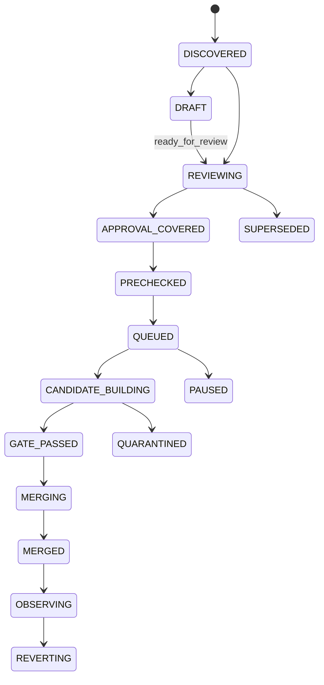
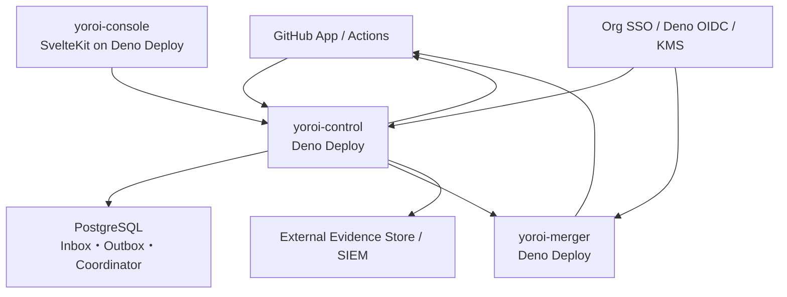
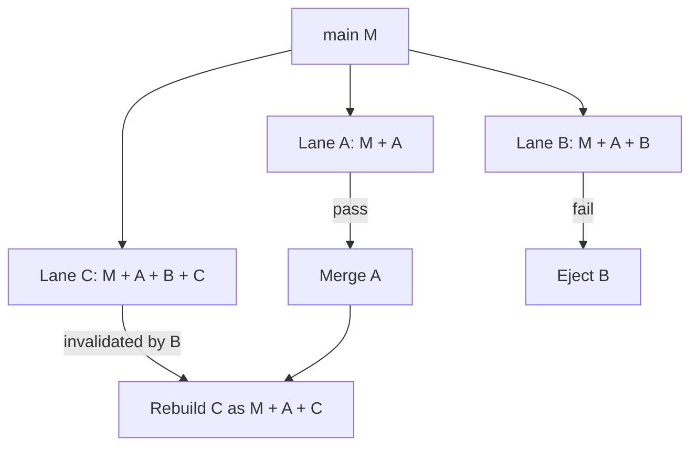
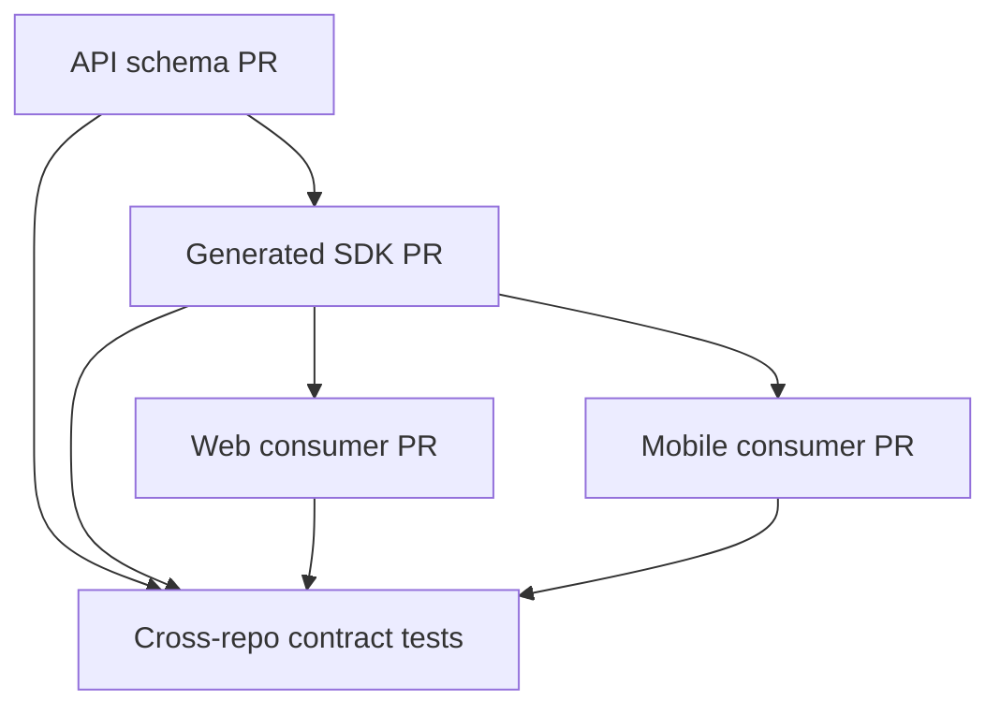

# 構成管理Bot “Yoroi” 汎用要件定義書

> **設計ポジション：安全は厳密に、日常操作は軽く、理由は先回りして伝える。**  
> YoroiはCIを実行するサーバではなく、**誰が・どの内容を承認し、どのexact candidateを・どの根拠で・どの順序に統合してよいか**を説明可能に裁定するコントロールプレーンとする。

## 目次

1. [結論](#1-結論)
2. [目的・スコープ・前提](#2-目的スコープ前提)
3. [調査方法と証拠の扱い](#3-調査方法と証拠の扱い)
4. [既存Bot・プロダクト・OSS運用の比較](#4-既存botプロダクトoss運用の比較)
5. [課題の洗い出し](#5-課題の洗い出し)
6. [いいとこ取りの設計原則](#6-いいとこ取りの設計原則)
7. [利用者・役割・責任モデル](#7-利用者役割責任モデル)
8. [開発者ジャーニー・判定単位・状態機械](#8-開発者ジャーニー判定単位状態機械)
9. [機能要件](#9-機能要件)
10. [贅沢にセキュアな追加機能](#10-贅沢にセキュアな追加機能)
11. [セキュリティ要件](#11-セキュリティ要件)
12. [脅威モデル](#12-脅威モデル)
13. [Deno Deploy構成](#13-deno-deploy構成)
14. [マージスケジューラの詳細](#14-マージスケジューラの詳細)
15. [Policy as Code](#15-policy-as-code)
16. [データモデル・API](#16-データモデルapi)
17. [GitHub Organization・Terraform構成管理](#17-github-organizationterraform構成管理)
18. [非機能要件・SLO](#18-非機能要件slo)
19. [可観測性・運用・インシデント対応](#19-可観測性運用インシデント対応)
20. [段階導入ロードマップ](#20-段階導入ロードマップ)
21. [受入シナリオ](#21-受入シナリオ)
22. [トレーサビリティ](#22-トレーサビリティ)
23. [未決事項](#23-未決事項)
24. [出典](#24-出典)

---

## 1. 結論

### 1.1 推奨する製品像

Yoroiを、**GitHub App + Deno Deploy + PostgreSQLのイベント駆動コントロールプレーン**として実装する。Deno Deployを単なる置換先にはせず、Deno 2 / Node互換、GitHub連携、Timeline、環境別DB、Cron、OpenTelemetry、OIDCを開発・運用・証跡へ一貫して使う。

- GitHub Webhookを受け、署名検証後にtransactional inboxへ永続化し、PR・レビュー・CI・組織設定の状態を収集する。
- 変更範囲、リスク、承認者、CI証跡、mainの最新状態を評価する。
- リポジトリごとのマージ順序を直列化、または安全に投機実行する。
- GitHubには原則1つの必須Check、`yoroi/gate` を返す。
- ビルド、テスト、Terraform plan/apply、デプロイはGitHub Actionsまたは隔離Runnerへ委譲する。
- Deno Deploy上の信頼核はfork PRを含む任意コードを実行しない。完全なDeno/Nodeランタイムを使えることと、未信頼コードを実行してよいことは別である。
- PR作成直後から、必要承認ロール、想定check、高感度scope、次の行動を先回りして表示する。
- rebaseや内容不変のforce-pushでは承認を維持し、実質変更があったscopeだけを再承認対象にする。
- merge、例外、組織設定変更には、再現可能なdecision evidenceを残す。

### 1.2 Yoroiが判定する4層ゲート

| ゲート                 | 判定対象                                              | 合格の意味                                           |
| ---------------------- | ----------------------------------------------------- | ---------------------------------------------------- |
| G1 Identity / Approval | 担当範囲、役割、定足数、職務分離、scope change digest | 必要な人が、現在も同一と証明できる変更範囲を承認した |
| G2 Candidate Integrity | head SHA、base SHA、依存DAG、policy digest            | テスト対象と最終マージ対象が一致する                 |
| G3 Test Evidence       | 動的テスト計画、flaky判定、成果物provenance           | 必要な検証が信頼できる環境で完了した                 |
| G4 Merge Authorization | 順序、最新main、freeze、例外期限                      | 今この瞬間に統合してよい                             |

### 1.3 最重要の設計判断

1. **GitHub側の必須Checkは原則1つにする。** 差分に応じて内部テスト集合が変化しても、`yoroi/gate` が完全性を集約する。
2. **人の承認と実行候補を別の不変条件へ結合する。** 人の承認は `scope change digest + context safety proof + policy digest + role` へ、CIとmerge権限は `exact candidate SHA + base SHA + evidence digest` へ結合する。SHAが変わっても承認した変更が同一で新base上の適用結果を証明できれば承認は維持するが、候補とCIは必ず作り直す。
3. **リポジトリ単位でモードを切り替える。** Observe / Advisory / Serial / Speculative / Batchを同一基盤で提供する。
4. **権限を分割する。** 読取・評価を行うObserver Appと、最終mergeのみを行うMerger Appを分ける。
5. **高リスク変更には追加ゲートを積む。** 二名承認、別チーム承認、trusted CI、手動デプロイ承認などをリスク比例で要求する。
6. **最初の90日はShadow modeとする。** 人間の判断との差、誤判定、待ち時間、CI費用を測ってからmerge権限を渡す。
7. **Fail-closedとセルフサービス復旧を両立する。** policyを弱めるbreak-glassと、現在状態を再取得するだけの `/yoroi recheck` を明確に分ける。
8. **GitHubを日常UIにする。** 一つの更新型summary、Check Run、標準Reviewを中心にし、変更理由・ETA・次の一手をpush型で知らせる。

### 1.4 「大は小を兼ねる」への注意

機能面では、複数の運用モードを持つ大きな基盤が小規模チームにも使える。一方、セキュリティ面では、権限・例外・状態遷移を盛るほど攻撃面と停止要因が増える。

したがって本要件では、次の二層に分ける。

- **豊かな外側**：ダッシュボード、AI要約、影響分析、Terraform drift、cross-repo DAG、flaky分析。
- **小さな信頼核**：Webhook検証、scope change digest / continuity proof、状態機械、gate評価、lease/fencing、merge直前再検証、merge API呼出し。

信頼核は依存を絞り、形式的に近い状態遷移テスト、property-based test、障害注入試験の対象とする。

---

## 2. 目的・スコープ・前提

### 2.1 目的

同時に多数のPRが流れる環境で、レビュー責任、統合順序、CI根拠、構成変更を一貫して裁定し、mainを継続的にgreenに保つ。

単なるmerge queueではなく、次を扱う汎用的な構成管理Botを目指す。

- PRのレビュー・承認・マージ制御
- CI計画と証跡の集約
- flaky testとCI障害の制御
- GitHub Organization / Repository設定のdrift検知
- Terraform plan/applyの安全な承認
- freeze、hotfix、rollback、auto-revert
- 監査証跡と説明可能性

### 2.2 対象範囲

| 領域           | 対象                                                 | 境界                                                           |
| -------------- | ---------------------------------------------------- | -------------------------------------------------------------- |
| Pull Request   | 承認、owner coverage、依存、queue、merge             | コード内容の妥当性そのものは人間とCIが判断する                 |
| CI / CD        | 実行計画、結果収集、provenance、再試行               | YoroiのDeno Deploy app内でbuildやTerraformを実行しない         |
| Org / Repo設定 | Ruleset、App権限、Actions policy、team access、drift | GitHubまたはTerraformのどちらをsource of truthにするか明示する |
| リリース       | freeze、hotfix lane、canary、auto-revert             | 製品固有のdeployはアダプタ化する                               |
| 監査           | 誰が・何を・なぜ許可したか                           | ソース本文やSecretは原則保存しない                             |

### 2.3 非目標（初期）

- 任意のCIエンジンを自前実装すること。
- AIが人間に代わって高リスク変更を承認すること。
- GitHubの権限モデルを迂回する独自ID基盤を作ること。
- 全repoへ同じ承認・テストルールを強制すること。
- Bot停止時に安全ゲートを自動迂回して可用性を稼ぐこと。
- ソースコード全文を長期保存するコード検索・分析基盤になること。

### 2.4 初期前提

- GitHub Enterprise Cloud / GitHub Actionsを主対象とする。
- 実行基盤は新Deno DeployとDeno 2とし、Deploy Classicは採用しない。新Deno DeployにはマネージドQueueがないため、存在しない機能を前提にしない [S36][S39]。
- 本番の権威ある状態、transactional inbox/outbox、branch coordinator、監査検索はPostgreSQLを正とする。Deno Deployから外部PostgreSQLまたはPrisma Postgresを接続する [S48]。
- PoCではDeno KVのatomic transactionを選択可能とするが、単一appへPostgreSQLとDeno KVを同時attachできない現行制約を構成に反映する [S41][S48]。
- Deno Deployのproduction / development / build context、branch / revision timeline、環境別DBを分離し、previewから本番merge資格情報へ到達させない [S43][S47][S48]。
- GHES対応はGitHub APIアダプタ層で分離する。
- 初期規模仮定は最大500 repos、同時2,000 open PR、平常50 webhook events/sとする。これはPoCで実測し、確定値へ更新する。
- TerraformはGitHub Organization、Deno Deploy app/context、接続先cloud resourceの宣言管理に使い、applyは環境承認付きActionsから行う。

---

## 3. 調査方法と証拠の扱い

### 3.1 調査対象

- Rust bors / Rust rollup
- Kubernetes Prow / Tide / OWNERS
- Chromium Gerrit / Commit Queue / OWNERS
- Zuul dependent pipeline
- GitHub Merge Queue
- GitLab Merge Trains
- Graphite Merge Queue
- Aviator MergeQueue
- Mergify Merge Queue
- CPython、LLVM、Linux kernelの人間中心・階層型運用
- 新Deno Deploy、Deno 2、Deno KV、Cron、Timeline、OIDC、OpenTelemetry、database integration
- GitHub Webhook delivery、Git Trees API、Git `patch-id`の同一性特性

### 3.2 証拠の優先順位

1. 公式設計・公式ドキュメント
2. 対象OSSのIssue、公式Community Discussion
3. ベンダー公式ドキュメント
4. 第三者ブログや口コミ

IssueやDiscussionは、統計的な満足度調査としては扱わない。**実際に発生したfailure modeを発見する定性的証拠**として使う。

ベンダー文書に書かれた性能・優位性は、その製品自身の説明である。Yoroiの要件へ採用する場合は、Shadow modeの実測で再検証する。

### 3.3 運用ユーザーレビューの扱い

2026-08-25の運用レビューを、単なる要望一覧ではなく設計のfailure-mode reviewとして扱った。主な判断は次のとおり。

| 指摘                              | 判断                                                                                                                                                          | 反映先                               |
| --------------------------------- | ------------------------------------------------------------------------------------------------------------------------------------------------------------- | ------------------------------------ |
| exact-SHA承認とreviewer枯渇が衝突 | **採用。ただしpatch-id単独は不採用。** 人の承認をscope単位のwhitespace-preserving change digest + context safety proofへ、CI/mergeをexact candidate SHAへ分離 | DP-13、FR-024/025、FR-090、AT-04A〜F |
| PR open時の期待提示               | **MUSTへ昇格**                                                                                                                                                | FR-071、FR-091、NFR-002、AT-25       |
| questionnaire疲れ                 | **該当差分だけ表示**                                                                                                                                          | FR-029、FR-097、AT-27                |
| Draftで無駄なCI/noise             | **Candidateと高コストCIを停止**                                                                                                                               | FR-096、AT-26                        |
| Queue ETA                         | **範囲 + confidenceとして採用**                                                                                                                               | FR-092、NFR-020、AT-33               |
| Speculative再構築の理由通知       | **push型・coalesce付きでMUST**                                                                                                                                | FR-093、FR-101、AT-28                |
| Batch干渉の当事者通知             | **相互linkと最小失敗集合を表示**                                                                                                                              | FR-094、AT-08                        |
| Flakyのself-service               | **報告/申請はself-service、gate弱体化は別承認**                                                                                                               | FR-098、AT-31                        |
| 誤検知時のrecheck                 | **break-glassと分離して採用**                                                                                                                                 | FR-095、AT-29/30                     |
| 異議申立て経路                    | **gate非迂回のfeedback loopを追加**                                                                                                                           | FR-099、AT-32                        |
| 開発者向けdocument不足            | **正式deliverableへ追加**                                                                                                                                     | 23.1 Developer向け正式成果物         |
| Exit criteriaが技術偏重           | **各phaseへDX exitを追加**                                                                                                                                    | NFR-016〜023、20章                   |

このレビューで信頼核を弱めた箇所はない。むしろ「人が承認した変更と文脈」と「機械が実行したcandidate」を別々に証明することで、どの証跡が何を保証するかを明確にした。

---

## 4. 既存Bot・プロダクト・OSS運用の比較

### 4.1 比較表

| 方式                   | 強いところ                                                               | 課題・代償                                                                   | Yoroiへ採用する要素                                |
| ---------------------- | ------------------------------------------------------------------------ | ---------------------------------------------------------------------------- | -------------------------------------------------- |
| Rust bors              | 承認後、最新mainとの統合候補をテストしてからmerge。mainをgreenに保つ     | 長いCIでは直列待ちが増える。rollup失敗時の犯人特定と公平性が難しい [S1][S2]  | exact candidate、明示的状態機械、Serial mode       |
| Kubernetes Prow / Tide | ReviewerとApproverを分離。OWNERSで変更範囲を被覆。pool/batch [S3][S4]    | 設定とstatus contextの組合せが複雑。失敗batchを反復し進まない事例 [S19][S21] | scope approval、pool、batch自動分割                |
| Chromium Gerrit / CQ   | ディレクトリOWNERS、巨大変更専用手続き、patch有無の失敗比較 [S5][S6]     | 運用・インフラが重くGerrit前提                                               | 高感度scope、mega lane、failure comparison         |
| Zuul                   | A、A+B、A+B+Cを並列検証し、実際にmergeされる形をテスト [S12]             | 先頭失敗で後続再実行。学習・運用コスト                                       | speculative train、adaptive window、cross-repo DAG |
| GitHub Merge Queue     | GitHub UI・Rulesetとの統合、導入が容易 [S10]                             | 動的check、診断、API可視性に粗さ。Actions設定ミスが分かりにくい [S15]–[S18]  | GitHub-native UX、aggregate check、reason graph    |
| GitLab Merge Trains    | 累積候補を並列実行し、失敗要素を除いて後続を再構築 [S11]                 | flakyでtrain全体のCI成果が無効化されうる [S24]                               | 選択的再構築、安全な証跡再利用                     |
| Graphite               | stack-aware queue、stackの並列処理、GitHub連携 [S31]                     | 外部SaaSへの権限・metadata委託、lock-in                                      | stacked PR UX、fast-forward可能性の検証            |
| Aviator                | parallel queue、flaky対策、optimistic validation [S32]                   | optimistic時は真の失敗を排除するまで遅くなる                                 | flaky registry、限定的optimistic mode              |
| Mergify                | 宣言的rules、priority queue、GitHub-native automation [S35]              | 複雑なruleの可読性、外部SaaS権限                                             | Policy as Code、rule simulation                    |
| Linux / CPython / LLVM | 階層的信頼、maintainer裁量、revert文化、プロジェクトに合う軽さ [S7]–[S9] | 自動ゲートの強さは一様でなく属人性も残る                                     | 人間の裁量、subsystem delegation、revert first     |

### 4.2 統合するパターン

- **レビュー責任**：Kubernetes / Chromium型
- **統合候補の安全性**：bors型
- **高スループット**：Zuul / GitLab型
- **GitHub上の操作感**：GitHub Merge Queue / Mergify型
- **stacked PR**：Graphite型
- **flaky制御**：Aviator + Chromiumの失敗比較
- **組織ガバナンス**：Terraform + 二者統制
- **障害時文化**：LLVM / Linuxのrevert-firstとmaintainer裁量

---

## 5. 課題の洗い出し

### 5.1 P-01：単体合格と統合後合格は違う

PR A、B、Cがそれぞれmainに対して合格しても、A+B+Cの組合せは未検証である。

- borsは安全側に直列化する [S1]。
- ZuulとGitLabは、A、A+B、A+B+Cという累積候補を投機的に並列実行する [S11][S12]。

**要求への変換**：Serialを正解モデルとし、CI信頼度とリスクが許すrepoだけSpeculativeへ上げる。

### 5.2 P-02：batch失敗で「誰も進まない」

Kubernetes Tideでは、5 PRを含む失敗batchを270回超再試行し、数時間1件もmergeしなかったというIssueがある [S19]。Rust rollupでも、失敗集合から原因PRを人が探し、rollupを作り直す負担がある [S2]。

**要求への変換**：同一batchの無限再試行を禁止し、二分探索またはdelta debuggingで原因PR・相互作用集合を自動特定する。原因不明でも、単体合格したPRをSerial fallbackで前進させる。

### 5.3 P-03：flaky testが後続を巻き込む

投機trainは先頭失敗で後続結果が無効になる。GitLab利用者は、先頭のflaky失敗で全CI成果が失われる問題を報告している [S24]。Aviatorもparallel modeのcascading resetとoptimistic validationのトレードオフを説明する [S32]。

**要求への変換**：test単位のflaky registry、再試行上限、confidence、quarantine期限、circuit breakerを持つ。既知flakyと未知の実失敗を同じ扱いにしない。

### 5.4 P-04：固定のrequired checkと動的CIが噛み合わない

GitHub Merge Queueでは、PR時だけ、またはqueue時だけ走らせたいcheckを自然にrequiredへできず、dummy jobを置く回避策がCommunityで共有されている [S16]。required checkの柔軟性不足に関するRoadmap Issueもある [S17]。

**要求への変換**：GitHub Rulesetは `yoroi/gate` のみを必須にし、内部で期待するcheck集合をYoroiが差分・リスクから動的に決める。

### 5.5 P-05：event raceで早すぎるmergeが起きる

Prow Tideがforce-push直後、遅れて起動するGitHub Actionsのstatusを待たずmergeしたというIssueがある [S20]。別Issueでは、batch時に明示起動jobが走らず、gating目的を外した [S21]。

**要求への変換**：「checkが失敗していない」ではなく、**期待check集合が存在し、対象SHAで完了した**ことを要求する。未起動・遅延・cancelled・別SHAをsuccess扱いしない。

### 5.6 P-06：失敗理由が人に説明されない

GitHub Communityでは、全checkがgreenに見えるのにqueueから外され続けた事例がある。原因は `merge_group` とqueue branchへの`push`で同じworkflowが二重起動し、同一concurrency groupが片方をcancelしていたことだった [S15]。

**要求への変換**：event、SHA、workflow、concurrency rule、期待check、実check、最終結論を因果関係として表示するreason graphを必須とする。

### 5.7 P-07：Queue APIの可視性が弱い

GitHub Communityでは、queue entryごとのrequired check状態をGraphQLで効率よく得にくく、複数queryが必要という要望がある [S18]。

**要求への変換**：Yoroi側に検索用projectionを持ち、GitHub APIを過剰pollingせずにqueue全体の状態を表示する。API情報は定期reconcileする。

### 5.8 P-08：CODEOWNERSだけでは責任の重なりを表現しにくい

GitHub CODEOWNERSには、last match wins、否定パターン不可、同一行の複数ownerはいずれか1名で足りる、といった制約がある [S25]。親owner + 子owner、security owner + data ownerの両方を必須にするには追加の意味モデルが必要である。

**要求への変換**：CODEOWNERSを入力の一つとして扱い、Yoroi独自のownership graphでAND / OR / quorum / fallback / specialist approvalを表現する。

### 5.9 P-09：owner集中と不在でレビューが止まる

150名超・60 reposの利用者は、tech leadに1日20–30件のreview request、応答時間が約4時間から24時間超へ悪化、休暇中owner待ち、跨部門PRの調整を課題として挙げている [S26]。単発の自己申告であり統計ではないが、大規模組織で起こるfailure modeとして具体的である。

**要求への変換**：availability、負荷、domain、timezone、bus factorを考慮して候補を提示し、SLA超過時にfallback teamへescalateする。

### 5.10 P-10：Bot固有コマンドとGitHub標準UIが二重化する

borsのIssueでは、`@bors r+` をGitHub Review API中心へ寄せ、複数reviewerやchanges requestedを標準UIで扱いたい提案がある [S23]。merge conflictがあるPRをr+できた粗さもIssueになった [S22]。

**要求への変換**：通常操作はGitHub Review、Check Run、label、PR UIへ寄せる。slash commandは高度操作の補助に限定する。

### 5.11 P-11：優先laneと公平性がstarvationを生む

Rust rollupには、`never`指定や高リスクPRが低リスクrollupに比べて待ちやすい問題がある [S2]。緊急laneを単純なpriorityだけで作ると、通常PRが永続的に後回しになる。

**要求への変換**：priorityだけでなくaging、lane別予約枠、最大待ち時間、明示的なtree freezeを組み合わせる。順序の理由を公開する。

### 5.12 P-12：例外権限が最弱リンクになる

管理者bypass、優先lane、policy変更は障害時に必要だが、常設の強権限は内部不正やアカウント侵害の近道になる。Organization所有権変更へ複数承認を求めるGitHub Community提案も、一人の強権限への懸念を示す [S34]。

**要求への変換**：break-glassを二名承認、理由、ticket、対象、TTL付きにする。policyやRulesetを弱める変更は、変更前policyの定足数でしか承認できない。

### 5.13 P-13：fork PRとSecretの境界を誤りやすい

`pull_request_target` はbase側のtokenとSecretを持つ。forkの未信頼コードをcheckoutし実行するとpwn requestになる [S27]。

**要求への変換**：未信頼コードと強い資格情報を同じ環境に置かない。fork CIはread-only、Secretなし、ephemeral、必要に応じてegress制限を課す。

### 5.14 P-14：Webhookは重複・欠落・順不同になりうる

GitHubはsignature検証、delivery ID、10秒以内の応答、非同期処理を推奨する一方、失敗したWebhookを自動再送しない [S13]。自前outboxもlease失効やAPI retryにより同一workを再実行しうる。

**要求への変換**：全処理をidempotentにする。event journal、単調な状態機械、GitHub APIとの定期reconcileを持つ。

### 5.15 P-15：Bot自身が単一障害点・単一侵害点になる

Botがmerge権限、組織設定権限、Terraform資格情報、監査削除権限を同時に持つと、侵害時のblast radiusが大きい。

**要求への変換**：Observer、Scheduler、Merger、Terraform Apply、Audit Exportの資格情報とdeploy権限を分ける。Mergerは署名済みdecision envelope以外を受け付けない。

### 5.16 P-16：承認失効がreviewer枯渇を増幅する

P-09のようにownerがすでに逼迫している環境で、承認を生のhead SHAだけへ固定すると、rebase、commit整理、typo修正のたびに再依頼が発生する。安全機構がレビュー待ちを増やし、開発者にforce-push回避や巨大commit温存を促す逆インセンティブになりうる。

一方、Gitの`patch-id --stable`をそのまま信頼核に使うことも危険である。同方式は行番号を無視し、既定ではwhitespaceも無視するため、重複commit探索には有用でも、認可対象の完全同一性証明としては粗い [S49]。

**要求への変換**：人の承認はscope単位のcanonical change digestへ結合し、新base上で承認済み変更を再適用した結果が新headと一致するcontext safety proofを求める。生SHAとresult tree digestは監査文脈として保存し、CI・merge候補のexact-SHA拘束は維持する。証明不能、rename曖昧、submodule、LFS、生成物不整合は安全側に失効する。

### 5.17 P-17：必要条件がPR後半で初めて分かる

CI開始後やreview完了後に「追加のSecurity Approverが必要」「高感度scopeだった」「別のcheckが必要」と判明すると、手戻りと待ち時間が増える。全PRへ長いquestionnaireを出せば、今度はform fatigueが起きる。

**要求への変換**：PR open直後に初期summaryを出し、必要ロール、想定check、高感度scope、Draft時の扱いを示す。risk questionnaireは差分ヒューリスティックが発火した項目だけをprogressive disclosureで尋ねる。

### 5.18 P-18：queueと投機再実行がブラックボックスになる

queue位置だけでは「いつ終わるか」が分からない。Speculative trainでは先行PRの失敗により、自分の変更に問題がなくても候補が作り直される。batch相互作用では、当事者が互いのPRを知らなければ調整できない。

**要求への変換**：lane別実測からETA範囲と信頼度を表示する。先行失敗による再構築は影響PRへ理由をpush通知し、相互作用集合は当事者PRを相互リンクする。通知は一つのsummary/checkを更新して集約する。

### 5.19 P-19：Fail-closedが「詰み感」へ変わる

Yoroiの誤判定、Webhook欠落、GitHub APIの一時的不整合でもmergeは止めるべきだが、軽微な整合性問題まで二名break-glassを要求すると運用者が新しいボトルネックになる。

**要求への変換**：policyを変更せず現在のGitHub状態を再取得する `/yoroi recheck` を、監査・rate limit付きセルフサービスとして提供する。判定への異議はfeedback導線へ送り、異議申立て自体はgateを迂回しない。

### 5.20 P-20：アーキテクチャの複雑さが利用者へ漏れる

4 gate、複数role、5 mode、複雑な状態機械は内部設計として必要でも、一般開発者がすべてを覚える必要はない。開発者向け成果物がrunbookやC4図より弱いと、正しい実装でも「待たされるBot」になる。

**要求への変換**：開発者へは常に「今どこか」「なぜか」「次に誰が何をするか」「いつ頃か」の4点へ翻訳する。Quickstart、FAQ、command reference、troubleshooting、reviewer guideを正式成果物に含め、phase exitへ信頼感指標を追加する。

### 5.21 P-21：新Deno DeployにマネージドQueueはない

Deploy ClassicにはQueuesがあったが、新Deno Deployでは未対応であり、Classicは2026年7月20日にsunsetした [S36]。response後のdetached Promiseや、共有されないmemory/file lockをdelivery保証や直列化に使うこともできない [S37]。

**要求への変換**：PostgreSQLのtransactional inbox/outboxとlease/fencingを正とする。Deno Cronはreconcileとstalled lease回収に使い、低遅延queueの代替と誤認しない。PoCでKVを使う場合もatomic transactionと期限付きleaseを実装し、KV watchをjournalとして扱わない。

---

## 6. いいとこ取りの設計原則

| ID    | 原則                          | 具体化                                                                             |
| ----- | ----------------------------- | ---------------------------------------------------------------------------------- |
| DP-01 | Exact candidate               | CIを通したcommitとmergeするcommitを一致させる                                      |
| DP-02 | Small trusted kernel          | Webhook検証、状態遷移、gate、mergeだけを信頼核にする                               |
| DP-03 | Fail closed for merge         | 不明、欠落、競合、外部障害時はmergeしない。表示と診断は継続する                    |
| DP-04 | Risk proportionality          | 変更影響に応じて承認、CI、queue modeを増減する                                     |
| DP-05 | Human-legible policy          | 機械評価でき、人がPR上で理解できるreason graphを返す                               |
| DP-06 | Idempotent event sourcing     | 重複・順不同を前提にevent journalと単調な状態機械で処理する                        |
| DP-07 | Least privilege by component  | Observer、Merger、Apply、Auditの資格情報を分離する                                 |
| DP-08 | Reconcile, do not assume      | Webhookだけを真実とせずGitHub APIと再照合する                                      |
| DP-09 | Progressive enforcement       | Observe→Advisory→Serial→Speculative/Batchの順に強化する                            |
| DP-10 | Revert is first-class         | merge後の監視、culprit判定、revertまで一連の制御に含める                           |
| DP-11 | Evidence before optimization  | 高速化は安全性が同等と証明できる範囲だけ行う                                       |
| DP-12 | No silent exception           | すべてのbypassにactor、理由、期限、対象、事後処理を要求する                        |
| DP-13 | Content-aware approval        | 人の承認はscope change + context proofへ、CIとmergeはexact candidate SHAへ結合する |
| DP-14 | Explain before waiting        | PR open直後に必要条件を示し、状態変化は理由と次の行動を伴って通知する              |
| DP-15 | Self-service reconciliation   | policy非変更の再照合は開発者が安全に起動できるようにする                           |
| DP-16 | No phantom platform primitive | Deno Deployに存在しないQueue、共有memory、永続filesystemを設計へ持ち込まない       |
| DP-17 | Measure human cost            | 安全性だけでなくreview load、理解度、待ち時間、信頼感をphase exitで測る            |

### 6.1 運用モード

| モード      | 用途               | Bot権限          | 統合方式                             |
| ----------- | ------------------ | ---------------- | ------------------------------------ |
| Observe     | 導入前、新repo     | read + Check Run | 人間のmergeをshadow採点する          |
| Advisory    | 小規模、低リスク   | status/comment   | GitHub native mergeを補助する        |
| Serial      | 高リスク、CI不安定 | merge権限        | 最新main + 1 PRを完全検証する        |
| Speculative | 高頻度、CI安定     | merge権限        | A / A+B / A+B+Cを並列検証する        |
| Batch       | 低リスク、長時間CI | merge権限        | 複数PRをまとめ、失敗時に自動分割する |

---

## 7. 利用者・役割・責任モデル

### 7.1 役割

| 役割              | できること                                  | 制約                              |
| ----------------- | ------------------------------------------- | --------------------------------- |
| Author            | PR作成、依存宣言、risk questionnaire回答    | 自己承認、自分の例外承認は不可    |
| Reviewer          | 実装品質のLGTM、changes request             | 所有範囲の最終承認とは別          |
| Scope Approver    | OWNERS範囲の変更責任を引き受ける            | 対象SHAとscopeにのみ有効          |
| Security Approver | 認証、権限、秘密、supply chainを承認        | 通常owner承認の代替にならない     |
| Data Approver     | schema、migration、retention、PIIを承認     | service owner承認と独立に要求可能 |
| Infra Approver    | Terraform、workflow、runner、networkを承認  | 高リスクでは二名定足数            |
| Release Manager   | freeze、優先度、release train操作           | gate結果を書き換えない            |
| Bot Operator      | pause、replay、deploy、障害対応             | PR承認や単独break-glassは不可     |
| Org Governor      | policy root、App権限、Ruleset変更を複数承認 | 日常queue操作から分離             |
| Auditor           | 証跡、例外、driftの閲覧・export             | mergeやpolicy変更は不可           |

### 7.2 承認カバレッジ

差分からscope集合を生成する。

```text
S = {frontend, payments, database-schema, terraform, auth, ...}
```

各scopeに必要なroleとquorumをpolicyから取得する。全scopeが承認者集合で被覆され、職務分離条件を満たした場合のみG1を合格させる。

- 親scopeと子scopeをANDにするかoverrideにするか明示する。
- 暗黙のlast-matchに依存しない。
- 承認は`scope change digest + context proof policy + scope mapping version + policy digest + actor role`へ固定する。承認時のhead/base SHAとscope result digestも監査文脈として保存する。
- head SHAが変わっても、承認対象scopeのcanonical changeが同一で、新baseへ承認済みchangeを安全に再適用した結果が新headと一致すると証明できれば承認を維持する。
- 内容が変わったscopeだけを失効させ、無関係scopeの承認を維持する。
- base更新やrebaseでmerge結果が変わる場合、G1の人間承認継続とG2/G3の候補・CI再生成を別々に評価する。
- rename、symlink、submodule、Git LFS pointer、generated file、mode変更、scope境界移動、取得不完全などで同一性を証明できなければ、影響scopeを安全側に失効する。
- `git patch-id --stable`はwhitespaceを無視するため、単独で承認継続の権威ある根拠にしない。`--verbatim`の考え方は参照できるが、Yoroiはpath、mode、change kind、binaryを含むversioned SHA-256形式を定義する [S49]。
- owner不在時はfallback teamへSLA付きescalationを行う。
- round-robinは候補提示に使い、責任の所在を曖昧にしない。
- AIはreviewer候補、影響scope、不足テストを提案できるが、承認票は持たない。

#### Scope Change DigestとContext Safety Proof

承認対象はhead全体のsubtreeではなく、承認時baseからheadへのscope内変更である。head全体のtree digestだけでは、main側の無関係な更新で同じPR変更まで失効するため採用しない。

```text
CanonicalChangeRecord = {
  before_path,
  after_path,
  change_kind,              // add, delete, modify, rename, mode
  object_type,
  mode_before,
  mode_after,
  exact_change_bytes,       // whitespaceを保持、hunk位置だけ正規化
  binary_before_after_oids  // binaryは厳格比較
}

ScopeChangeDigest = SHA-256(
  digest_algorithm_version
  || policy_scope_mapping_version
  || scope_id
  || sort(CanonicalChangeRecord)
)

ScopeResultDigest = SHA-256(
  sort(changed_path, object_type, mode, resulting_blob_or_tree_oid)
)
```

continuityはdigest一致だけで完了しない。次の`ContextSafetyProof`も必要とする。

1. Compare / PR files APIで変更候補を得るが、それだけを完全性根拠にしない。old/new両方のbase/headから完全なtree/blob集合を取得する [S50][S54][S55]。
2. old/newの`ScopeChangeDigest`が一致する。whitespace変更は既定で一致しない。
3. old base→old headの承認済みchangeをnew baseへ、hookと外部protocolを無効化した決定論的data-only engineで再適用する。
4. 再適用結果の`ScopeResultDigest`がnew headの結果と一致する。
5. new baseが同じ高感度path/interfaceを変更していた場合は、policyによりcontext re-reviewを要求できる。CI再実行だけで人間のcontext reviewを代替しない。

実装上の安全条件：

- recursive tree応答が`truncated=true`ならsubtreeを個別取得し、完全集合を得るまで判定しない。
- PR files APIは最大3,000 filesのため、大規模PRではtree traversalから独立に完全性を検証する [S55]。
- sourceやbuild scriptを実行せず、Git object/diffをdataとして扱う。外部URL、submodule fetch、LFS smudge、hookを起動しない。
- renameはbefore/after pathと内容を含め、類似度だけで同一としない。
- binary、submodule、symlink、巨大diff、生成物のsource対応が証明できない場合は既定で再承認する。
- formatter等の非semantic変換を自動維持したい場合、低感度scopeに限り、固定versionの決定論的transformerとAST/byte evidenceをpolicyで明示する。AI判断だけで同一としない。
- digest algorithmまたはscope mapping変更時は互換性を明示し、証明不能なら再承認する。
- carry-forwardした承認には、元review ID、旧/新head/base SHA、同一と判定したscope、change/result digest、proof algorithmを表示する。

### 7.3 高感度scope

以下はデフォルトで高感度とする。

- Yoroi自身のpolicy、workflow、コード
- CODEOWNERS / OWNERS
- GitHub Ruleset、App permission、Actions policy
- Terraform、Deno Deploy app/context/database/cloud connection設定
- DB migration、schema削除、data retention
- 認証・認可・暗号・Secret処理
- package publish、release signing、artifact provenance
- 公開APIの破壊的変更

高感度scopeは二名以上、別チーム、content-bound approvalを要求可能にする。人の承認を生SHAへ固定するのではなく、内容同一性の証明強度を上げる。policyを弱める変更は現行policyでしか裁定しない。

---

## 8. 開発者ジャーニー・判定単位・状態機械

### 8.1 開発者ジャーニーを先に定義する

内部のgateや状態名を覚えなくても、AuthorとReviewerが次の行動を判断できることを受入条件にする。

| 段階             | Yoroiの即時動作                                                                     | 開発者に見せるもの                                        | 抑止する負担                            |
| ---------------- | ----------------------------------------------------------------------------------- | --------------------------------------------------------- | --------------------------------------- |
| Draft作成        | webhook永続化、軽量scope/risk推定、初期summary。Candidateと高コストCIは原則作らない | 想定role、想定check、高感度scope、Draft中に省略する処理   | 無駄なCI、早すぎるreview依頼、Bot noise |
| Ready for review | scopeとriskを確定し、必要reviewer候補とcheck planを更新                             | 必要票、推奨reviewer、questionnaire該当理由、開始されたCI | 後出し要件、reviewer探索                |
| Review中         | approval coverageをscope別に集約。push時はchange continuityとcontext proofを判定    | 維持した承認、失効した承認、変更scope、必要な再依頼だけ   | rebase起因の再承認storm                 |
| Queue待ち        | laneへenqueueし、位置・ETA範囲・信頼度を更新                                        | 待ち理由、先行PR、推定時間、優先順位根拠                  | ブラックボックス感、手動問い合わせ      |
| Candidate / CI   | exact candidateを作り、必要jobだけ実行。再構築理由を記録                            | candidate SHA、job選択理由、再実行の原因PR                | 「なぜまたCI？」という混乱              |
| Batch干渉        | 最小失敗集合を探索し、相互作用を学習                                                | 関係PRの相互link、共同で直すべき症状、次のmode            | 原因不明の再試行ループ                  |
| Merge直前        | GitHubから全権威状態を再取得し、lease/fencingを検証                                 | 最終gate、merge予定、変更があれば差分理由                 | stale state merge                       |
| Merge後          | evidenceを確定しpost-merge signalを監視                                             | merged SHA、evidence link、監視状態、revert手順           | 「入った後」が見えない状態              |
| Block / 異議     | `/yoroi recheck`で再照合、`feedback`で異議を受付                                    | 失敗箇所、自己解決手段、応答SLO、case ID                  | Fail-closedによる詰み感                 |

summaryは内部用語を次の4問へ翻訳する。

1. **今どこか**：Review / Queue / CI / Block / Merged。
2. **なぜか**：最上位のreasonと根拠link。
3. **次に誰が何をするか**：Author、Reviewer、Yoroi、Operatorの一つのaction。
4. **いつ頃か**：ETA範囲または、推定不能の理由。

### 8.2 二つの判定Identity

「同じPR」という曖昧な単位をやめ、人のreview continuityと、実行・merge authorizationを分離する。

```text
ReviewIdentity =
  repository_id
  + pull_request_number
  + scope_id
  + scope_change_digest
  + context_safety_proof_digest
  + scope_mapping_version
  + policy_digest
  + actor_stable_id
  + actor_role

CandidateDecisionIdentity =
  repository_id
  + pull_request_number
  + exact_candidate_sha
  + head_sha
  + base_sha
  + ordered_dependency_shas
  + policy_digest
  + expected_check_plan_digest
```

この分離により、内容不変のrebaseでは`ReviewIdentity`を維持できる一方、`CandidateDecisionIdentity`は新SHAとして再生成される。悪意ある差し替え検知と不要な再承認抑止を同時に満たす。

### 8.3 状態機械



### 8.4 状態遷移ルール

- 許可された遷移だけを実行する。
- 古いSHAのeventで新しいSHAの状態を後退させない。
- 各遷移にactor、operation ID、根拠、時刻、入力digestを付ける。
- head更新時はまずscope change continuityとcontext safety proofを判定し、G1のapprovalとG2/G3のcandidate evidenceを別々に失効させる。
- `GATE_PASSED` は期限付きとし、base更新、head更新、policy更新、tree closeで候補判定を失効させる。内容同一scopeの人間承認まで無条件に失効させない。
- `MERGING` 直前にGitHubからhead/base/approval/check/rulesetを再取得する。
- `MERGING` はrepo + target branch単位で一つだけにし、PostgreSQLのleaseと単調増加fencing tokenで多重instanceを排除する。
- `PAUSED` や `QUARANTINED` からの復帰条件をpolicyで明示する。
- Draftではreview escalation、queue登録、Candidate生成、高コストCIを開始しない。Secret scan等のcheap safety checkだけはpolicyで許可できる。

---

## 9. 機能要件

優先度は以下とする。

- **MUST**：merge権限を渡す前に必須
- **SHOULD**：本番運用の成熟に必要
- **COULD**：高度化・効率化

### 9.1 Event ingestion・整合性

| ID     | 優先   | 要求                                                                                                                                                                                             |
| ------ | ------ | ------------------------------------------------------------------------------------------------------------------------------------------------------------------------------------------------ |
| FR-001 | MUST   | Webhook raw bodyへHMAC-SHA256を検証し、event type allowlist、content-type、payload上限を適用する                                                                                                 |
| FR-002 | MUST   | 受信時刻、GitHub delivery ID、installation ID、repository ID、event type、payload digestと再処理に必要な最小event factsをjournalへ記録する。raw payloadを保持する場合は暗号化と短いTTLを適用する |
| FR-003 | MUST   | GitHubへ10秒以内に2xxを返す。応答前にeventをPostgreSQL transactional inboxへcommitし、重い処理をoutbox workerへ分離する。response後のdetached Promiseを唯一のdelivery手段にしない [S13][S37]     |
| FR-004 | MUST   | `delivery ID + installation ID` をidempotency keyとし、同一eventでCheck、queue、mergeを二重実行しない                                                                                            |
| FR-005 | MUST   | 順不同eventを許容し、古いeventで状態を後退させない                                                                                                                                               |
| FR-006 | MUST   | Deno Cronでopen PR、review、check、queue、Ruleset、stalled leaseをGitHub APIと再照合する。Cronは1分粒度のsafety netであり、低遅延queueの代替にしない [S42]                                       |
| FR-007 | MUST   | 再処理、DLQ復帰、手動replayでも同一operationを一度だけ有効化する                                                                                                                                 |
| FR-008 | SHOULD | GitHub API rate limitとsecondary rate limitを監視し、backoff、window縮小、優先event処理を行う                                                                                                    |

### 9.2 Policy・判定

| ID     | 優先   | 要求                                                                                                 |
| ------ | ------ | ---------------------------------------------------------------------------------------------------- |
| FR-010 | MUST   | versioned YAMLまたはJSON policyをschema検証し、org/repo/branch継承、例外、effective policyを決定する |
| FR-011 | MUST   | 同じ入力bundleから同じ判定とreason graphを返す決定論的evaluatorを提供する                            |
| FR-012 | MUST   | invalid syntax、未知field、owner不在、循環継承、空の必須check集合を安全側のerrorにする               |
| FR-013 | MUST   | 過去eventまたは対象PRへpolicyをdry-runし、merge可否、追加CI、待ち時間への影響を比較する              |
| FR-014 | MUST   | GitHub Rulesetへ `yoroi/gate` をrequired checkとして公開する                                         |
| FR-015 | MUST   | 内部の期待check集合、承認coverage、候補SHA、policy versionをCheck Run detailへ表示する               |
| FR-016 | SHOULD | policy schemaのversioning、deprecation、converter、rollbackを提供する                                |
| FR-017 | SHOULD | Shadow判定と実際の人間判断の差を記録し、誤判定を分類する                                             |

### 9.3 Ownership・レビュー・承認

| ID     | 優先   | 要求                                                                                                                                                                                           |
| ------ | ------ | ---------------------------------------------------------------------------------------------------------------------------------------------------------------------------------------------- |
| FR-020 | MUST   | path、component、service、data class、infra resourceをscopeへ写像するownership graphを持つ                                                                                                     |
| FR-021 | MUST   | scopeごとにAND、OR、quorum、role、fallback、separation-of-dutiesを表現する                                                                                                                     |
| FR-022 | MUST   | Reviewer、Scope Approver、Security/Data/Infra Approver、Governorを区別する                                                                                                                     |
| FR-023 | MUST   | Authorの自己承認、Botの自己承認、同一人物による二役充足をpolicyに従い拒否する                                                                                                                  |
| FR-024 | MUST   | approvalをscope change digest、context proof policy、scope mapping version、policy digest、actor roleへ結合し、承認時head/base SHAとresult digestを監査文脈として保存する                      |
| FR-025 | MUST   | head変更後にscope別change continuityとcontext safety proofを判定し、変更が異なるscopeのapprovalだけを無効化する。同一かつ適用結果を証明できれば維持し、判定不能なら影響scopeを安全側に失効する |
| FR-026 | MUST   | changes requested、dismissed review、team membership変更、SSO失効を再評価する                                                                                                                  |
| FR-027 | SHOULD | availability、直近負荷、domain、timezone、bus factorからreviewer候補を提示する                                                                                                                 |
| FR-028 | SHOULD | review SLA超過時にfallback team、manager、release managerへ段階的にescalateする                                                                                                                |
| FR-029 | SHOULD | schema、auth、permission、infra、public API等の差分ヒューリスティックが発火した場合だけ、該当項目のrisk questionnaireを提示する。全PR一律の長いformを禁止し、発火理由と回答用途を表示する      |

### 9.4 Dynamic CI・証跡

| ID     | 優先   | 要求                                                                                                     |
| ------ | ------ | -------------------------------------------------------------------------------------------------------- |
| FR-040 | MUST   | 差分、dependency graph、risk tag、履歴から期待job集合を決める                                            |
| FR-041 | MUST   | 実行するjobだけでなく、選択理由と省略理由を表示する                                                      |
| FR-042 | MUST   | job結果をcandidate SHA、workflow SHA、runner class、input/artifact digestへ結合する                      |
| FR-043 | MUST   | 期待jobが存在し、完了し、対象SHA一致の場合のみ合格する。未起動、遅延、cancelledを成功扱いしない          |
| FR-044 | MUST   | fork/unreviewed CIをread-only token、Secretなし、ephemeral runnerで実行する                              |
| FR-045 | MUST   | Secretを使うjobをreview後のtrusted pipelineへ限定する                                                    |
| FR-046 | SHOULD | test単位の失敗履歴、再現率、owner、quarantine期限をflaky registryへ保持する                              |
| FR-047 | SHOULD | retry回数、backoff、confidence、voting/non-voting扱いをtest classごとにpolicy化する                      |
| FR-048 | SHOULD | patch有無、直前main、同一runner imageの結果を比較し、既知infra failureと変更起因を区別する               |
| FR-049 | SHOULD | source、lockfile、toolchain、workflow、environment、candidate ancestryが同一の場合だけCI結果を再利用する |

### 9.5 Queue・Merge Train

| ID     | 優先   | 要求                                                                                   |
| ------ | ------ | -------------------------------------------------------------------------------------- |
| FR-050 | MUST   | 最新mainへ1 PRを合成し、候補SHAの全gate通過後のみmergeするSerial modeを提供する        |
| FR-051 | MUST   | base更新時に候補を再生成し、旧候補の証跡を最終mergeへ使わない                          |
| FR-052 | SHOULD | A、A+B、A+B+Cを並列検証するSpeculative modeを提供する                                  |
| FR-053 | SHOULD | 先行失敗時、影響を受ける後続だけを新しい累積候補で再実行する                           |
| FR-054 | SHOULD | 成功率、flaky率、CI capacity、riskに応じtrain windowを自動拡縮する                     |
| FR-055 | SHOULD | 低リスクPRをbatch化し、失敗時に二分探索またはdelta debuggingで原因集合を特定する       |
| FR-056 | MUST   | stacked PR、cross-repo/API/schema依存をDAGとして表し、cycle、欠落、逆順mergeを拒否する |
| FR-057 | MUST   | textual conflictをenqueue前とcandidate作成時に検出する                                 |
| FR-058 | MUST   | priority、aging、risk lane、reserved slotで順序を決め、starvationを可視化する          |
| FR-059 | MUST   | 同一batch、同一failure fingerprintの無限再試行をcircuit breakerで止める                |

### 9.6 Merge実行・例外・リカバリ

| ID     | 優先   | 要求                                                                                      |
| ------ | ------ | ----------------------------------------------------------------------------------------- |
| FR-060 | MUST   | merge直前にhead、base、policy、approval、expected checks、tree-openをGitHubから再取得する |
| FR-061 | MUST   | merge API呼出しへ一意なoperation IDを割り当て、retry時も二重mergeしない                   |
| FR-062 | MUST   | pause、drain、tree close、repo quarantine、lane freezeを権限付きで操作する                |
| FR-063 | MUST   | 操作へ理由、対象、actor、期限を要求する                                                   |
| FR-064 | MUST   | break-glassへ二名承認、ticket、TTL、事後reviewを要求する                                  |
| FR-065 | MUST   | Bot、GitHub、Deno Deploy、PostgreSQL、外部証跡先の不整合時はmergeをfail closedにする      |
| FR-066 | MUST   | Bot停止中のeventを保持し、復旧後reconcileして一度だけ処理する                             |
| FR-067 | SHOULD | post-merge signalを監視し、回帰候補をqueue履歴と突合する                                  |
| FR-068 | SHOULD | 単一culpritが明確でrevert安全性を満たす場合、revert PRを自動作成する                      |
| FR-069 | SHOULD | auto-revertがpolicyを満たすrepoだけ自動mergeし、曖昧な場合は人へ委譲する                  |

### 9.7 UX・説明可能性

| ID     | 優先   | 要求                                                                                                                                                                              |
| ------ | ------ | --------------------------------------------------------------------------------------------------------------------------------------------------------------------------------- |
| FR-070 | MUST   | PR上に一つの更新型summaryと一つのaggregate Checkを表示し、同一原因のBotコメントを乱立させない。重要な状態変化だけをtargeted notificationにする                                    |
| FR-071 | MUST   | PR openイベント受信直後に初期summaryを投稿し、現在状態、必要role、該当scope、高感度判定、想定check、不足gate、次の担当、queue位置、ETA、候補SHA、policy versionを段階的に表示する |
| FR-072 | MUST   | event→policy→期待check→実check→結論のreason graphを表示する                                                                                                                       |
| FR-073 | MUST   | raw webhook delivery、Actions run、policy source、decision evidenceへのlinkを表示する                                                                                             |
| FR-074 | SHOULD | org/repo横断dashboardへqueue、aging、review bottleneck、CI reliability、drift、incidentを表示する                                                                                 |
| FR-075 | SHOULD | 同一原因の通知を集約し、owner/SLA/escalationに応じGitHub通知する                                                                                                                  |
| FR-076 | SHOULD | Slack等はadapterとし、通知先を判定のsource of truthにしない                                                                                                                       |
| FR-077 | COULD  | 依存宣言、PR分割、reviewer候補、risk説明、失敗要約をAIが提案する                                                                                                                  |
| FR-078 | MUST   | AI提案をgateの権威ある根拠にせず、決定論的判定から分離する                                                                                                                        |

### 9.8 監査・Evidence

| ID     | 優先 | 要求                                                                                  |
| ------ | ---- | ------------------------------------------------------------------------------------- |
| FR-080 | MUST | review、policy、candidate、CI、merge API responseをdecision evidence bundleへまとめる |
| FR-081 | MUST | evidenceにactorのstable GitHub IDを使い、変更可能なhandleだけに依存しない             |
| FR-082 | MUST | evidence bundleへhash chainを持たせ、独立した保存先またはSIEMへexportする             |
| FR-083 | MUST | actor、PR、SHA、policy、exception、merge、config changeで検索できる                   |
| FR-084 | MUST | 保持期間、legal hold、削除、exportをorg policyで設定できる                            |
| FR-085 | MUST | 全mergeにdecision envelopeとevidence linkが存在することを日次検査する                 |

### 9.9 開発者体験・セルフサービス

レビュー指摘を信頼核と同格の製品要件へ引き上げる。以下は「便利機能」ではなく、回避行動とreviewer枯渇を防ぐ統制である。

| ID     | 優先   | 要求                                                                                                                                                                                                     |
| ------ | ------ | -------------------------------------------------------------------------------------------------------------------------------------------------------------------------------------------------------- |
| FR-090 | MUST   | 承認継続は生head SHA一致ではなく、対象scopeのwhitespace-preserving canonical change digest一致と、新base上のcontext safety proofで判定する。CI・mergeのexact candidate SHA原則は維持する                 |
| FR-091 | MUST   | PR open受信後、初期summaryをp95 30秒以内に投稿し、想定必要role、高感度scope、想定check集合、Draft扱い、次のactionを表示する                                                                              |
| FR-092 | SHOULD | queue位置に加え、lane別の実測throughput、CI所要分布、先行依存からETA範囲・信頼度・主要変動要因を表示する                                                                                                 |
| FR-093 | MUST   | 候補が先行PRの失敗・離脱・順序変更で再構築された場合、影響PR authorへ原因PR、旧/新candidate、再実行範囲、次の見込みを通知する                                                                            |
| FR-094 | SHOULD | batch相互作用で失敗した最小集合の各PRを相互linkし、単体pass・組合せfailの事実、failure fingerprint、調整ownerを当事者へ通知する                                                                          |
| FR-095 | SHOULD | policy変更を伴わないGitHub状態再照合を `/yoroi recheck` とUI actionで提供し、Operator承認を要求しない。coalescing、cooldown、audit、権限確認を行う                                                       |
| FR-096 | MUST   | Draft/WIP PRではCandidate生成、queue投入、review escalation、高コストdynamic CIをskipする。cheap safety checkの実行可否はpolicy化する                                                                    |
| FR-097 | SHOULD | risk questionnaireは差分ヒューリスティック該当時だけ段階表示し、質問ごとに発火path/ruleと回答が変えるgateを説明する                                                                                      |
| FR-098 | SHOULD | developerがflaky failureをself-service reportでき、test ID、run、failure fingerprint、再現率、ownerを自動添付する。quarantineは期限付きproposalとして別権限者が承認し、commandだけでvotingを無効化しない |
| FR-099 | MUST   | 本番稼働後の誤判定・wrong owner・wrong check・unexplained rerun・ETA不満を送れるfeedback/appeal導線を提供し、decision IDと最小metadataを添付する。申立てはgateを迂回しない                               |
| FR-100 | MUST   | slash commandのsyntax、対象状態、実行権限、副作用、idempotency、audit、rate limitをversioned registryとして定義し、`/yoroi help`から参照できるようにする                                                 |
| FR-101 | SHOULD | 通知をblocker、action required、informationalへ分類し、同一原因を一つのsummary/checkへ集約する。authorは非必須通知を選択できる                                                                           |
| FR-102 | MUST   | 内容不変pushではreview requestを再送しない。失効scopeと同じreviewerへの依頼は一定時間coalesceし、reviewerごとの重複依頼率を計測する                                                                      |
| FR-103 | SHOULD | merge後summaryへmerged SHA、merge時刻、decision evidence、post-merge監視、release/freezeとの関係、revert窓口を表示する                                                                                   |
| FR-104 | SHOULD | block理由は人向け文、機械code、根拠link、self-service action、escalation先を必ず持つ                                                                                                                     |
| FR-105 | SHOULD | 初期summary、ETA、再構築通知、approval carry-forwardを本番UI同等のpreviewでShadow mode中にusability testする                                                                                             |

#### 9.9.1 Slash command registry

通常の承認はGitHub Review UI、ready状態は標準Draft UIを正とする。commandは補助であり、PR本文や未信頼文字列をshell、SQL、template式として実行しない。

| Command                                     | 実行者                        | 効果                                                | 非効果・安全境界                                  |
| ------------------------------------------- | ----------------------------- | --------------------------------------------------- | ------------------------------------------------- |
| `/yoroi status`                             | repo read以上                 | 現在のsummaryを再表示し、decision IDを返す          | 再評価・状態変更なし                              |
| `/yoroi why [gate]`                         | repo read以上                 | reason graphの該当箇所を展開する                    | gate変更なし                                      |
| `/yoroi recheck`                            | repo write以上またはPR author | 現在のGitHub権威状態を再取得しevaluatorを再実行する | policy、承認、CI結果を改変せず、mergeを強制しない |
| `/yoroi queue`                              | repo write以上                | queue位置、lane、ETA、先行依存を再表示する          | priority変更なし                                  |
| `/yoroi flaky report <test-id>`             | CI閲覧可能なcontributor       | 現在runをflaky候補として登録し、evidenceを収集する  | quarantineやnon-voting化はしない                  |
| `/yoroi flaky quarantine-request <test-id>` | repo write以上                | 期限・owner付きproposalを作る                       | 承認者なしにgateを弱めない                        |
| `/yoroi feedback <category>`                | contributor                   | decision ID付きfeedback caseを作る                  | gate bypass、merge実行なし                        |
| `/yoroi help`                               | 全員                          | 利用可能commandと権限、例を表示する                 | 状態変更なし                                      |

`ready`はGitHubのReady for review UIを優先し、command aliasを設ける場合も同じ権限・eventへ正規化する。priority、pause、freeze、break-glass、policy変更は一般slash commandへ公開しない。

#### 9.9.2 Recheckの乱用・race対策

- 同じ`repository + PR + head SHA + snapshot watermark`への要求は一つへcoalesceする。
- actor、installation、repository単位のrate limitと短いcooldownを設ける。
- 実行中にheadが変わった場合は古い結果を公開せず、新headをpendingにする。
- GitHub API rate limit中は予想再開時刻を表示し、silent retry loopを作らない。
- 判定が変わらなければ「再照合済み・変化なし」と時刻を表示する。
- 判定が変わった場合は、どのGitHub事実が変化したかをdiffとして残す。

#### 9.9.3 Flaky testのセルフサービス境界

Developerは報告とquarantine申請を自分で開始できるが、安全性を単独で弱められない。

1. `report`はrun URL、test ID、failure signature、同一main上の履歴を自動収集する。
2. Yoroiは既知infra failure、既知flaky、変更起因候補へ分類しconfidenceを表示する。
3. quarantine proposalはowner、理由、expiry、代替signal、修正issueを必須にする。
4. low-risk testはTest Owner一名、高感度gateはTest Owner + Service/Release Ownerなどpolicy定足数で承認する。
5. expiry時に自動復帰し、未修正ならescalateする。無期限quarantineは禁止する。

#### 9.9.4 Feedback / Appeal

- categoryは`false-block`、`wrong-owner`、`wrong-check-plan`、`unexplained-rerun`、`eta`、`accessibility`、`other`を最低限持つ。
- PR/diff全文を外部ticketへ複製せず、decision ID、reason code、repo ID、actorが許可した説明だけを送る。
- 受付は即時ackし、営業時間内の一次応答SLOを定める。
- upheld / Yoroi bug / policy issue / documentation issue / external outageへ分類し、再発率を測る。
- Yoroi bugであっても暗黙mergeはせず、修正deployまたは既存policyの正規な再評価で解消する。

---

## 10. 贅沢にセキュアな追加機能

以下はMVP必須ではないが、「できたら贅沢にセキュア」な機能として設計上の拡張点を確保する。

### 10.1 Observer App / Merger Appの分割

- Observer App：Metadata read、Pull Request read、Checks writeなど。
- Merger App：最終mergeに必要な最小permissionだけ。
- 別Deno Deploy app、別context secret、別deploy権限にする。
- Deno DeployにはCloudflare Service Binding相当を前提にしない。Merger endpointは公開network上でも、短命OIDC tokenと署名済みdecision envelopeを検証し、許可した`org_id / app_id / context / audience`以外を拒否する [S45]。
- Mergerは署名またはMAC済みdecision envelopeだけを受け付ける。

### 10.2 Sign-only KMS / HSM

GitHub App private keyをDeno DeployのProduction context secretへ置く構成から開始できるが、より強くするならDeno Deploy OIDC / Cloud Connectionsで外部KMS/HSMの短命資格情報を得て、JWT署名だけを行い、private keyをappから取り出せないようにする [S45][S46]。

### 10.3 Review Continuity + Exact Candidate Attestation

次を一つの署名対象にする。

- review scope change/result digestとcontext proof集合
- approval actor/roleと元review ID
- head SHA / base SHA（監査文脈）
- exact candidate SHA（実行・merge拘束）
- dependency SHAs
- policy digest
- approval coverage digest
- CI evidence digest
- expiry
- operation ID

これにより、「人が確認した変更」と「新base上の適用文脈」と「テストした候補」と「mergeしたcommit」を区別したまま一つの証跡へ束ねる。承認をcarry-forwardした場合も、旧/新SHA、change/result digest、context proofを含める。

### 10.4 Virtual Integration Branch / Shadow Main

mainへ入る予定の候補を仮想的に積み上げ、consumer contract、DB migration、Terraform plan、preview deploymentを実行する。Git branchを大量作成する方式と、API上のsynthetic merge commit方式をアダプタ化する。

### 10.5 自動的な最小テスト計画

コード依存、サービス依存、schema、Terraform resource、過去の失敗相関から、必要な最小check集合を作る。省略したtestも理由を表示する。

安全なresult reuseは、単なる「同じPR」ではなく、入力digestとcandidate ancestryが一致した場合に限定する。

### 10.6 Semantic conflict検出

Gitのtext conflictだけでなく、次を検出する。

- 同じ公開APIの意味を別々に変更
- DB schemaとconsumerの互換性不一致
- Terraform resourceの競合更新
- feature flagの不整合
- permission modelの組合せ変化
- generated code / lockfile / protocol versionの不一致

### 10.7 Policy What-if Simulator

「承認数を2へ増やす」「queueをSpeculativeへする」「このtestを必須化する」といった変更を過去30〜90日のeventへ再生し、次を比較する。

- merge可能件数
- 誤通過候補
- review待ち増加
- queue待ち変化
- CI費用増減
- owner別負荷

### 10.8 自動culprit特定とrevert

- batch failureはddminで最小失敗集合を探す。
- post-merge regressionは直前queue履歴とtest fingerprintを使ってculprit候補を順位付けする。
- 一意に特定でき、revertが安全な場合だけ自動化する。
- DB migrationや不可逆変更は自動revert対象外にできる。

### 10.9 二重統制付きOrganization Governance

次の変更はpull requestのようにproposal化し、二名以上のGovernor承認を要求する。

- Organization ownerの追加・削除
- GitHub App permission拡大
- Ruleset bypass actor追加
- required check削除
- Yoroi policyの定足数低下
- Actions allowlist緩和
- audit retention短縮
- Secret rotation設定変更

### 10.10 Merge Evidenceの独立保管

Bot自身のDBだけに監査証跡を置かず、hash chain付きbundleを独立したSIEM、監査bucket、または別accountへexportする。Bot operatorが単独で履歴を消せない構成にする。

---

## 11. セキュリティ要件

| ID      | 優先   | 要求                                                                                                                                                                                 |
| ------- | ------ | ------------------------------------------------------------------------------------------------------------------------------------------------------------------------------------ |
| SEC-001 | MUST   | GitHub App permission、Webhook購読、対象repositoryを最小化する [S14]                                                                                                                 |
| SEC-002 | MUST   | installation token生成時にrepositoryとpermissionをさらに限定する                                                                                                                     |
| SEC-003 | MUST   | PATを使用せず、短命installation tokenを必要時生成・cacheする [S14]                                                                                                                   |
| SEC-004 | MUST   | GitHub App private key、Webhook Secretをコード・repo・logへ保存しない                                                                                                                |
| SEC-005 | MUST   | private keyとWebhook Secretのrotation、失効、侵害対応runbookを持つ                                                                                                                   |
| SEC-006 | SHOULD | 高保証構成ではprivate keyを外部KMS/HSMのsign-only運用にする                                                                                                                          |
| SEC-007 | MUST   | raw bodyでWebhook HMACを検証し、比較はtiming-safeに行う                                                                                                                              |
| SEC-008 | MUST   | delivery ID、installation ID、repository ID、許容時間窓でreplayと重複を制御する                                                                                                      |
| SEC-009 | MUST   | fork/untrusted codeをSecret、write token、Merger keyと同じ実行環境へ置かない                                                                                                         |
| SEC-010 | MUST   | `pull_request_target`、`workflow_run`、`issue_comment`等で未信頼コードやartifactを実行しない [S27]                                                                                   |
| SEC-011 | MUST   | untrusted runnerをephemeralにし、内部networkへの到達とegressを必要最小限にする                                                                                                       |
| SEC-012 | MUST   | 第三者GitHub Actionをfull commit SHAへpinし、allowlistと更新手順を持つ                                                                                                               |
| SEC-013 | MUST   | workflow、lockfile、runner image、build toolchainの変更を高感度scopeにする                                                                                                           |
| SEC-014 | SHOULD | SBOM、artifact attestation、provenanceをevidence bundleへ結合する                                                                                                                    |
| SEC-015 | MUST   | Author、Approver、Operator、Governorの職務を分離する                                                                                                                                 |
| SEC-016 | MUST   | 高リスクmerge、policy弱体化、break-glassへ二者統制を要求する                                                                                                                         |
| SEC-017 | MUST   | break-glassに理由、ticket、対象、TTL、自動失効、事後reviewを要求する                                                                                                                 |
| SEC-018 | MUST   | 不整合、欠落、parse error、証跡不明、時刻不明時はmergeをfail closedにする                                                                                                            |
| SEC-019 | MUST   | installation/repository IDを全storage keyへ含め、repo間データ混同を防ぐ                                                                                                              |
| SEC-020 | MUST   | Dashboardと管理APIをorganization SSO/OIDC + RBACで保護し、Merger APIはDeno OIDCのaudience、issuer、expiry、org/app/context claimとdecision署名を検証する [S45]                       |
| SEC-021 | MUST   | 高権限操作へ再認証、CSRF防御、監査、必要に応じdevice/IP条件を課す                                                                                                                    |
| SEC-022 | MUST   | ソース本文、diff全文、Secretを原則保存せず、ID、digest、decision metadata中心にする                                                                                                  |
| SEC-023 | MUST   | payload、CI metadata、audit evidenceごとに保持期間と削除手順を定義する                                                                                                               |
| SEC-024 | MUST   | installation/repository/actor別rate limit、PostgreSQL outbox backpressure、dead-letter状態と再投入手順を実装する                                                                     |
| SEC-025 | MUST   | event replay、DB復旧、policy rollback、key revocation、Merger停止を定期演習する                                                                                                      |
| SEC-026 | MUST   | Yoroi自身が自分のrequired check、App権限、policy定足数を単独で弱められない                                                                                                           |
| SEC-027 | MUST   | 本番deployを保護branch、review、署名、Deno revision preview、段階rollout、timeline lockで制御する [S43]                                                                              |
| SEC-028 | SHOULD | Deno Deploy revision、build、依存、SBOM、source revision、contextを追跡可能にする                                                                                                    |
| SEC-029 | MUST   | 新Deno Deploy runtimeが`--allow-all`相当で動作することを前提とし、ローカルDeno permission flagを本番security boundaryとして主張しない [S37]                                          |
| SEC-030 | MUST   | Ingress/Controlは一app内の分離moduleとし、MergerとDashboardを別appへ分ける。各appへ必要なproduction secretだけを割り当て、Development / Build contextへMerger secretを置かない [S47] |
| SEC-031 | MUST   | branch/revision previewには環境分離DBを使い、本番DBへfallbackしない。現行のshared preview DB制約をtest data設計へ反映する [S48]                                                      |
| SEC-032 | MUST   | instance間でmemory、CPU、filesystemが共有されないため、local mutex、local file、in-memory queueを直列化・永続化の根拠にしない [S37]                                                  |
| SEC-033 | MUST   | PostgreSQL coordinatorへlease expiryと単調増加fencing tokenを持たせ、古いinstanceからのmerge requestをMerger側でも拒否する                                                           |
| SEC-034 | MUST   | Deno Deploy OIDC tokenの`aud`、`iss`、`exp`、organization、app、contextを検証し、development revisionや別appのtokenを本番操作へ流用できないようにする [S45]                          |
| SEC-035 | MUST   | OIDC/Cloud ConnectionでAWS/GCP/Vault/KMSへ接続する場合、長期static cloud keyを避け、subject/attribute条件をappとproduction contextへ限定する [S45][S46]                              |
| SEC-036 | MUST   | Deno KVを採用する場合、primary data locationと組織のresidency要件を照合し、不適合なら承認・監査の正本に使わない [S40]                                                                |
| SEC-037 | MUST   | Deno Deploy built-in logの保持期間だけに監査を依存せず、merge evidenceを改ざん耐性のある外部保存先へ継続exportする [S39][S44]                                                        |
| SEC-038 | MUST   | dependencyは`deno.lock`をcommitし、JSR/npm importをlockし、build時network取得の再現性とprovenanceを検証する                                                                          |

---

## 12. 脅威モデル

| 脅威                          | 典型シナリオ                                        | 主要対策                                                                                           | 残余リスク                              |
| ----------------------------- | --------------------------------------------------- | -------------------------------------------------------------------------------------------------- | --------------------------------------- |
| 悪意あるfork                  | PR buildでSecret窃取、cache poisoning               | SEC-009〜011、Secretなし、ephemeral、egress制限                                                    | テスト基盤DoS                           |
| 侵害されたmaintainer          | approval後の内容差替え、bypass、policy弱体化        | scope change digest、context proof、exact candidate、二者統制、self-protection                     | 複数account侵害、同一性classifierの欠陥 |
| 悪意あるAction                | tag差替え、token exfiltration                       | full SHA pin、allowlist、最小token                                                                 | pin先自体の脆弱性                       |
| Bot supply chain              | Deno revision改ざん、依存package侵害                | protected deploy、lockfile、SBOM、revision trace、timeline lock/rollback                           | Deno accountまたは依存元侵害            |
| Webhook spoof/replay          | 偽review/check、duplicate operation                 | HMAC、dedupe、state machine                                                                        | GitHub側secret侵害                      |
| Race / stale state            | 新commit前のgreen statusでmerge                     | expected checks、SHA binding、直前再取得                                                           | 外部API整合遅延                         |
| CI flaky / outage             | 無限retry、starvation、誤green                      | registry、circuit breaker、Serial fallback                                                         | 判別不能なintermittent failure          |
| 内部operator                  | 監査削除、例外常設、Secret閲覧                      | RBAC、dual control、外部export、KMS                                                                | 特権者共謀                              |
| 設定drift                     | RulesetやApp権限を画面変更                          | Terraform reconcile、alert、承認付きremediation                                                    | 検知までの時間窓                        |
| Cross-repo confusion          | repo Aの証跡をrepo Bへ適用                          | repo ID付きkey、explicit DAG、tenant isolation                                                     | GitHub API側の誤設定                    |
| AI prompt injection           | PR本文でBot要約や提案を誘導                         | AI出力を非権威化、tool allowlist、構造化入力                                                       | 誤った人間判断への影響                  |
| Preview credential leak       | branch/preview revisionから本番Merger keyやDBへ到達 | context分離、環境別DB、OIDC claim pinning、別app                                                   | Deno org admin侵害                      |
| Split-brain coordinator       | 複数instanceが同じbranchのlockを保持したと誤認      | PostgreSQL lease、fencing token、Merger側token検証                                                 | DB重大障害、clock設定不良               |
| Approval continuity collision | 粗いpatch同一判定で実質変更を見逃す                 | exact whitespace change digest、deterministic replay、result digest、algorithm version、曖昧時失効 | Git/GitHub object modelの未知ケース     |
| Recheck abuse                 | comment floodでGitHub API枯渇                       | actor権限、coalescing、cooldown、rate limit、audit                                                 | 分散した正規actorによるDoS              |

### 12.1 最重要の信頼境界

**最も強い秘密と、最も危険な入力を同じ実行環境へ置かない。**

- Merger App keyとfork PRコードを分離する。
- Terraform apply credentialとuntrusted artifactを分離する。
- GitHub App private keyと一般dashboard processを分離する。
- Audit deletion権限とmerge権限を分離する。
- Development / Preview contextとProduction Merger identityを分離する。
- Deno appのfull runtime権限と、GitHub Appの権限を別の境界として設計する。

---

## 13. Deno Deploy構成

### 13.1 採用判断

新Deno Deployを**実行・配布・環境分離・可観測性の基盤**として採用する。状態の正本と直列化はPostgreSQLへ置く。これはDeno Deployを軽視する判断ではなく、同サービスの地の利と限界を正しく分担する判断である。

| Deno Deployの特性                       | Yoroiでの活用                                                                         | 設計上の注意                                                      |
| --------------------------------------- | ------------------------------------------------------------------------------------- | ----------------------------------------------------------------- |
| Deno 2 / Node互換、npm/JSR              | TypeScript、Octokit、`pg`、OpenTelemetry周辺の資産を再利用する [S38]                  | lockfileと依存allowlistを必須にする                               |
| isolated Linux上のfull runtime          | native Node addonやsubprocessも利用可能なため、管理toolingとlocal再現性を高める [S37] | 本番は`--allow-all`相当。未信頼PRを同じappで実行しない            |
| GitHub repository連携と自動build        | protected branchからrevisionを作り、build eventを監査へ結合する [S43][S52]            | GitHub連携自体をmerge権限の根拠にしない                           |
| production / branch / revision timeline | policy simulatorとUIをpreview URLで確認し、直前revisionへrollbackする [S43]           | preview DBの共有範囲と本番secret分離を検証する                    |
| environment別database                   | production、branch、previewの状態を分離する [S48]                                     | 現行では一appに一DB instance。複数appの自動DBは別logical DBになる |
| Deno Cron                               | reconcile、SLA scan、lease回収、evidence欠落監査を実行する [S42]                      | 最小1分。重複実行は抑止されるが、通常queueの代替ではない          |
| built-in OpenTelemetry                  | revision/context/trace単位でwebhookからdecisionまで追跡する [S44]                     | built-in log保持だけを監査保存にしない                            |
| Deno OIDC / Cloud Connections           | AWS/GCP/Vault/KMSへ短命資格情報で接続する [S45][S46]                                  | audienceとorg/app/context claimを厳密にpinする                    |
| cold startとscale-to-zero               | 低トラフィックrepoの費用を抑える [S37]                                                | global constructorを軽くし、local memoryへ状態を置かない          |

### 13.2 推奨論理構成



#### Deno Deploy apps

| App             | 公開入口                       | 保持する資格情報                                                | 責務                                                                     |
| --------------- | ------------------------------ | --------------------------------------------------------------- | ------------------------------------------------------------------------ |
| `yoroi-control` | GitHub webhook、read/admin API | Webhook secret、Observer App key、PostgreSQL role、OIDC発行権限 | ingress、policy、state machine、outbox drain、scheduler、Check Run、Cron |
| `yoroi-merger`  | OIDC保護されたmerge endpoint   | Merger App key、decision署名検証key                             | envelope検証、GitHub再取得、fencing検証、merge一回実行                   |
| `yoroi-console` | SSO保護UI                      | 本番merge secretなし                                            | SvelteKit UI、read API利用、recheck/feedback操作 [S51]                   |

IngressとControlは同じapp・同じPostgreSQLへ置く。Deno Deployの自動database isolationはapp単位で別logical DBを作るため、無理に別appへ分けて共有DBを暗黙期待しない [S48]。最強権限のMergerだけは別app・別GitHub App・別deploy権限へ分離する。

より厳格な組織ではIngressを別appへ分離できるが、その場合は両appが明示的に共有する外部PostgreSQLと最小DB role、または耐久性のある外部message serviceを設計しなければならない。HTTP転送だけをdelivery guaranteeにしない。

### 13.3 Webhook ingressとtransactional inbox/outbox

新Deno Deployにはmanaged Queueがない [S36]。以下を標準フローとする。

1. raw bodyのサイズ、content type、event allowlistを検査する。
2. raw bodyのままHMACをtiming-safeに検証する。
3. PostgreSQL transactionで`webhook_inbox`へdelivery ID、payload digest、再処理に必要な最小event factsをunique insertし、同transactionで`work_outbox`へ初期workを作る。raw payloadが必要なeventは暗号化し短いTTLを付ける。
4. commit後、request budget内で現在eventを含む少数workをbounded drainする。初期summaryのp95 30秒を狙う。
5. GitHubへ10秒以内、内部目標p95 1秒以内に`202 Accepted`を返す。
6. 未処理workは後続webhookのbounded drainとDeno Cronのsweepで回収する。
7. outbox workerはlease付きclaimを行い、成功時ack、失敗時backoff、上限超過時dead-letter状態へ移す。

禁止事項：

- `return Response`後のdetached Promiseだけへ処理継続を委ねない。
- in-memory arrayをqueueと呼ばない。
- local filesystemをjournal、lock、evidence正本にしない。
- Deno Cronだけへ通常eventの低遅延処理を依存しない。
- GitHubはfailed webhookを自動redeliverしないため、reconcileを省略しない [S13]。

#### Outbox claimの概念

```sql
BEGIN;
SELECT id
FROM work_outbox
WHERE state = 'pending' AND available_at <= now()
ORDER BY priority DESC, created_at
FOR UPDATE SKIP LOCKED
LIMIT 20;

UPDATE work_outbox
SET state = 'leased', lease_owner = $instance,
    lease_until = now() + interval '30 seconds', attempt = attempt + 1
WHERE id = ANY($ids);
COMMIT;
```

実処理の副作用には`operation_id`をunique keyとして付ける。DB transactionとGitHub APIを一つの分散transactionに見せかけず、intent、API response、reconcile結果で収束させる。

### 13.4 Branch coordinator：lease + fencing

Deno Deploy instanceは複数region/instanceで動作し、memoryやdiskを共有しない [S37]。`repository_id + target_branch`ごとにPostgreSQL rowを一つ持ち、次を原子的に更新する。

```text
BranchLease = {
  installation_id,
  repository_id,
  target_branch,
  holder_operation_id,
  lease_until,
  fencing_token,      // 取得ごとに単調増加
  expected_base_sha,
  state_version
}
```

- lease取得時に`fencing_token`を必ず増やす。
- Controlが作るdecision envelopeへtokenを含める。
- MergerはDBの現在tokenまたは署名された短命lease証明と一致しなければ拒否する。
- lease更新失敗後の古いinstanceは、たとえ処理を継続していてもmergeできない。
- Deno Cronはstalled leaseを検出するが、期限だけで旧operationの副作用を信頼しない。
- database時刻を期限判定に使い、instance local clockへ依存しない。

### 13.5 PostgreSQLとDeno KVの使い分け

| 項目         | PostgreSQL（本番推奨）                                           | Deno KV（PoC / 小規模option）                                |
| ------------ | ---------------------------------------------------------------- | ------------------------------------------------------------ |
| transaction  | inbox/outbox、projection、coordinatorを一transactionへ束ねやすい | versionstamp checkを使うoptimistic atomic operation [S41]    |
| queue claim  | `SKIP LOCKED`、lease、DLQ、検索を明示実装                        | key設計、lease、retry、DLQをすべて自前実装                   |
| audit/search | SQL、index、BI/SIEM exportに向く                                 | secondary indexを別keyとして維持する必要                     |
| environment  | Deno Deployがtimeline別logical DBを自動作成 [S48]                | timelineに対応したKVへ自動接続 [S40]                         |
| residency    | provider/regionを要件に合わせて選択                              | primary data locationなど現行仕様を事前確認 [S40]            |
| watch        | LISTEN/NOTIFYは補助signalとして利用可能                          | `watch`は全中間変更を保証しないためjournal/queueに不可 [S53] |
| app接続      | 一appにつき一DB instance                                         | PostgreSQLと同じappへ同時attach不可 [S48]                    |

PoCでDeno KVを使う場合のkey例：

```text
["delivery", installation_id, delivery_id]
["outbox", shard, available_at, operation_id]
["branch", installation_id, repository_id, target_branch]
["decision", repository_id, pr_number, decision_id]
```

KV atomic operationのcheck/mutation/size上限を負荷試験へ含める。`watch`通知の欠落・圧縮を前提に、定期scanとGitHub reconcileを残す [S41][S53]。

### 13.6 Deno Cronの正しい役割

最低限、次のCronを定義する。

| Job                        | 目安 | 用途                                             | 失敗時                                                  |
| -------------------------- | ---: | ------------------------------------------------ | ------------------------------------------------------- |
| `outbox-sweep`             |  1分 | pending/stalled workを回収                       | exponential retryを設定し、5回以内。未回復はalert [S42] |
| `github-reconcile`         |  5分 | active PR/check/review/queueを再照合             | repo shardごとにcursor継続                              |
| `approval-membership-scan` | 15分 | team membership/SSO変更でcoverage再評価          | 影響PRだけ再判定                                        |
| `evidence-completeness`    |  1日 | merge済みdecision envelope欠落を検査             | Critical alert、監査case作成                            |
| `ttl-expiry`               |  1分 | break-glass、quarantine、freeze、lease期限を処理 | 期限超過を安全側に停止                                  |

Deno Cronは同じjobのoverlapを防ぎ、実行中なら次回をskipする。failure retryは既定で自動ではないため、retry policyを明示する [S42]。長い全件scanを一回に詰めずcursorで分割する。

### 13.7 Timeline・Preview・Rollbackをpolicy開発へ使う

- PRごとのrevision previewでYoroi console、policy reason graph、schema migrationを確認する。
- Git branch timelineはDevelopment contextと非本番DBへ接続する。
- Production timelineだけがObserver/Mergerのproduction identityを利用できる。
- policy changeは過去event replayと対象repo sandboxでwhat-if結果を生成する。
- rollout中はproduction timelineを意図したrevisionへlockし、build完了だけで自動切替しない運用を選択可能にする [S43]。
- rollbackは以前のrevisionを選べるが、DB migrationの前方/後方互換性を別gateにする。
- Deno Deployのpre-deploy commandでmigrationを実行する場合、expand/contract方式、advisory lock、再実行安全性を要求し、migration成功をrevision rolloutの前提にする [S48]。
- 現行のsingle shared preview DBはpreview間のtest data衝突を起こしうるため、tenant prefixとcleanupを必須にする [S48]。

### 13.8 OpenTelemetryとrevision-aware evidence

Deno Deployの組込みlogs、traces、metricsを使い、次のtraceを一続きにする [S44]。

```text
GitHub delivery
  -> inbox transaction
  -> policy evaluation
  -> Check Run update
  -> candidate dispatch
  -> CI evidence ingestion
  -> merger authorization
  -> GitHub merge response
```

全spanへ`delivery_id`、`operation_id`、`decision_id`、`repository_id`、`pr_number`、`head_sha`、`candidate_sha`、`policy_digest`、`deno_revision_id`、`context`を付ける。source本文、token、Webhook secret、private keyは属性へ入れない。built-in observabilityは診断用、外部evidence storeは監査正本とする。

### 13.9 OIDCでstatic cloud credentialを減らす

Deno DeployのOIDC tokenはorganization、app、context、revision/deployment等のclaimを持ち、短命である [S45]。これを次へ使う。

- 外部KMSでdecision envelopeまたはGitHub App JWTをsignする。
- S3/GCSのappend-only evidence prefixへ書き込む。
- Vaultから短命database/audit credentialを取得する。
- `yoroi-control`から`yoroi-merger`を呼ぶ際のcaller identityとする。

受信側は`aud`を個別serviceへ限定し、production contextと許可app IDを照合する。revision IDを固定しすぎると通常deployで停止するため、許可production app + protected deployment provenance + envelope署名を組み合わせ、緊急rollback手順も定義する。

### 13.10 GitHub Appと実行責務の分割

#### Observer App

想定permissionの例。実装時にGitHub API endpointごとの最小permissionを再確認する。

- Metadata: Read
- Pull requests: Read
- Checks: Read and write
- Commit statuses: Read
- Actions: Read
- Contents: Read（scope change/result digest取得に必要）
- Members: Readが必要な場合のみ
- Administration: 原則なし

#### Merger App

- merge APIに必要な最小permissionのみ。
- repositoryを限定してinstallする。
- private key、Deno app、deploy roleをObserverから分ける。
- token生成はmerge直前のみとする。
- OIDC + decision envelope + current fencing tokenを検証する。
- Development contextでは起動しても本番merge資格情報が存在しない構成にする。

#### CI / Terraform Apply Identity

- GitHub AppやDeno Deploy runtime identityとは別にする。
- GitHub Actions OIDCまたは短命cloud credentialを使う。
- environment protectionと人間の承認を要求する。
- plan artifact digestをapply時に再照合する。
- Deno Deploy内でforkのbuild、test、Terraform applyを実行しない。

### 13.11 Deno Deploy採用時の明示的な非依存

Yoroiは次のDeno Deploy機能がなくてもcore domainを移植できるようadapterを切る。

- `EventStore`：PostgreSQL / Deno KV
- `WorkScheduler`：transactional outbox / 外部managed queue
- `Coordinator`：PostgreSQL lease / KV OCC
- `IdentityIssuer`：Deno OIDC / cloud workload identity
- `TelemetrySink`：Deno OTel / standard OTLP
- `EvidenceSink`：S3 / GCS / SIEM

ただし最初から最低公倍数へ寄せず、Timeline、context、Cron、OIDC、built-in OTelはDeno Deploy実装で積極的に使う。移植性はdomain portで確保し、Denoの地の利はadapterで捨てない。

### 13.12 現行Deno Deploy制約を要件へ固定する

2026-08-25時点のplatform前提をADRとcapacity testへ固定し、変化したら再評価する。

| 制約                                                                                           | 本PJの判断                                                                                                                                                                    |
| ---------------------------------------------------------------------------------------------- | ----------------------------------------------------------------------------------------------------------------------------------------------------------------------------- |
| 新Deployは2 deployment regions、managed Queueなし [S36]                                        | GitHub APIとprimary DBに近いUS配置を第一候補にし、multi-region active-activeを前提にしない。latency/DRをPoC計測する                                                           |
| instanceはscale-to-zeroし、単純appでもcold start、停止時は短いgrace periodがある [S37]         | global initializationを軽くし、各workを短くcheckpoint可能にする。shutdown handlerはbest effortであり、lease回収を正とする                                                     |
| Free planは1日log retention、request/CPU/memory/app/member等に上限がありSLAがない [S39]        | local/preview/Shadowに有用。本番merge authorityはquota実測、support、SLA、DPA、監査保持を満たすplan/構成が決まるまでGoにしない                                                |
| Free planのCronはrevisionあたり上限がある [S39][S42]                                           | MVPは5 jobへ集約し、repoごとのCronを作らずsharded scanにする                                                                                                                  |
| appへattachできるdatabase instanceは一つ。preview deploymentは現行一つのpreview DBを共有 [S48] | control appはPostgreSQL一つへ集約。preview dataをtenant prefixで隔離し、production fallbackを禁止する                                                                         |
| 外部PostgreSQL接続でDeno Deployの固定egress IP一覧は現時点で提供されない [S48]                 | network IP allowlist必須環境では未解決blockerとする。Deno provisioned DB、TLS/CA、最小DB role、credential rotation、DB proxy等を比較し、public unauthenticated DBを許可しない |
| Deno KVはglobally distributedだがprimary location/residencyに制約 [S40]                        | merge metadataのresidency要件と合わなければPoC cacheにも使用しない                                                                                                            |
| Production runtimeはDeno permission sandboxを適用した制限実行ではない [S37]                    | `--allow-net`等のlocal testは開発事故防止に使えるが、本番境界はapp/context/credential/DB role/OIDCで作る                                                                      |

Free planの数値上限は変更されうるため本文へcapacity commitmentとして埋め込まず、deploy前checklistで公式pricingを再確認する。Yoroi自身はquota残量を監視し、approach-to-limitをqueue ETAとoperator alertへ反映する。

### 13.13 実装言語・repository構成

実装言語は**TypeScript on Deno 2**を標準とする。Node互換を逃げ道ではなく資産として使い、runtime-nativeなWeb APIとnpm ecosystemを使い分ける [S38]。

```text
apps/
  control/        # Deno.serve, webhook, API, Deno.cron
  merger/         # 最小dependencyの信頼核
  console/        # SvelteKit
packages/
  domain/         # state machine, gates, scope digest, invariants
  github/         # Octokit adapter
  postgres/       # inbox/outbox, projection, lease/fencing
  policy/         # schema, evaluator, reason graph
  evidence/       # envelope, signature, export
  notifications/  # summary, Check Run, command parser
```

- `strict` TypeScript、明示的なruntime schema validation、exhaustive state transitionを必須にする。
- control/mergerは`Deno.serve`とWeb Cryptoを基本にし、HTTP frameworkを信頼核の必須依存にしない。
- GitHubはOctokit、PostgreSQLは成熟したNode互換clientを使えるが、dependencyとtransitive permissionをreviewする。
- `deno.lock`をcommitし、CIはfrozen lockfile相当で再現する。任意URL importを無制限に増やさない。
- `Deno.test`でunit/integration、property-based testでstate transition、testcontainer相当のPostgreSQLでtransaction競合を検証する。
- localではDeno permissionを絞って事故を早期検知するが、本番security claimには使わない。
- domain packageはDeno Deploy APIへ直接依存せず、Timeline/OIDC/Cron/OTelはadapterで利用する。

---

## 14. マージスケジューラの詳細

### 14.1 Serial mode

```text
candidate = merge(latest_main, PR_A.head)
run expected checks(candidate)
if all gates pass and latest_main is unchanged:
    merge PR_A
else:
    rebuild or stop
```

最も理解しやすく、安全性の基準となる。高リスクrepo、CIが不安定なrepo、queue障害時のfallbackに使う。

### 14.2 Speculative mode



重要なのは、Cを元のmainだけに対してテストするのではなく、先行A/Bが成功すると仮定した累積候補でテストすること。

Bが失敗した場合は、Cの元の結果を無条件に使わず、`M + A + C` として再構築する。その際Cのauthorへ、`先行PR Bの候補失敗により、C自身の失敗ではないが統合前提が変わった`こと、再利用できたjob、再実行するjob、更新ETAをsummary/Checkでpush通知する。raw内部eventを一件ずつcommentしない。

### 14.3 Adaptive window

train幅を固定しない。

増やす条件：

- 直近のcandidate成功率が高い
- flaky率が低い
- CI capacityに余裕がある
- PR riskが低い
- dependency graphが単純

縮める条件：

- 先頭失敗が連続
- flakyまたはinfra failureが増加
- GitHub API rate limit逼迫
- main incident、release freeze
- high-risk PRが先頭に来た

最小幅は1、すなわちSerial modeとする。

### 14.4 Batch / Rollup

Batch対象の既定条件例：

- small diff
- code owner承認済み
- high-sensitive scopeを含まない
- migration、auth、permission、Terraformを含まない
- 単体precheckがgreen
- 明示依存がない
- `batch: never` ではない

失敗時は次の順で処理する。

1. infra failureか判定する。
2. 既知flakyか判定しpolicy上限内でretryする。
3. 同じbatchを無限再実行しない。
4. 二分探索またはddminで最小失敗集合を探す。
5. 単体原因が見つかればquarantineする。
6. 相互作用だけで失敗する場合はその組を同時batch禁止として学習する。
7. 原因不明でも、合格候補をSerial fallbackで前進させる。

相互作用集合が`{A, B}`と判明した場合は、AとBの両PRへ次を表示する。

- 単体ではpass、`A+B`では同じfailure fingerprintでfailしたこと。
- 相手PRへのlinkと、関係するtest/component owner。
- 次回から同一batchへ入れない学習rule、そのTTLと解除条件。
- 協調修正、順序指定、Serial検証のどれを次のactionにするか。

学習ruleを永久化せず、baseや関係pathが変わった時点で再検証できるようにする。

### 14.5 公平性

queue scoreの概念例：

```text
score =
  explicit_priority
  + aging_bonus
  + release_deadline_bonus
  + starvation_bonus
  - risk_penalty
  - unresolved_dependency_penalty
```

ただし、high riskを永遠に後回しにしない。lane別予約枠、最大待ち時間、release manager reviewを用いる。

#### ETA

ETAは一つの確定時刻ではなく、`P50–P90`の範囲とconfidenceを返す。

```text
ETA =
  remaining_predecessor_service_time
  + expected_candidate_build_time
  + selected_check_duration_quantiles
  + expected_rebuild_penalty
  + capacity_wait
```

- repo/lane/check plan別の直近実測をEWMAとquantileで更新する。
- 高いflaky率、GitHub outage、未知check planではconfidenceを下げる。
- 予測不能なら偽の精密値を出さず、変動要因と次回更新条件を表示する。
- ETA誤差、coverage、calibrationを運用指標にし、priority判断そのものへ無批判に使わない。

### 14.6 Cross-repo DAG

例：schema producerとconsumerを同時に変更する場合。



- dependency cycleを拒否する。
- producerの破壊変更をconsumer未対応のままmergeしない。
- cross-repo candidateの証跡を各repoのdecision envelopeへ含める。
- 一部merge後の障害に備え、roll-forward / rollback順序を定義する。

---

## 15. Policy as Code

### 15.1 概念例

```yaml
version: yoroi/v2

defaults:
  gate_check: yoroi/gate
  queue:
    mode: serial
    aging: 8h
    eta:
      enabled: true
      display: range
  approval_continuity:
    algorithm: scope-change-v1
    whitespace: exact
    context_proof: deterministic-replay
    high_risk_base_overlap: reapprove
    ambiguous: invalidate-affected
  draft:
    candidate: disabled
    checks: [secret-scan]
  questionnaire:
    mode: triggered
  notifications:
    mutable_summary: true
    coalesce: 10m

scopes:
  - id: infrastructure
    match:
      - 'infra/**'
      - '**/*.tf'
    require:
      approvals:
        - role: infra-approver
          count: 2
          distinct_teams: true
      checks:
        - terraform-plan
        - policy-scan
      trusted_pipeline: true

  - id: database-migration
    match:
      - 'db/migrations/**'
    require:
      approvals:
        - role: data-approver
          count: 1
        - role: service-owner
          count: 1
      checks:
        - migration-dry-run
        - backward-compat

  - id: yoroi-policy
    match:
      - '.yoroi/**'
      - '.github/workflows/**'
    require:
      approvals:
        - role: org-governor
          count: 2
      prohibit_self_weakening: true

risk:
  high:
    queue:
      mode: serial
    prohibit_batch: true

self_service:
  recheck:
    enabled: true
    cooldown: 60s
    policy_mutation: false
  flaky_report:
    enabled: true
    quarantine_requires_approval: true

break_glass:
  approvals: 2
  distinct_actors: true
  max_ttl: 2h
  require_ticket: true
  require_post_review: true
```

### 15.2 Evaluatorの必須性質

- **決定論的**：同じ入力bundleは同じ判定とreason graphを返す。
- **安全側**：未知field、invalid owner、空のcheck集合、循環継承はgate fail。
- **説明可能**：継承元、matchしたrule、上書き、例外をeffective policyとして展開する。
- **移行可能**：schema version、deprecation、converter、過去event replayを提供する。
- **自己保護**：policy rootの変更は現行policyで裁定する。
- **テスト可能**：policyごとにfixture、expected decision、negative caseを置ける。

### 15.3 一つのStable Check

GitHub Rulesetでは `yoroi/gate` を必須にする。

`terraform-plan`、`migration-dry-run`、`contract-test`などは、Yoroiが期待集合を宣言し、対象SHAで全件揃ったときだけaggregate checkを成功させる。

これにより次を避ける。

- repoごとにrequired checkが乱立する。
- PR用とmerge queue用にdummy jobを置く。
- conditional jobがskipされたときに永遠にpendingになる。
- Ruleset変更なしではtest計画を変えられない。

### 15.4 Reason Graph例

```text
yoroi/gate = BLOCKED
├─ Candidate integrity: PASS
│  ├─ head: 8f31...
│  ├─ base: 21ac...
│  └─ policy: v17 / sha256:...
├─ Approval coverage: BLOCKED
│  ├─ service-owner: PASS (@team-payments, carried forward)
│  │  └─ payments change unchanged + context proof passed after rebase
│  └─ data-approver: MISSING (db/migrations/2026...sql)
├─ Expected checks: 4
│  ├─ unit: PASS / candidate 90bd...
│  ├─ migration-dry-run: PASS / candidate 90bd...
│  ├─ backward-compat: RUNNING
│  └─ secret-scan: PASS / candidate 90bd...
└─ Queue: not eligible
   ├─ ETA after eligible: 18–31 min / medium confidence
   └─ next action: data approval + backward-compat completion
```

---

## 16. データモデル・API

### 16.1 主要エンティティ

| エンティティ         | 主キー・重要属性                                                                            | 保持方針                                   |
| -------------------- | ------------------------------------------------------------------------------------------- | ------------------------------------------ |
| PullRequestRevision  | repo ID + PR number + head SHA                                                              | PR終了後は短期保持、証跡参照はdigest化     |
| MergeCandidate       | base SHA + ordered heads + policy digest                                                    | CI evidence retentionに合わせる            |
| ScopeSnapshot        | repo + PR + base/head SHA + scope + change/result digest + algorithm                        | review continuityと監査期間                |
| Approval             | actor ID + role + scope change digest + context policy + policy digest + original head/base | 監査期間。handleではなくstable GitHub ID   |
| ApprovalCarryForward | review ID + old/new base/head + unchanged scopes + context proof digest                     | 元Approvalと同期間                         |
| ExpectedCheckPlan    | candidate + ordered expected jobs + reasons                                                 | decision retentionに合わせる               |
| CheckEvidence        | candidate SHA + job + workflow SHA + result                                                 | raw logはGitHub、Botはmetadata/digest中心  |
| QueueEntry           | repo + lane + priority + aging + dependency                                                 | 完了後metricへ集約                         |
| PolicyBundle         | org/repo + version + digest + signer                                                        | 全merge evidenceから参照できる期間         |
| DecisionEvent        | operation ID + actor + from/to + reason                                                     | append-only論理log + hash chain + export   |
| ConfigSnapshot       | resource ID + desired/actual digest                                                         | drift調査期間                              |
| FlakyTest            | test fingerprint + failure history + owner + expiry                                         | quarantineと傾向分析期間                   |
| WebhookInbox         | installation + delivery ID + event type + payload digest                                    | raw payloadは最短、metadataはreconcile期間 |
| WorkOutbox           | operation ID + kind + state + lease + attempts                                              | terminal後にdecisionへ集約                 |
| BranchCoordinator    | repo + branch + lease until + fencing token + base                                          | 現在値 + lease履歴を監査保持               |
| Notification         | decision + audience + reason code + coalesce key                                            | 配信/抑止理由を短期保持                    |
| FeedbackCase         | case ID + decision ID + category + disposition                                              | privacy policyと改善分析期間               |
| DeploymentRevision   | Deno app + context + revision + source + SBOM digest                                        | 対応するdecision evidence期間              |

### 16.2 Decision Envelope

```json
{
	"operation_id": "01J...",
	"installation_id": 123,
	"repository_id": 456,
	"pull_request": 789,
	"head_sha": "...",
	"base_sha": "...",
	"dependency_shas": ["..."],
	"candidate_sha": "...",
	"scope_review_proofs": {
		"payments": {
			"change_digest": "sha256:...",
			"result_digest": "sha256:...",
			"context_proof_digest": "sha256:..."
		}
	},
	"policy_digest": "sha256:...",
	"approval_digest": "sha256:...",
	"check_plan_digest": "sha256:...",
	"evidence_digest": "sha256:...",
	"fencing_token": 1842,
	"deno_revision_id": "rev_...",
	"expires_at": "2026-08-25T12:00:00Z"
}
```

`yoroi-merger`はこの封筒の署名、expiry、Deno OIDC claim、現在のfencing tokenを検証し、GitHubから状態を再取得した後だけmergeする。

### 16.3 内部APIの最小面

| Method / Path                       | 認証                                | 用途                         |
| ----------------------------------- | ----------------------------------- | ---------------------------- |
| `POST /github/webhook`              | GitHub HMAC                         | Webhook受信                  |
| `GET /api/repos/{id}/queue`         | SSO/OIDC + read scope               | queue、ETA、lane表示         |
| `GET /api/decisions/{operation_id}` | SSO/OIDC + audit scope              | reason graph / evidence      |
| `POST /api/pr/{id}/recheck`         | SSO/OIDC + author/write             | policy非変更のGitHub再照合   |
| `POST /api/pr/{id}/feedback`        | SSO/OIDC + contributor              | decision-linked feedback作成 |
| `POST /api/flaky/reports`           | SSO/OIDC + CI read                  | flaky evidence収集           |
| `POST /api/repos/{id}/pause`        | operator + re-auth                  | pause                        |
| `POST /api/repos/{id}/drain`        | operator + re-auth                  | 新規投入停止、既存処理継続   |
| `POST /api/pr/{id}/break-glass`     | proposal作成のみ                    | 二段階例外workflow開始       |
| `POST /internal/merge`              | Deno OIDC + signed envelope         | Merger App API               |
| `POST /internal/reconcile`          | Deno Cron / operator / self-service | GitHub再照合                 |
| `POST /internal/outbox/drain`       | same-app scheduler / Deno OIDC      | bounded outbox drain         |

### 16.4 API原則

- 外部APIはresource IDにinstallation / repository contextを必ず含める。
- 管理変更はGETでは行わない。
- mutationへidempotency keyを要求する。
- optimistic concurrency tokenまたはstate versionを要求する。
- errorは人向けreasonと機械向けcodeを分ける。
- Secret、token、raw private payloadをresponseへ含めない。
- Merger APIはnetwork locationを信頼せず、OIDC audience/contextとenvelope署名を毎回検証する。
- recheckはpolicy mutation endpointとroute、RBAC、audit eventを分ける。

---

## 17. GitHub Organization・Terraform構成管理

### 17.1 管理対象

- Organization / Repository Rulesets
- branch protection相当設定
- required check
- merge method
- GitHub App installationとpermission
- Actions allowed actions / reusable workflows
- runner groupとrepository access
- environment protection
- team / repository access
- CODEOWNERS / Yoroi ownership policy
- webhook購読
- Deno Deploy organization / app / GitHub repository link / production timeline
- Deno Deploy Production / Development / Build contextの変数名とsecret存在metadata
- PostgreSQL / Deno KV assignment、migration、backup policy
- Deno OIDC / AWS・GCP Cloud Connectionのtrust policy
- custom domain、SSO callback、evidence export先
- Secretの存在・rotation metadata。Secret値そのものは取得・保存しない

### 17.2 要件

| ID      | 優先   | 要求                                                                                      |
| ------- | ------ | ----------------------------------------------------------------------------------------- |
| CFG-001 | MUST   | desired stateとactual stateを定期比較しdriftを検知する                                    |
| CFG-002 | MUST   | resource、権限拡大、保護低下、破壊変更をrisk分類する                                      |
| CFG-003 | MUST   | driftまたは変更からTerraform planを生成し、plan digestを記録する                          |
| CFG-004 | MUST   | applyはtrusted GitHub Actionsへ委譲し、Deno Deploy appでTerraformを実行しない             |
| CFG-005 | MUST   | apply時に承認済みplan digestと再照合する                                                  |
| CFG-006 | MUST   | Org owner、App permission、Ruleset bypass、policy rootの変更を二名以上で承認する          |
| CFG-007 | MUST   | Yoroi自身が自分の必須Checkや保護ルールを単独で削除できない                                |
| CFG-008 | MUST   | UIで行った緊急変更を15分以内の目標で検知する                                              |
| CFG-009 | SHOULD | driftの自動remediation PRを作るが、high riskは自動applyしない                             |
| CFG-010 | SHOULD | policy / Ruleset変更を過去eventへwhat-if replayする                                       |
| CFG-011 | MUST   | Terraform state、apply credential、GitHub App keyを別の信頼境界へ置く                     |
| CFG-012 | MUST   | bootstrap problemを文書化し、Yoroiが依存する最低限のRulesetを別管理する                   |
| CFG-013 | MUST   | Development / Build contextへMerger keyと本番DB credentialが存在しないことをdrift検査する |
| CFG-014 | MUST   | `yoroi-control`と`yoroi-merger`のdeploy権限、GitHub App、OIDC trustを分離する             |
| CFG-015 | MUST   | Deno revision rollout前にmigration互換性を検査し、rollback可能範囲を記録する              |
| CFG-016 | SHOULD | production timeline lock、active revision、source commitのdriftを検知する                 |

### 17.3 Bootstrapの境界

Yoroiが自分を守るRulesetをYoroi自身だけで管理すると循環する。

推奨は以下。

- `yoroi-bootstrap`専用repoまたは独立Terraform stackを設ける。
- Org Governorだけが変更できる。
- 二名承認と環境承認を要求する。
- Yoroi Merger Appはこのrepoへwrite accessを持たない。
- Deno Deploy organization ownerとproduction app deployerを日常Bot Operatorから分離する。
- emergency変更後は必ずdesired stateへ戻すPRを作る。

---

## 18. 非機能要件・SLO

以下は初期目標であり、PoCの実測後に確定する。

| ID      | 分類                  | 初期目標                                                                           | 測定                                            |
| ------- | --------------------- | ---------------------------------------------------------------------------------- | ----------------------------------------------- |
| NFR-001 | Webhook受理           | 月99.95%、p95 1秒以内、上限10秒。応答前にinbox commit                              | GitHub delivery + Deno trace + DB commit        |
| NFR-002 | 初期状態反映          | PR openから初期summaryを正常時p95 30秒以内                                         | event received→Check Run/comment update         |
| NFR-003 | Merge安全性           | 誤merge 0、duplicate merge 0                                                       | decision audit + incident                       |
| NFR-004 | Scheduler可用性       | 月99.9%。停止時はoutbox保持、merge fail closed                                     | PostgreSQL outbox / lease / Deno Cron metrics   |
| NFR-005 | 復旧                  | RTO 30分、RPO 0 decision eventsを目標                                              | 四半期recovery drill                            |
| NFR-006 | 整合収束              | Webhook欠落から15分以内                                                            | GitHub snapshot diff                            |
| NFR-007 | CI効率                | 同等安全性のSerial基準比でqueue待ち30%減                                           | Shadow simulation / lead time                   |
| NFR-008 | Flaky制御             | 同一failureの無限retry 0                                                           | failure fingerprint counter                     |
| NFR-009 | Rate limit            | secondary limit違反0、残量20%で縮退                                                | GitHub API headers                              |
| NFR-010 | 監査完全性            | mergeの100%にdecision envelopeとevidence link                                      | 日次completeness job                            |
| NFR-011 | Scalability           | 初期仮定500 repos、2,000 open PR、50 events/s                                      | load test。確定値ではない                       |
| NFR-012 | Privacy               | retention jobと削除要求を定期検証                                                  | retention audit                                 |
| NFR-013 | Deploy safety         | canary / gradual deploy、即時rollback                                              | deploy audit                                    |
| NFR-014 | Accessibility         | Dashboardはkeyboard操作、色以外の状態表現                                          | accessibility test                              |
| NFR-015 | Portability           | GitHub API、CI、notificationをadapter化                                            | contract test                                   |
| NFR-016 | 承認継続              | 内容不変rebase/force-pushの承認維持率99%以上、誤維持0                              | scope digest fixtures + production sample audit |
| NFR-017 | Reviewer noise        | 内容不変push由来の再review request 0、重複依頼率1%未満                             | review request reason metric                    |
| NFR-018 | Actionability         | block表示の95%以上にreason、次のactor、self-service actionまたはescalation先       | summary schema audit                            |
| NFR-019 | Recheck               | request ack p95 2秒、正常時の再評価完了p95 60秒                                    | command/API trace                               |
| NFR-020 | ETA品質               | eligible queue entryの90%以上にETA範囲を表示し、P90実績が表示範囲内となる率80%以上 | forecast calibration                            |
| NFR-021 | Notification quality  | 同一root causeの重複comment 0、不要通知率を四半期ごとに低下                        | notification feedback / coalesce metric         |
| NFR-022 | Developer理解度       | pilot surveyで「なぜ止まったか分かる」肯定80%以上                                  | task-based survey                               |
| NFR-023 | Developer信頼感       | pilot survey中央値4/5以上、回避行動意向がbaseline以下                              | quarterly pulse survey                          |
| NFR-024 | Revision traceability | decisionの100%をDeno app/context/revision/source commitへ追跡可能                  | OTel + deployment evidence audit                |
| NFR-025 | Durable processing    | instance termination、Cron skip、DB failover後もevent loss 0、二重副作用0          | fault injection + reconcile                     |
| NFR-026 | Data residency        | 保存先ごとにregion、転送先、PII classをinventory化しpolicy適合100%                 | architecture/config audit                       |

### 18.1 性能より安全を優先する場面

- GitHub APIが不整合またはtimeoutする。
- expected check planが確定できない。
- policyのschema validationが失敗する。
- candidate SHAがGitHub上のmerge候補と一致しない。
- scope change/result digestまたはcontext replayが完全でなく、承認継続を証明できない。
- Merger App token生成に失敗する。
- branch leaseまたはfencing tokenが一致しない。
- evidence bundleのdigestが一致しない。
- clock skewによりexpiryを判断できない。

これらはqueueを遅くしてもmergeしない。ただし、開発者には`/yoroi recheck`、外部status、feedback、担当operator、次回reconcile予定を表示し、fail-closedをsilent-dead-endにしない。

---

## 19. 可観測性・運用・インシデント対応

### 19.1 主要メトリクス

- PR lead timeをreview待ち、queue待ち、CI、再実行、merge待ちへ分解する。
- train window、batch成功率、culprit特定時間、無効化されたCI分数。
- scope別approval latency、owner bus factor、fallback発動率。
- flaky score、infra failure率、test quarantine age、circuit breaker回数。
- GitHub API rate limit、Webhook lag、inbox/outbox depth、lease age、dead-letter depth、Cron skip/retry。
- drift件数、break-glass件数、期限超過、policy simulation差分。
- post-merge regression、auto-revert成功率、tree close時間。
- 内容不変pushのapproval carry-forward率、scope別失効率、重複review request率。
- initial summary latency、`recheck`解決率、reason別feedback件数、blockのactionable率。
- ETA coverage、P50/P90誤差、confidence別calibration、予測更新回数。
- speculative rebuild通知、batch相互link、通知coalesce率、mute率。
- 四半期developer trust / comprehension score。個人別に切らずteam/repo規模で匿名集計する。

> メトリクスはプロセス改善に使い、個人の生産性ランキングへ転用しない。そうしないと、安全な小さいPRより、数字の見栄えがよい行動が最適化される。

### 19.2 Log / Trace

全処理に次を付ける。

- `operation_id`
- `github_delivery_id`
- `installation_id`
- `repository_id`
- `pull_request_number`
- `head_sha`
- `candidate_sha`
- `policy_digest`
- `state_version`
- `scope_change_digest_set`
- `context_proof_digest_set`
- `fencing_token`
- `deno_app_id`
- `deno_context`
- `deno_revision_id`

Secret、token、raw Authorization header、private repositoryの本文はlogへ出さない。

### 19.3 Alert

#### Critical

- 誤mergeまたはdecision envelope不一致
- Merger App key漏えい疑い
- Ruleset / policy rootの保護低下
- evidence completeness欠落
- repo境界を越えるデータ混同
- stale fencing tokenによるmerge試行
- Development/Preview identityによる本番Merger呼出し

#### High

- queueが全停止
- reconciliationでGitHubとの大きな不一致
- break-glass期限超過
- DLQ増加
- outbox最古ageまたはstalled lease増加
- GitHub rate limit継続

#### Warning

- review SLA超過
- train window縮小
- flaky増加
- drift検知
- owner bus factor低下
- ETA calibration悪化またはunexplained rerun feedback増加
- approval carry-forward率の急低下

### 19.4 インシデントモード

| モード             | 動作                                        |
| ------------------ | ------------------------------------------- |
| Normal             | policyどおり運用                            |
| Degraded Read-only | 新規merge停止、CheckとDashboardは継続       |
| Serial Fallback    | Speculative/Batchを止め1件ずつ処理          |
| Tree Closed        | 全通常merge停止。既存CIは診断目的で継続可能 |
| Emergency Hotfix   | 専用lane、二名承認、TTL、事後再検証         |
| Merger Disabled    | Merger App token生成を停止またはkey失効     |

### 19.5 復旧runbookの必須項目

- Inbox/outbox replayとdedupe確認
- GitHub snapshot reconciliation
- PostgreSQL BranchCoordinatorのstate version、lease、fencing token確認
- Merger App token/key失効
- policy rollback
- Deno production timelineのrevision lock / rollback
- PostgreSQL projection再構築とmigration互換性確認
- evidence completeness検査
- pending break-glass失効
- tree reopen条件確認
- built-in telemetryが失われても外部evidenceからdecisionを復元できることの確認
- 開発者向けstatus更新と、既知の`recheck`可否の明示

---

## 20. 段階導入ロードマップ

| 段階                       | 期間目安 | 提供                                                                                        | Security / Reliability Exit                  | Developer Experience Exit                                       |
| -------------------------- | -------: | ------------------------------------------------------------------------------------------- | -------------------------------------------- | --------------------------------------------------------------- |
| 0. Journey / Threat Design |    2–3週 | journey map、UI prototype、App権限表、scope taxonomy、Deno ADR                              | threat review、owner合意、data residency判断 | 代表developer 8名以上のtask testで主要状態の理解率80%以上       |
| 1. Observe                 |    4–6週 | Deno control app、PostgreSQL inbox/outbox、initial summary、reason graph、recheck、feedback | 30日分でevent loss 0、shadow誤判定2%未満     | 初期summary p95 30秒、actionable block 95%、理解度肯定80%以上   |
| 2. Approval Continuity     |    4–6週 | ownership graph、scope digest、carry-forward、review request coalescing、`yoroi/gate`       | owner coverage 100%、誤った承認維持0         | 内容不変更新の維持率99%以上、重複再依頼0、reviewer満足中央値4/5 |
| 3. Serial Merge            |    4–8週 | exact candidate、PostgreSQL lease/fencing、別Merger app、pause、recovery、ETA               | fault injection合格、RTO演習、10 repos稼働   | ETA coverage90%、block理解度80%、trust score中央値4/5           |
| 4. Speculative / Batch     |   6–10週 | 累積候補、adaptive window、rebuild通知、batch cross-link、flaky self-service                | Serial同等安全性、p95 queue time 30%減       | unexplained rerun feedback baseline比50%減、相互作用通知100%    |
| 5. Org Governance          |   6–10週 | Terraform drift、dual control、policy simulator、Deno revision guard                        | 重要設定drift検知100%、apply監査             | admin向けtask success 90%、一般developerの追加学習時間30分以内  |
| 6. Advanced                |     継続 | cross-repo DAG、auto-bisect、auto-revert、external KMS                                      | 個別risk acceptanceと段階rollout             | 四半期trust/comprehensionを維持し、回避行動の増加なし           |

### 20.1 MVP

対象：

- 通常のアプリrepo
- fork PRを受けるrepo
- Terraform / GitHub Organization管理repo

実装：

- Deno 2 / TypeScript monorepo
- `yoroi-control` Deno Deploy app
- PostgreSQL transactional inbox/outbox、projection、branch lease/fencing
- Deno Cronによるoutbox sweepとGitHub reconcile
- Development / Production contextとtimeline別database
- Deno OpenTelemetry traceと外部evidence export
- GitHub Check Run
- Shadow policy evaluator
- PR open直後のinitial summary
- scope change/result digest、context replayとapproval carry-forward simulation
- `/yoroi recheck`、`feedback`、command help
- reason graph
- Serial candidate

権限：

- Phase 1〜2はMetadata / PR read / Checks write中心。
- Contents write相当のmerge権限はPhase 3で別Merger Appへ追加する。
- Terraform applyはMVPでは行わず、plan収集とdrift通知から始める。

### 20.2 Merge権限付与のGo / No-Go

「Botがmergeできる」だけではGoにしない。

次を注入しても誤mergeしないことを条件とする。

- 重複Webhook
- 順不同Webhook
- 古いSHAのcheck
- force-push
- GitHub API遅延・timeout
- CI未起動
- cancelled job
- outbox event重複、lease expiry、stale fencing token
- PostgreSQL projection遅延・failover
- Deno instance終了、cold start、Cron skip/retry、複数instance競合
- Deno revision deploy途中障害とtimeline rollback
- Development context tokenからMerger呼出し
- 内容不変/内容変更/曖昧なforce-push
- truncated Git tree、submodule、symlink、mode変更、scope mapping変更
- `/yoroi recheck`連打とhead更新race
- key rotation途中障害
- policy parse error

さらに、正しく止まるだけでなく、各ケースでsummaryにreason、次のaction、再試行可否、escalation先が表示されることをGo条件にする。

---

## 21. 受入シナリオ

| ID     | 状況                         | 注入                                                                                      | 期待結果                                                                                          |
| ------ | ---------------------------- | ----------------------------------------------------------------------------------------- | ------------------------------------------------------------------------------------------------- |
| AT-01  | A/B/C干渉                    | A pass、B fail、CはA+B+Cでpass                                                            | Aのみmerge。B排除。CをA+Cで再検証後merge                                                          |
| AT-02  | 重複Webhook                  | 同じdeliveryを10回送信                                                                    | Check、queue、merge operationは各1回                                                              |
| AT-03  | 順不同Event                  | `check_completed`後に`workflow_started`                                                   | 状態が後退せずreconcileで正規化                                                                   |
| AT-04A | 内容不変force-push           | commit整理/rebase後、scope change digest一致かつnew baseへのreplay resultがnew headと一致 | 人の承認を維持し再依頼しない。旧CI/candidateは失効し新exact candidateを再検証                     |
| AT-04B | scope内変更force-push        | payments scopeのblobが1件変化                                                             | paymentsに結合した承認だけ失効。無関係scope承認は維持。旧candidateをmergeしない                   |
| AT-04C | 同一性判定不能               | truncated tree未解消、submodule/LFS/generated差分が曖昧                                   | 影響scope承認を安全側に失効し、理由と必要actionを表示                                             |
| AT-04D | whitespace変更               | patch-id stableなら同一だがblob OIDは変化                                                 | 既定policyでは内容変更として失効。限定scopeの明示ruleがある場合だけ例外                           |
| AT-04E | 新baseが同じ高感度pathを変更 | PR changeは同一でreplayも成功したが、main側auth interfaceが更新                           | policyのcontext re-reviewによりauth承認だけ再依頼。候補/CIは再生成                                |
| AT-04F | 新baseが無関係pathだけ変更   | PR change同一、context proof成功                                                          | 全scope承認を維持し、review request再送なし。候補/CIだけ再生成                                    |
| AT-05  | 未起動Check                  | 期待jobのeventが遅延                                                                      | 未存在をsuccessにせずtimeoutと診断                                                                |
| AT-06  | Flaky cascade                | 先頭jobが既知flakyで1回失敗                                                               | policy上限内retry、後続全破棄を抑制、confidence表示                                               |
| AT-07  | 真の先頭失敗                 | Bが決定的failure                                                                          | Bをejectし影響後続だけ再構築                                                                      |
| AT-08  | Batch interaction            | A/B単体pass、A+Bでfail                                                                    | 最小集合`{A,B}`を記録し同時batch禁止。両PRを相互linkし、当事者へ同じfingerprintと次のactionを通知 |
| AT-09  | Fork attack                  | PRがSecret表示と外部送信を試行                                                            | Secretなし、read-only、egress policyで失敗、alert                                                 |
| AT-10  | Policy弱体化                 | author兼operatorが承認数を0へ変更                                                         | 現行policyのGovernor 2名なしでは適用不可                                                          |
| AT-11  | Bot outage                   | Deno instance / outbox drain / APIを停止                                                  | merge fail closed、inbox/outbox保持、Cron/reconcile後に副作用を一回だけ処理                       |
| AT-12  | GitHub rate limit            | secondary limitを模擬                                                                     | backoff、window縮小、ETA更新、無限retryなし                                                       |
| AT-13  | Break-glass                  | 緊急hotfixを要求                                                                          | 二名承認、ticket、2h TTL、事後再検証、完全監査                                                    |
| AT-14  | Config drift                 | Ruleset bypassをUIで追加                                                                  | 15分以内検知、risk high、Terraform remediation plan                                               |
| AT-15  | Cross-repo schema            | producer破壊変更、consumer未対応                                                          | dependency / contract gateでmerge阻止                                                             |
| AT-16  | Approval membership          | approverがteamから削除                                                                    | merge前再検証でapproval無効化                                                                     |
| AT-17  | Expected check race          | GitHub Actions起動が遅延                                                                  | job出現までpending、早すぎるmergeなし                                                             |
| AT-18  | Wrong candidate              | CI結果のcandidate SHAが不一致                                                             | evidence拒否、gate fail、再実行                                                                   |
| AT-19  | Evidence tamper              | PostgreSQL上のdecision metadataを変更                                                     | hash不一致を検知、Merger拒否、外部evidenceとの差をCritical alert                                  |
| AT-20  | Post-merge回帰               | main monitorがculpritを一意特定                                                           | tree close、culprit quarantine、revert path実行                                                   |
| AT-21  | Irreversible migration       | migration後に回帰                                                                         | 自動revertせずroll-forward runbookを提示                                                          |
| AT-22  | Notification storm           | 同一infra failureが100 PRへ波及                                                           | 原因単位で集約し100件の個別spamを抑制                                                             |
| AT-23  | Repo isolation               | repo Aのeventへrepo B IDを混入                                                            | authorization失敗、状態非更新、security alert                                                     |
| AT-24  | Deploy rollback              | 新Deno revisionで判定差異                                                                 | production timelineをlockし旧revisionへrollback、outbox保持、DB互換性を確認                       |
| AT-25  | Initial summary              | PR open、まだCIなし                                                                       | p95 30秒以内に必要role、高感度scope、想定check、Draft扱い、次のactionを表示                       |
| AT-26  | Draft push storm             | Draftへ20回push                                                                           | Candidate/queue/review escalation/高コストCIなし。summaryは更新型、cheap checkだけpolicyどおり    |
| AT-27  | Conditional questionnaire    | docs-only PRとauth変更PRを作る                                                            | docs PRにはformなし。auth PRだけ発火理由付きsecurity質問を表示                                    |
| AT-28  | Speculative rebuild          | B失敗でCをA+Cへ再構築                                                                     | C authorへB由来であること、再実行job、更新ETAを一回通知                                           |
| AT-29  | Self-service recheck         | GitHub API一時不整合後にauthorがcommand                                                   | policy/approvalを改変せず再取得。解消事実または変化なしをaudit付き表示                            |
| AT-30  | Recheck abuse                | 100 comment、同時head update                                                              | coalesce/rate limitし、古いhead結果を公開せず、GitHub APIを枯渇させない                           |
| AT-31  | Flaky report                 | developerが失敗testをreport                                                               | run/fingerprint/historyを自動添付。単独commandではnon-votingにならない                            |
| AT-32  | Feedback appeal              | wrong-ownerを報告                                                                         | decision-linked caseを即時ack。gateは迂回せず、privacy最小metadataだけ連携                        |
| AT-33  | ETA outage                   | GitHub障害で分布外遅延                                                                    | 確定時刻を装わずconfidenceを下げ、外部要因と更新条件を表示                                        |
| AT-34  | Stale lease                  | instance Aのlease失効後、Bがtokenを更新。Aがmerge試行                                     | Mergerが古いfencing tokenを拒否し、二重merge 0                                                    |
| AT-35  | Cron semantics               | sweep実行が次周期まで継続、続いてfailure                                                  | overlapしない。skipを観測し、明示retry上限後alert                                                 |
| AT-36  | Deno context isolation       | branch previewから本番Merger endpointを呼ぶ                                               | OIDC context/app claim不一致またはsecret不在で拒否                                                |
| AT-37  | KV watch omission            | PoCで中間更新がwatchに現れない                                                            | journal/scan/reconcileで収束し、watchだけに依存した欠落なし                                       |
| AT-38  | Response termination         | webhook応答直後にinstance終了                                                             | commit済みinbox/outboxから回収。detached Promise喪失でもevent loss 0                              |
| AT-39  | Diff/tree API limit          | PR files 3,000件超、またはrecursive treeが100,000 entry/7MB超                             | subtree/blobを個別取得し、完全性を証明するまでapproval continuityを確定しない [S50][S55]          |
| AT-40  | Notification aggregation     | 同一infra failureが100 PRへ波及後に復旧                                                   | PRごと一つのmutable state、原因単位broadcast、復旧通知を重複させない                              |

---

## 22. トレーサビリティ

| 課題                    | 主な要件                                                         | 受入                    |
| ----------------------- | ---------------------------------------------------------------- | ----------------------- |
| PR間干渉                | FR-050〜058、FR-042                                              | AT-01、08、15           |
| Batch / flaky           | FR-046〜049、FR-052〜059                                         | AT-06〜08               |
| Status race / 不可視    | FR-005〜006、FR-014〜015、FR-043、FR-072                         | AT-03、05、17、18       |
| Owner / 承認継続        | FR-020〜029、FR-090、FR-102                                      | AT-04A〜04F、10、16、39 |
| 早期期待提示 / Draft    | FR-071、FR-091、FR-096〜097                                      | AT-25〜27               |
| Queue説明 / ETA         | FR-092〜094、FR-101、FR-104                                      | AT-08、28、33、40       |
| Self-service / 異議     | FR-095、FR-098〜100                                              | AT-29〜32               |
| Fork / supply chain     | FR-044〜045、SEC-009〜014                                        | AT-09                   |
| Bot / Deno platform障害 | FR-003〜008、FR-059、FR-065〜066、SEC-018、SEC-025、SEC-032〜037 | AT-11、12、24、34〜38   |
| 設定drift               | CFG-001〜016                                                     | AT-10、14、36           |
| 例外・内部不正          | FR-063〜064、SEC-015〜017、SEC-026                               | AT-10、13、19           |
| 事後回帰                | FR-067〜069                                                      | AT-20、21               |
| Repo isolation          | SEC-019                                                          | AT-23                   |
| Developer trust         | FR-091〜105、NFR-016〜023                                        | AT-25〜33、40           |

---

## 23. 未決事項

実装前に、経営・セキュリティ・開発で次を決める。

1. どのrepo・変更をhigh riskとし、何名・どの組合せの承認を要求するか。
2. GitHub App private keyをDeno Deploy Production secretで許容するか、Deno OIDC経由の外部KMS/HSM sign-onlyを必須にするか。
3. 監査証跡の保持年限、データ所在地、SIEM export、削除要求の基準。
4. 自動revertを許可するサービスと、tree closeの発動権限。
5. CI費用上限、speculative window、flaky retryのrisk budget。
6. break-glassの承認者、TTL、事後review SLA、規制要件。
7. Terraformのsource of truth範囲と、UIによる緊急変更の扱い。
8. GitHub Enterprise Cloudだけを対象にするか、GHESを初期対応するか。
9. Cross-repo DAGをどの単位で共有queueにするか。
10. AI機能へprivate diffを渡せるか。渡す場合のdata boundaryとretention。
11. Slack等の通知先をどこまで初期対応するか。
12. SLOと初期規模仮定を、実データでどの値へ更新するか。
13. 本番PostgreSQLをDeno provisioned Prisma Postgres、既存managed Postgres、専用accountのどれにするか。backup、PITR、region、SLAを含めて決める。
14. Deno DeployのFree tierを開発/Shadowだけに限定するか。本番merge authorityに必要なsupport、SLA、log retention、DPAをどう満たすか [S39]。
15. Deno KVをPoCで採用するか。採用時はUS中心のdata locationと組織のresidency/privacy要件が合うか [S40]。
16. scope change / context proof algorithmの初版で、symlink、submodule、LFS、generated code、rename、mode変更をどこまで自動判定するか。
17. reviewerへの通知channel、quiet hours、escalation SLAをteam別にどう設定するか。
18. developer feedbackの受付先、一次応答SLO、匿名surveyのprivacyをどう運用するか。

### 23.1 次版で追加する成果物

- C4レベルの詳細構成図
- Webhookからmergeまでのsequence diagram
- GitHub App permission / webhook matrix
- OpenAPI
- event schema
- policy JSON Schema
- repoタイプ別sample policy
- STRIDE脅威分析とabuse case
- key rotation / incident runbook
- PoC backlog、見積、テスト計画
- Terraform module境界とbootstrap手順
- PostgreSQL schema、transactional inbox/outbox、lease/fencingのformal invariant
- Scope Change Digest / Context Safety Proof specificationとtest vector
- Deno Deploy app/context/timeline/database/OIDC構成表
- Deno Cron、instance termination、timeline rollback、DB failoverのfailure-injection plan

#### Developer向け正式成果物

以下はarchitecture成果物と同じくリリース必須とし、「時間があれば書く」扱いにしない。

- **5分Quickstart**：Draft→Ready→Review→Queue→Mergeの最短経路
- **FAQ**：なぜ再CI、なぜ承認維持/失効、ETAが変わる理由、Fail-closed時の行動
- **Slash Command Reference**：syntax、権限、副作用、使用例、rate limit
- **Troubleshooting Guide**：blocked、stuck queue、missing check、GitHub障害、recheck、feedback
- **Reviewer Guide**：scope approval、carry-forward表示、再依頼、休暇/fallback、changes requested
- **Notification Guide**：通知class、購読、quiet hours、相互作用通知
- **Flaky Self-service Guide**：reportとquarantine proposalの違い、expiry、owner責任
- **「Yoroiは何を保存するか」**：privacy、retention、evidence link、問い合わせ先
- **Accessibility / Localization Guide**：色だけに依存しない状態、keyboard、平易な文言、日本語/英語用語表
- **One-page Status Glossary**：一般developerが知る必要のある5状態以内へ内部状態を翻訳

各guideはsummary内の該当reasonからdeep linkでき、製品versionと同期して更新する。

---

## 24. 出典

調査更新日：2026-08-25。

### OSS・大規模プロジェクト運用

- **[S1]** [rust-lang/bors — Design](https://github.com/rust-lang/bors/blob/main/docs/design.md)
- **[S2]** [Rust Forge — Rollups](https://forge.rust-lang.org/release/rollups.html)
- **[S3]** [Prow — Approvers and Reviewers](https://docs.prow.k8s.io/docs/components/plugins/approve/approvers/)
- **[S4]** [Prow — Tide](https://docs.prow.k8s.io/docs/components/core/tide/)
- **[S5]** [Chromium — Code Reviews](https://chromium.googlesource.com/chromium/src/%2B/HEAD/docs/code_reviews.md)
- **[S6]** [Chromium — Commit Queue](https://chromium.googlesource.com/chromium/src/%2B/HEAD/docs/infra/cq.md)
- **[S7]** [CPython — Pull request lifecycle](https://devguide.python.org/getting-started/pull-request-lifecycle/)
- **[S8]** [LLVM — GitHub workflow](https://llvm.org/docs/GitHub.html)
- **[S9]** [Linux kernel — Development process](https://docs.kernel.org/7.1/process/2.Process.html)
- **[S12]** [Zuul — Pipeline / dependent manager](https://zuul-ci.org/docs/zuul/latest/config/pipeline.html)

### GitHub / GitLab / 商用製品

- **[S10]** [GitHub Docs — Managing a merge queue](https://docs.github.com/repositories/configuring-branches-and-merges-in-your-repository/configuring-pull-request-merges/managing-a-merge-queue)
- **[S11]** [GitLab Docs — Merge trains](https://docs.gitlab.com/ci/pipelines/merge_trains/)
- **[S13]** [GitHub Docs — Webhook best practices](https://docs.github.com/en/webhooks/using-webhooks/best-practices-for-using-webhooks)
- **[S14]** [GitHub Docs — GitHub App best practices](https://docs.github.com/en/apps/creating-github-apps/about-creating-github-apps/best-practices-for-creating-a-github-app)
- **[S25]** [GitHub Docs — About CODEOWNERS](https://docs.github.com/en/repositories/managing-your-repositorys-settings-and-features/customizing-your-repository/about-code-owners)
- **[S27]** [GitHub Docs — Securely using pull_request_target](https://docs.github.com/en/actions/reference/security/securely-using-pull_request_target)
- **[S31]** [Graphite — Merge Queue](https://www.graphite.com/docs/graphite-merge-queue)
- **[S32]** [Aviator — Managing flaky tests in MergeQueue](https://docs.aviator.co/mergequeue/concepts/managing-flaky-tests-in-mergequeue)
- **[S35]** [Mergify — Merge Queue](https://docs.mergify.com/merge-queue/)

### Issue・Community Discussionによる運用報告

- **[S15]** [GitHub Community #168145 — PR repeatedly removed from merge queue](https://github.com/orgs/community/discussions/168145)
- **[S16]** [GitHub Community #41726 — Merge queue and optional checks](https://github.com/orgs/community/discussions/41726)
- **[S17]** [GitHub Roadmap #824 — Required status check flexibility](https://github.com/github/roadmap/issues/824)
- **[S18]** [GitHub Community #130943 — Merge queue API visibility](https://github.com/orgs/community/discussions/130943)
- **[S19]** [Prow issue #13551 — Serial merges when batches fail](https://github.com/kubernetes/test-infra/issues/13551)
- **[S20]** [Prow issue #30628 — Status race and early merge](https://github.com/kubernetes/test-infra/issues/30628)
- **[S21]** [Prow issue #31686 — Required jobs omitted from batch](https://github.com/kubernetes/test-infra/issues/31686)
- **[S22]** [bors issue #452 — Approving PRs with merge conflicts](https://github.com/rust-lang/bors/issues/452)
- **[S23]** [bors issue #189 — Use GitHub Review API](https://github.com/rust-lang/bors/issues/189)
- **[S24]** [GitLab issue #434489 — Flaky test invalidates train work](https://gitlab.com/gitlab-org/gitlab/-/issues/434489)
- **[S26]** [GitHub Community #176058 — Review load balancing at scale](https://github.com/orgs/community/discussions/176058)
- **[S34]** [GitHub Community #177729 — Multi-approval organization ownership controls](https://github.com/orgs/community/discussions/177729)

### Deno Deploy / Deno Runtime

- **[S36]** [Deno Docs — Deno Deploy](https://docs.deno.com/deploy/)
- **[S37]** [Deno Docs — Deploy Runtime](https://docs.deno.com/deploy/reference/runtime/)
- **[S38]** [Deno Docs — Node.js and npm compatibility](https://docs.deno.com/runtime/fundamentals/node/)
- **[S39]** [Deno Deploy — Pricing and plan limits](https://deno.com/deploy/pricing)
- **[S40]** [Deno Docs — Deno KV on Deploy](https://docs.deno.com/deploy/reference/deno_kv/)
- **[S41]** [Deno Docs — KV Transactions](https://docs.deno.com/deploy/kv/transactions/)
- **[S42]** [Deno Docs — Cron](https://docs.deno.com/deploy/reference/cron/)
- **[S43]** [Deno Docs — Timelines](https://docs.deno.com/deploy/reference/timelines/)
- **[S44]** [Deno Docs — Observability](https://docs.deno.com/deploy/reference/observability/)
- **[S45]** [Deno Docs — OIDC](https://docs.deno.com/deploy/reference/oidc/)
- **[S46]** [Deno Docs — Cloud Connections](https://docs.deno.com/deploy/reference/cloud_connections/)
- **[S47]** [Deno Docs — Environment Variables and Contexts](https://docs.deno.com/deploy/reference/env_vars_and_contexts/)
- **[S48]** [Deno Docs — Databases](https://docs.deno.com/deploy/reference/databases/)
- **[S51]** [Deno Docs — Framework Support](https://docs.deno.com/deploy/reference/frameworks/)
- **[S52]** [Deno Docs — Apps and GitHub integration](https://docs.deno.com/deploy/reference/apps/)
- **[S53]** [Deno Docs — KV Operations](https://docs.deno.com/deploy/kv/operations/)

### Git object同一性

- **[S49]** [Git — git-patch-id Documentation](https://git-scm.com/docs/git-patch-id)
- **[S50]** [GitHub Docs — REST API endpoints for Git trees](https://docs.github.com/en/rest/git/trees)
- **[S54]** [GitHub Docs — Compare two commits](https://docs.github.com/en/rest/commits/commits#compare-two-commits)
- **[S55]** [GitHub Docs — List pull request files](https://docs.github.com/en/rest/pulls/pulls#list-pull-requests-files)

---

## 変更履歴

| 版  | 日付       | 変更                                                                                                                                                                                                                                       |
| --- | ---------- | ------------------------------------------------------------------------------------------------------------------------------------------------------------------------------------------------------------------------------------------ |
| 0.1 | 2026-08-24 | 既存OSS・製品・運用課題の調査、汎用要件、Cloudflare構成、セキュリティ、導入計画を初版化                                                                                                                                                    |
| 0.2 | 2026-08-25 | Deno Deploy + PostgreSQL基盤へ再設計。scope change digest + context safety proofによる承認継続、Developer Journey、初期summary、Draft抑制、ETA、再構築/相互作用通知、recheck、flaky self-service、feedback、DX指標と開発者向け成果物を追加 |
